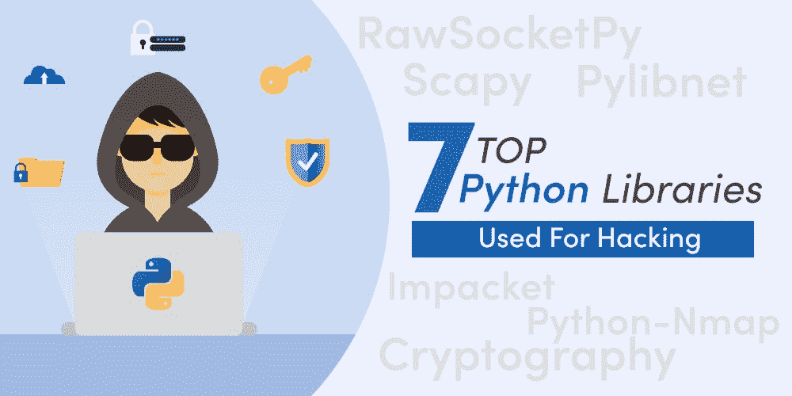

# 用于黑客攻击的 7 大 Python 库

> 原文:[https://www . geesforgeks . org/top-7-python-libraries-用于黑客攻击/](https://www.geeksforgeeks.org/top-7-python-libraries-used-for-hacking/)

黑客这个术语已经存在了很长时间，第一次有记录的黑客事件实际上可以追溯到 20 世纪 60 年代初的麻省理工学院，在那里黑客和黑客这两个术语从那时起就被创造出来，黑客实际上已经演变成了计算机界广泛遵循的一门学科。如今，道德黑客是通过未经授权进入特定系统执行从删除文件到窃取一些敏感信息的活动来检测系统漏洞的过程。

### 说到道德黑客，为什么是 Python？

Python 被认为是发展最快的编程语言之一，用途广泛，被安全专家和黑客广泛用于道德黑客。在这篇文章中，您将阅读 7 个对道德黑客有效的 python 库。作为一种开源语言，python 允许程序员创建多组预组合代码，并形成库，使 Python 脚本更加全面和安全。

除了将 python 应用于网络开发、数据科学和机器学习之外，它还被黑客和网络安全部门成功地用于识别计算机网络中的漏洞并破坏安全协议。有道德的黑客也使用 Python 编程来开发有效的黑客工具和技术，这些工具和技术可以通过使用 python 脚本来发现降低系统效率的恶意软件和漏洞。

Python 库减少了从头开始开发代码的负担。有了已经制定好的代码库，道德黑客可以使用它们来简化他们的任务。道德黑客行为发生在对计算机网络存在潜在威胁的地方，因此，对系统的未识别或非法访问会危及安全。

### 面向道德黑客的 Python 库

Python 非常受欢迎，因为它的超级强大但易于使用的库对开发人员来说很容易获得。尽管 Python 有最少的语法和令人敬畏的可读性，但没有什么比这些在各种领域都可用的库让开发人员的生活变得非常简单更好的了，例如，人工智能有 PI touch 密集循环，而数据科学有 pandas、NumPy、matplotlib 等等。以下是用于黑客攻击的前 7 个 Python 库，每个库都有其独特的标识和功能。

### 1.要求

请求库有助于使 HTTP 请求更加用户友好。它返回响应对象，包括状态、编码和内容数据。它是一个可以用来发送各种 HTTP 请求的模块，非常容易使用，并且具有在 URL 中传递参数以及传递自定义头等功能。它是一个人性化的 HTTP 库，正如它在官方文档页面上所暗示的那样，并且它是下载量最大的 Python 库之一，每天下载量超过 40 万次。Python 请求之所以如此受欢迎，是因为开发人员不必手动将查询添加到 URL 和表单编码帖子数据中，这就是使用 Python 请求的足够理由。

### 2.密码系统

密码学是一个有助于加密和数据集描述的库。该库包括 Python 3.3+、Python 2.6-2.7 支持的原语。密码学涉及两层的融合，即需要最少配置选择的安全密码配方。而另一个是低级加密技术，这是最危险的，可能会被错误地使用。借助于有效开发的代码，这个 python 库有助于保护信息。密码学包括生成随机数、数字签名、散列、流密码和散列。

### 3.python nmap

Nmap 是一种典型的网络扫描工具，它使用 IP 数据包来识别网络上的设备和操作系统信息。通过使用 Nmap 端口扫描程序，该库帮助系统管理员自动执行扫描支持 Nmap 脚本输出的报告的任务。Nmap 有助于识别和发现网络上的主机，并检测在任何远程设备上运行的版本号、应用程序名称。

### 4.Impacket

该库由 Python 脚本组成，有助于处理网络协议，它确保了对其他数据包的低级编程访问以及协议的实现。数据包可以由原始数据组成，应用编程接口使深层协议高效工作。Impacket 的目标是让程序员更容易完成任务，这样他们就可以在一个框架下工作，同时遵守一些定制协议。

### 5.scapy！scapy

操纵网络数据包的工具，有助于发现网络、探测、跟踪、路由和扫描。除了数据包嗅探之外，Scapy 还包括多种功能，可以根据需要进行定制。它可以在 Linux、Mac OS 和 windows 上运行。它呈现解码后的数据包，其解释取决于用户。Scapy 致力于将高级协议和低级网络编程联系起来。

### 6.RawSocketPy

鼓励与 MAC 地址通信的第 2 层 python 库。人们可以使用 rawsocketpy 创建定制的 WiFi 通信。一台不具备加密功能的非同步服务器需要 1500 的 MTU。Rawsocketpy 不涉及传输控制协议或用户数据报协议。

### 7.Pylibnet

libnet 包注入库确保了发送包的功能、libcap 跟踪的呈现以及 libnet 包的 python API。这些是一些在道德黑客下有效的 python 库。Python 语言因其多功能性和安全算法而被科技公司使用。在过去的几十年里，Python 变得非常流行。它被很多开发人员、大公司的黑客使用，因为它的语法简单易懂，通用，可以应用于大量的编程领域。网上有无数的 python 库，但是上面列出的那些最适合道德黑客。