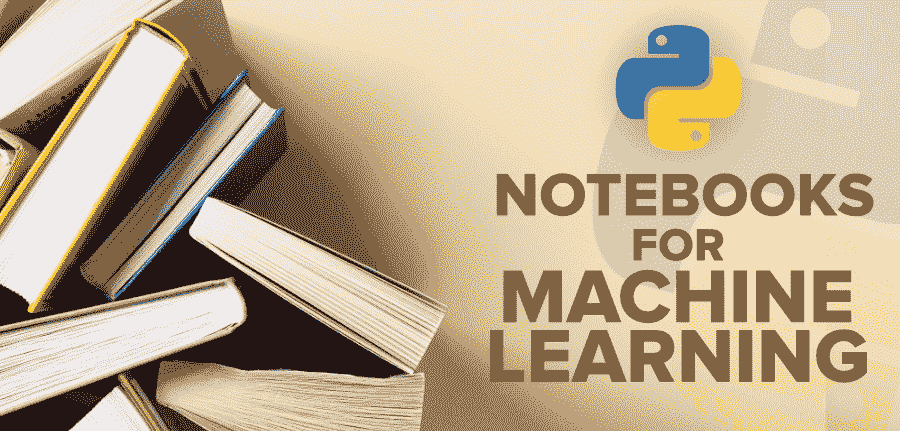

# 顶级机器学习 Python 笔记本

> 原文:[https://www . geesforgeks . org/top-python-笔记本用于机器学习/](https://www.geeksforgeeks.org/top-python-notebooks-for-machine-learning/)

**笔记本**通过对文本、代码、图像、输出等素材的整理，以循序渐进的方式说明分析过程。这有助于数据科学家在设计研究过程时记录思维过程。传统上，笔记本用于记录工作和复制发现，只需在源数据上重新运行笔记本即可。但是为什么人们会选择使用笔记本而不是首选 IDE 或命令行呢？当前基于浏览器的笔记本实现有许多限制，但它们所做的是提供一个探索、协作和可视化的环境。笔记本通常用于数据科学家的快速探索任务。

与任何本地脚本或工具相比，它们在这方面提供了一系列优势。笔记本电脑似乎通常设置在集群环境中，这使得数据科学家能够利用台式机/笔记本电脑无法利用的计算资源，并且无需下载本地副本即可完成数据的完整收集。

如今，交互式笔记本越来越受欢迎。他们正在取代会议中的 PowerPoint，在公司之间进行交流，甚至他们正在从商业智能套件中转移工作负载。如今，有许多笔记本可供选择，包括 Jupyter、R Markdown、Apache Zeppelin、Spark Notebook 等等。在本文中，我们将介绍机器学习专业人员使用的一些**顶级 python 笔记本**。

### [1 .Jupyter 笔记型电脑](https://www.geeksforgeeks.org/getting-started-with-jupyter-notebook-python)

**Jupyter 笔记本**是一个开源的网络应用程序，可以用来构建和共享实时代码、公式、可视化和文本文档。Jupyter 笔记本由 Jupyter 项目的人员维护。这是 IPython 项目中的一个附带项目，它本身曾经有一个 IPython Notebook 项目。Jupyter 这个名字来源于它支持的核心编程语言:Julia、Python 和 R. Jupyter 附带了 IPython 内核，它允许您编写 Python 程序，但是还有 100 多个其他内核可供您使用。当您使用计算工具作为科学实验室书籍进行计算物理和/或大量数据分析时，Jupyter 笔记本尤其有用。

### [2 .Google Colab](https://www.geeksforgeeks.org/how-to-use-google-colab/)

**Google Colab** ，也叫协同实验室，是一个免费的 Jupyter 笔记本环境，不需要任何配置，完全在云端运行。它支持用户免费使用图形处理器和图形处理器。您可以使用协同实验室编写和执行代码，保存和共享您的分析，并从浏览器访问强大的计算工具，所有这些都是免费的。顾名思义，它伴随着产品中支持的协作。这是一款 Jupyter 笔记本，利用了与谷歌文档协作的功能。它也运行在谷歌服务器上，所以你不需要更新任何东西。笔记本会保存到您的谷歌硬盘帐户。它为任何人提供了一个使用常用库(如 PyTorch、TensorFlow 和 Keras)开发深度学习应用程序的平台。它为你的电脑提供了一种方法，让你不用承担你的 ML 操作的高强度训练。

### 3.卡格尔

**Kaggle** 是云端深度学习应用的绝佳平台。Kaggle 和 Colab 有几个相似之处，都是谷歌的产品。像 Colab 一样，它让用户可以免费使用云中的 GPU。这为用户提供了 Jupyter 笔记本。Jupyter 笔记本上的很多键盘快捷键都和 Kaggle 一样。它有许多可以导入的数据集。Kaggle Kernels 似乎经常会有一点滞后，但是比 Colab 更快。Kaggle 有一个庞大的社区来支持、学习和验证数据科学技能。

### [4。蔚蓝笔记本](https://www.geeksforgeeks.org/azure-virtual-machine-for-machine-learning/)

**微软的 Azure 笔记本**在设计上与 Colab 非常相似。这两个平台都有免费的云共享功能。就速度而言，Azure Notebooks 胜出，在这方面比 Colab 强得多。它有 4gb 的内存。Azure 笔记本创建了一系列名为*图书馆*的链接笔记本。这些库每个数据文件的大小小于 100 兆字节。Azure 笔记本支持 Python、R 和 F #编程语言。它有一个本地的 Jupyter 用户界面。Azure 笔记本电脑最适合简单的应用。

### 5 .亚马逊 Sagemaker

**亚马逊的笔记本 SageMaker** 运行在 Jupyter 笔记本应用上。它负责开发和维护 Jupyter 笔记本，这些笔记本可用于进一步处理数据以及训练和部署 ML 模型。它为培训和模型部署提供了 API。亚马逊 SageMaker 提供了一个控制台，允许用户使用控制台用户界面开始模型培训或部署模型。通过在一套工具中提供所有的机器学习组件，它允许将 ML 模型轻松地结合到应用程序中，从而可以用更少的工作和更低的成本更快地生成模型。

### 6.IBM 数据平台笔记本

早在 2016 年，IBM 就推出了**沃森数据平台**和**数据科学体验(DSX)** ，认可开源选项。其中包括 Apache Spark、R、Python、Scala 和 Jupyter 的笔记本。它最终推出了自己的数据科学工作平台，可以自由选择多个云。这是在库本内特公司的产品集装箱化的帮助下完成的。因此，它可以部署在数据驻留的任何地方，在 Docker 或 CloudFoundry 容器中。与谷歌 Colab 不同，IBM DataPlatform 笔记本拥有多云容器化或混合部署。Colab 需要对其公共云的数据科学进行微调。

IBM 支持容器化，因为它允许客户在任何地方分析数据、创建、部署和运行模型，包括竞争对手的公共云。作为 DSX 本地公司，DSX 既是沃森数据平台的一部分，也可能独立于该平台。它提供对程序、数据、数据科学资源、服务和社区空间的协作、授权控制的访问。DataPlatform 笔记本支持 R、Python 和 Scala 语言，支持 Jupyter 和 Apache Zeppelin 的笔记本。DSX 的用户可以使用开源库，如 Spark MLlib、TensorFlow、Caffe、Keras 和 MXNet。