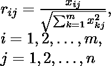
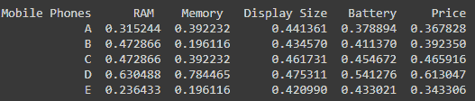
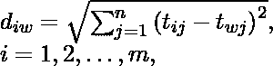
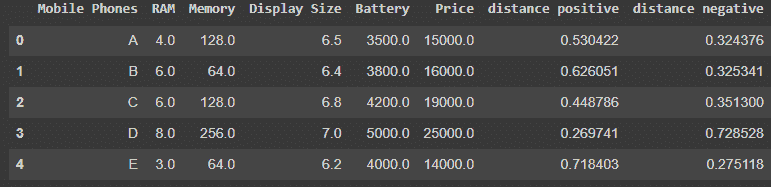
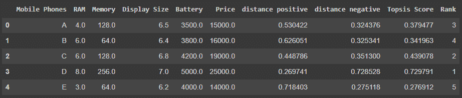

# 多准则决策的理想解法(MCDM)

> 原文:[https://www . geesforgeks . org/tops is-多准则方法-决策-mcdm/](https://www.geeksforgeeks.org/topsis-method-for-multiple-criteria-decision-making-mcdm/)

**基于理想解相似度的订单偏好技术(TOPSIS)** 出现于 20 世纪 80 年代，是一种基于多准则的决策方法。TOPSIS 选择与理想解的欧氏距离最短和与负理想解的距离最大的选项。

为了简化这个定义，让我们假设你想买一部手机，你去一家商店，根据内存、内存、显示器大小、电池和价格分析 5 部手机。最后看了这么多因素你很迷茫，不知道该怎么决定买哪部手机。理想解法是一种根据给定因素的权重和影响来分配等级的方法。

*   **权重**是指给定的因子应该被考虑多少(所有因子的默认权重= 1)。就像你希望 RAM 比其他因素有更多的权重，所以 RAM 的权重可以是 2，而其他人可以有 1。
*   **影响**表示给定因素有正面或负面影响。就像你希望电池尽可能大，但手机的价格尽可能低，所以你会给电池分配“+”的重量，给价格分配“-”的重量。

该方法可以应用于基于诸如相关性、R^2、准确度、均方根误差等各种因素对机器学习模型进行排序。既然我们已经理解了什么是 TOPSIS，以及我们可以在哪里应用它。让我们看看在给定的数据集上实现 TOPSIS 的过程是什么，由多行(像各种手机)和多列(像各种因素)组成。

**数据集示例:**

特定因素的给定数据值将被视为标准单位。始终将*标记为*任何非数字数据类型。

<center>


</center>

### 程序:

**第一步:**计算归一化矩阵和加权归一化矩阵。我们将每个值规范化为:其中 m 是数据集中的行数，n 是列数。I 沿行变化，j 沿列变化。

<center>



</center>

上述给定值的归一化矩阵为:

<center>
</center>

然后，我们将列中的每个值乘以给定的相应权重。

```
# Arguments are dataset, number of columns, and weights of each column 
def Normalize(dataset, nCol, weights):
    for i in range(1, nCol):
        temp = 0
        # Calculating Root of Sum of squares of a particular column
        for j in range(len(dataset)):
            temp = temp + dataset.iloc[j, i]**2
        temp = temp**0.5
        # Weighted Normalizing a element
        for j in range(len(dataset)):
            dataset.iat[j, i] = (dataset.iloc[j, i] / temp)*weights[i-1]
    print(dataset)
```

**步骤 2:** 从理想最差和理想最佳值计算每行的理想最佳和理想最差以及欧氏距离。首先，我们将找出理想的最佳值和理想的最差值:现在这里我们需要看到影响，即它是‘+’还是‘-’影响。如果“+”影响，则一列的理想最佳值是该列的最大值，理想最差值是该列的最小值，反之亦然。

```
# Calculate ideal best and ideal worst
def Calc_Values(dataset, nCol, impact):
    p_sln = (dataset.max().values)[1:]
    n_sln = (dataset.min().values)[1:]
    for i in range(1, nCol):
        if impact[i-1] == '-':
            p_sln[i-1], n_sln[i-1] = n_sln[i-1], p_sln[i-1]
    return p_sln, n_sln
```

现在我们需要从理想最佳和理想最差开始计算所有行中元素的欧氏距离，这里*d<sub>iw</sub>T3】是对一个*I<sup>th</sup>T7】行计算的最差距离，其中 *t <sub>i，j</sub>T11】是元素值， *t <sub>w，j</sub>T15】是该列的最差理想值。同样，我们可以找到 *d <sub>ib</sub>* ，即在一个 *i <sup>第</sup>* 行上计算的最佳距离。****

<center>



</center>

现在数据集看起来像这样，包括正距离和负距离。

<center>
</center>

**第三步:**计算 Topsis 得分和排名。现在我们有距离正和距离负，让我们根据它们来计算每行的 Topsis 分数。

TOPSIS 得分= d<sub>iw</sub>/(d<sub>IB</sub>+d<sub>iw</sub>)每行

现在根据 TOPSIS 得分进行排名，即得分越高，排名越好

我们的数据集的排名如下:

<center>
</center>

最后一部分的代码在这里！

```
 # Calculating positive and negative values
 p_sln, n_sln = Calc_Values(temp_dataset, nCol, impact)

 # calculating topsis score
 score = [] # Topsis score
 pp = [] # distance positive
 nn = [] # distance negative

# Calculating distances and Topsis score for each row
 for i in range(len(temp_dataset)):
     temp_p, temp_n = 0, 0
     for j in range(1, nCol):
         temp_p = temp_p + (p_sln[j-1] - temp_dataset.iloc[i, j])**2
         temp_n = temp_n + (n_sln[j-1] - temp_dataset.iloc[i, j])**2
     temp_p, temp_n = temp_p**0.5, temp_n**0.5
     score.append(temp_n/(temp_p + temp_n))
     nn.append(temp_n)
     pp.append(temp_p)

 # Appending new columns in dataset   

 dataset['distance positive'] = pp
 dataset['distance negative'] = nn
 dataset['Topsis Score'] = score

 # calculating the rank according to topsis score
 dataset['Rank'] = (dataset['Topsis Score'].rank(method='max', ascending=False))
 dataset = dataset.astype({"Rank": int})
```

你可以在我的 Github Repo 上找到源代码:[链接](https://github.com/Tewatia5355/Topsis_tewatia)