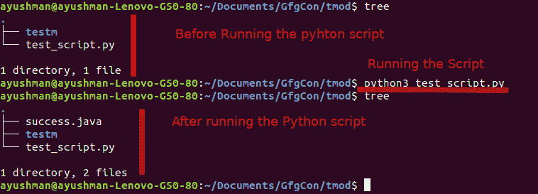
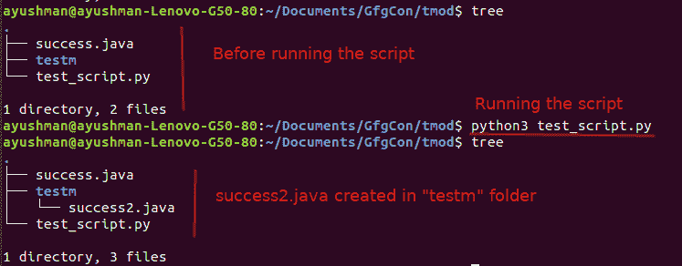
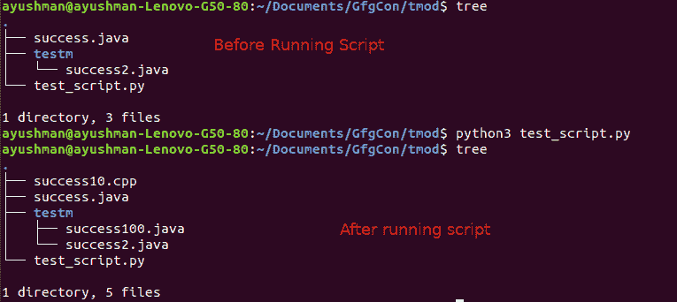

# Python 中的触摸模块

> 原文:[https://www.geeksforgeeks.org/touch-module-in-python/](https://www.geeksforgeeks.org/touch-module-in-python/)

在 Python 中，**触摸模块**用于在任何指定的目录下创建任何文件。触摸模块相当于 linux 命令“`touch`”或 windows“cmd 命令” `type null >` 。

**安装:**

这个模块没有内置 Python。要安装此模块，请在终端中键入以下命令。

```py
pip install touch
```

**示例 1:** 在本例中，我们将在同一个目录中创建一个文件。

```py
import touch

touch.touch("success.java")
```

**输出:**

[](https://media.geeksforgeeks.org/wp-content/uploads/20200307152529/Screenshot-from-2020-03-07-15-20-30.png)

**示例 2:** 在本例中，我们将在不同的目录中创建一个文件。这里我们在“testm”文件夹中创建一个文件。

```py
import touch

touch.touch("testm / success2.java")
```

**输出:**

[](https://media.geeksforgeeks.org/wp-content/uploads/20200307152934/Screenshot-from-2020-03-07-15-26-53.png)

**示例 3:** 在本例中，我们将同时创建一个多个文件。为此，我们需要在列表中传递文件名。

```py
import touch

touch.touch(["testm / success100.java", "success10.cpp"])
```

**输出:**
[](https://media.geeksforgeeks.org/wp-content/uploads/20200307154156/Screenshot-from-2020-03-07-15-39-34.png)