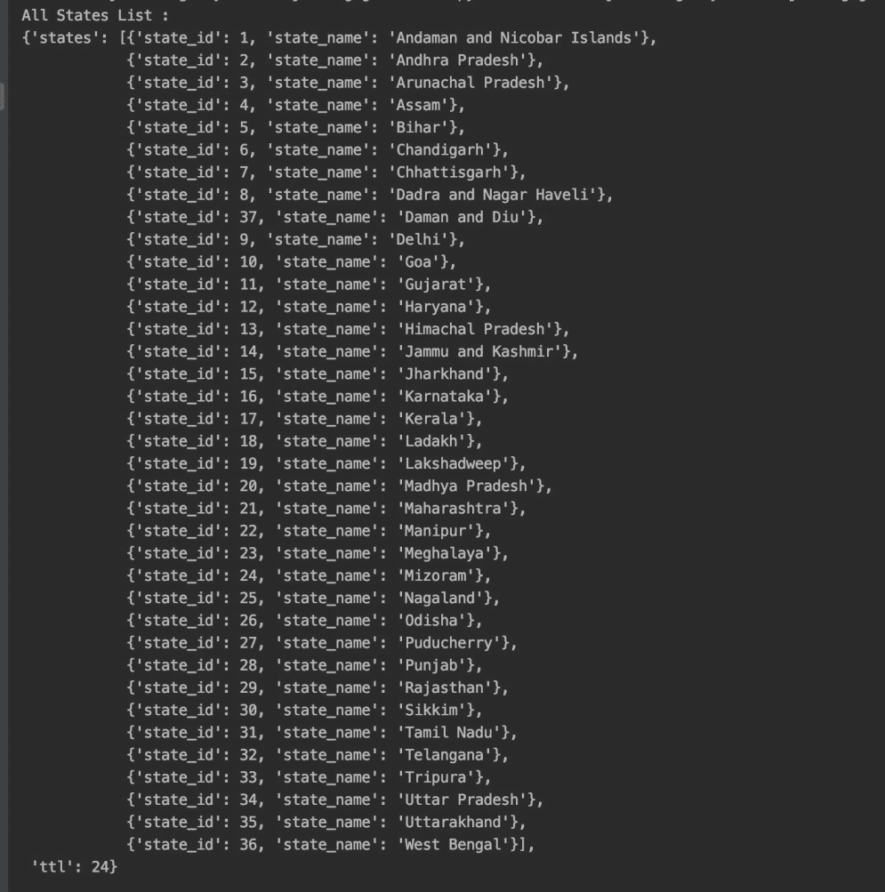
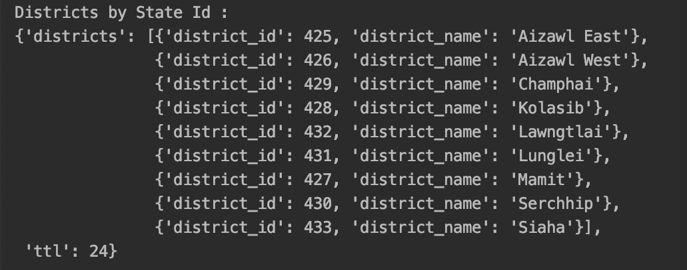
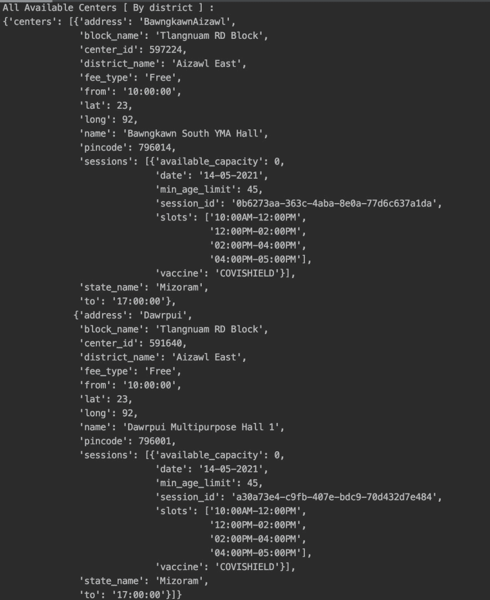
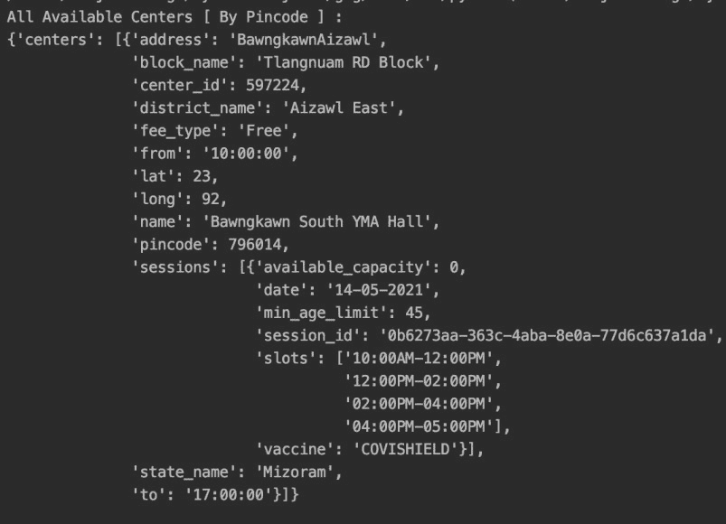

# 使用 Python 中的 cowin 跟踪新冠肺炎疫苗槽

> 原文:[https://www . geeksforgeeks . org/track-新冠肺炎-疫苗-插槽-使用-python 中的 cowin/](https://www.geeksforgeeks.org/track-covid-19-vaccine-slots-using-cowin-in-python/)

印度最近发起了最大规模的疫苗接种运动，让每个人都能接种新冠肺炎疫苗。CoWin 是一个官方网站，负责处理空缺职位的可用性。前进的过程可能是乏味的项目。这个站点的 Python API Wrapper，CoWin，提供了一些方法，可以帮助我们在 Pincode 和区域的基础上找到附近的可用性。

### **安装:**

要安装此模块，请在终端中键入以下命令。

```py
pip install cowin
```

### 获取所有状态的列表

这里将使用 get_states()方法获取所有状态。首先，我们将导入该模块，然后使用 coWinAPI()访问 get_state()对象。该方法获取状态列表及其标识

**代码:**

## 蟒蛇 3

```py
from cowin_api import CoWinAPI
from pprint import pprint

cowin = CoWinAPI()

states = cowin.get_states()
print("All States List : ")
print(states)
```

**输出:**



### 获得一个州的所有地区

这里我们将使用 get_districts()，它返回地区名称，将整数传递给 get_districts()。get_districts(state_id)将从上面的 API 返回的州 id 作为 param，并返回所有带有其 id 的区。

**代码:**

## 蟒蛇 3

```py
from cowin_api import CoWinAPI
from pprint import pprint

cowin = CoWinAPI()
state_id = '24'
districts = cowin.get_districts(state_id)

print("Districts by State Id : ")
pprint(districts)
```

**输出:**



### 获取地区内所有中心的可用性信息

这里我们将获取该地区的中心信息，get_availability_by_district()方法能够返回该地区内的所有中心信息。

> **语法:**get _ availability _ by _ district(district _ id，日期，min_age_limit)
> 
> **参数:**
> 
> *   地区标识:使用上述应用编程接口选择的标识。
> *   日期(可选) :日-月-年格式的日期。默认为今天。
> *   最小年龄限制(可选) :要查询的最小年龄，因为插槽在不同的年龄组中开放。如果没有给出，所有年龄都用作过滤器。

**代码:**

## 蟒蛇 3

```py
from cowin_api import CoWinAPI
from pprint import pprint
cowin = CoWinAPI()

district_id = '425'
date = '14-05-2021'
available_centers = cowin.get_availability_by_district(district_id, date)
print("All Available Centers [ By district ] : ")
pprint(available_centers)
```

**输出:**



### 按密码获取所有中心的可用性信息

这里我们将根据密码获取所有的中心可用性信息，get_availability_by_pincode 可以通过密码返回中心信息。

> **语法:**get _ availability _ by _ pincode(pin _ code，date，min_age_limit)
> 
> **参数:**
> 
> *   pin_code:查找中心区域的 pin 码。
> *   日期(可选) :日-月-年格式的日期。默认为今天。
> *   最小年龄限制(可选) :要查询的最小年龄，因为插槽在不同的年龄组中开放。如果没有给出，所有年龄都用作过滤器。

**代码:**

## 蟒蛇 3

```py
from cowin_api import CoWinAPI
from pprint import pprint
cowin = CoWinAPI()

pin_code = "796014"
date = '14-05-2021'
min_age_limit = 18
available_centers = cowin.get_availability_by_pincode(pin_code, date)
print("All Available Centers [ By Pincode ] : ")
pprint(available_centers)
```

**输出:**

