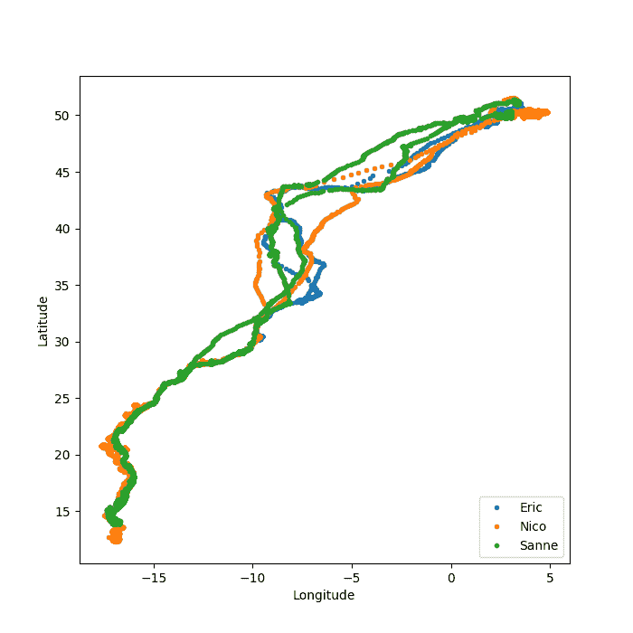
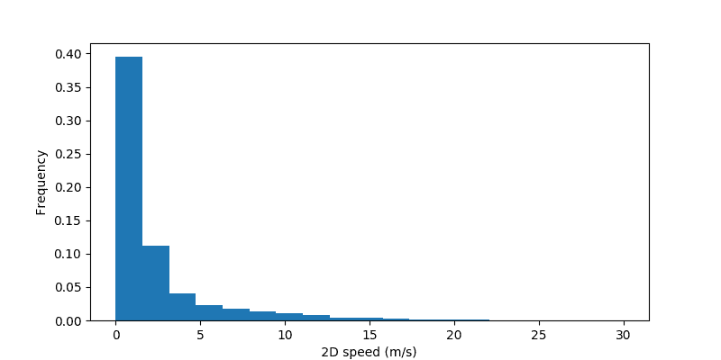
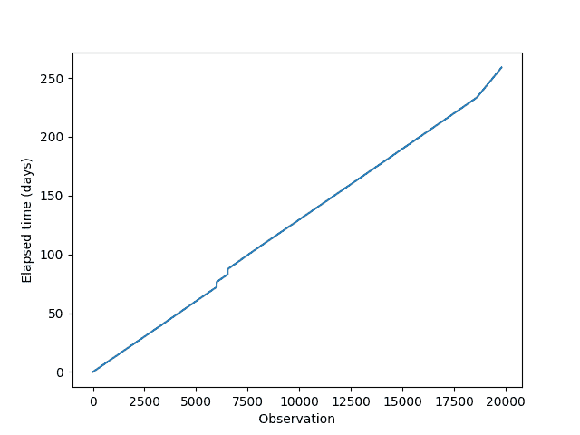
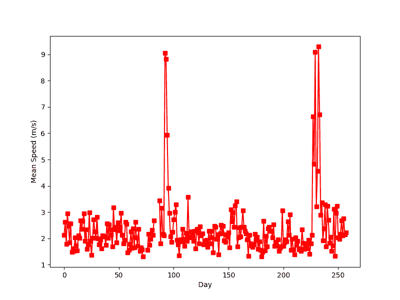
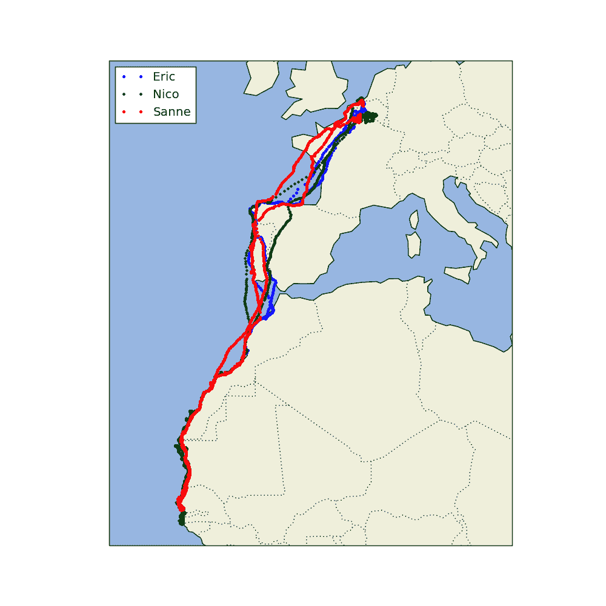

# 使用 Python-3 跟踪鸟类迁徙

> 原文:[https://www . geesforgeks . org/tracking-bird-migration-use-python-3/](https://www.geeksforgeeks.org/tracking-bird-migration-using-python-3/)

一个引人入胜的研究领域是使用全球定位系统来跟踪动物的运动。现在可以制造一个太阳能充电的小型全球定位系统设备，这样你就不需要更换电池，用它来跟踪鸟类的飞行模式。
本案例研究的数据来自 LifeWatch INBO 项目。作为该项目的一部分，已经发布了几个数据集。我们将使用一个由三只海鸥的迁徙数据组成的小数据集，这三只海鸥分别叫埃里克、尼科和桑尼。[官方 _ 数据集](https://inbo.carto.com/u/lifewatch/datasets)；使用的数据集–CSV ">CSV 文件包含八列，包括纬度、经度、海拔和时间戳等变量。在本案例研究中，我们将首先加载数据，可视化一些简单的飞行轨迹，跟踪飞行速度，了解白天，以及更多。

**目标:**跟踪三只海鸥的运动，即–Eric、Nico&Sanne
T3【数据集:T5【官方 _ 数据集】；使用的数据集–[CSV](https://d37djvu3ytnwxt.cloudfront.net/assets/courseware/v1/c72498a54a4513c2eb4ec005adc0010c/asset-v1:HarvardX+PH526x+3T2016+type@asset+block/bird_tracking.csv)
**依赖项:** Matplotlib、Pandas、Numpy、Cartopy、Shapely
**资源库(Github):** [源代码](https://github.com/SKKSaikia/data-analysis/tree/master/data-analysis%20project%20-%201%20-%20bird_migration_cartopy)
(查看资源库获取源代码文档。)
**写道:** [解释(。pdf)](https://drive.google.com/file/d/0ByqooCIGbyKiYXcxbmpKdWJiVWs/view)

我们将我们的案例研究分为五个部分:
1。将海鸥的经度和纬度数据可视化。
2。想象海鸥的速度变化。
3。想象一下海鸥在旅程中走同样的距离所需的时间。
4。想象海鸥每天的平均速度。
5。海鸥旅行的地图视图。

**第(1/5)部分:经纬度**
在这一部分，我们将可视化鸟类的位置。我们将分别沿 y 轴和 x 轴绘制纬度和经度，并可视化 csv 文件中的位置数据。

## 计算机编程语言

```py
import pandas as pd
import matplotlib.pyplot as plt
import numpy as np

birddata = pd.read_csv("bird_tracking.csv")
bird_names = pd.unique(birddata.bird_name)

# storing the indices of the bird Eric
ix = birddata.bird_name == "Eric"
x,y = birddata.longitude[ix], birddata.latitude[ix]
plt.figure(figsize = (7,7))
plt.plot(x,y,"b.")

''' To look at all the birds trajectories,
    we plot each bird in the same plot '''
plt.figure(figsize = (7,7))
for bird_name in bird_names:

    # storing the indices of the bird Eric
    ix = birddata.bird_name == bird_name 
    x,y = birddata.longitude[ix], birddata.latitude[ix]
    plt.plot(x,y,".", label=bird_name)
plt.xlabel("Longitude")
plt.ylabel("Latitude")
plt.legend(loc="lower right")
plt.show()
```

```py
plt.figure(figsize = (7,7))
plt.plot(x,y,"b.")
```

我们使用 matplotlib 函数，figure()将图的大小初始化为 7 x 7，并使用 plot()函数绘制它。函数图()中的参数(即 x、y 和“b”)指定使用沿 x 轴的经度数据(对于 x)、沿 y 轴的纬度数据(对于 y)和 b =蓝色。=可视化中的圆圈。

```py
Output : You must have all the dependencies.Install them using "pip install dependency_name"
```




**PART (2/5): 2D 速度 vs 频率**
在本案例研究的第二部分，我们将为名为“埃里克”的海鸥可视化 2D 速度 Vs 频率。

## 计算机编程语言

```py
import pandas as pd
import matplotlib.pyplot as plt
import numpy as np

birddata = pd.read_csv("bird_tracking.csv")
bird_names = pd.unique(birddata.bird_name)

# storing the indices of the bird Eric
ix = birddata.bird_name == "Eric"
speed = birddata.speed_2d[ix]

plt.figure(figsize = (8,4))
ind = np.isnan(speed)
plt.hist(speed[~ind], bins = np.linspace(0,30,20), normed=True)
plt.xlabel(" 2D speed (m/s) ")
plt.ylabel(" Frequency ")
plt.show()
```

```py
ind = np.isnan(speed)
plt.hist(speed[~ind], bins = np.linspace(0,30,20), normed=True)
plt.xlabel(" 2D speed (m/s) ")
plt.ylabel(" Frequency ")
plt.show()
```

参数 speed[~ind]表示我们将只包括那些 ind！= True，bin = NP . Lin space(0，30，20)表示沿着 x 轴的 bin 从 0 到 30 不等，其中有 20 个 bin，线性间隔。最后，我们分别使用 xlabel()和 ylabel()函数绘制 x 轴上的 2D 速度(单位为米/秒)和 y 轴上的频率，并使用 plt.show()绘制数据。

输出:



**PART (3/5):时间和日期**
第三部分与日期和时间相关联。我们将想象埃里克在旅程中走完恒定距离所需的时间(以天为单位)。如果他在相同的时间内走了相同的距离，那么经过时间与观察曲线将是线性的。

## 计算机编程语言

```py
import pandas as pd
import matplotlib.pyplot as plt
import datetime
import numpy as np

birddata = pd.read_csv("bird_tracking.csv")
bird_names = pd.unique(birddata.bird_name)

timestamps = []
for k in range(len(birddata)):
    timestamps.append(datetime.datetime.strptime(birddata.date_time.iloc[k][:-3], "%Y-%m-%d %H:%M:%S"))

birddata["timestamp"] = pd.Series(timestamps, index = birddata.index)

times = birddata.timestamp[birddata.bird_name == "Eric"]
elapsed_time = [time-times[0] for time in times]

plt.plot(np.array(elapsed_time)/datetime.timedelta(days=1))
plt.xlabel(" Observation ")
plt.ylabel(" Elapsed time (days) ")
plt.show()
```

```py
for k in range(len(birddata)):
    timestamps.append(datetime.datetime.strptime(birddata.date_time.iloc[k][:-3], "%Y-%m-%d %H:%M:%S"))
```

" > > > datetime.datetime.today()"，返回当前日期(yy-mm-dd)和时间(h:m:s)。
" > > > date_str[:-3]"，切分/移除 UTC +00 协调时间戳。
">>>datetime . datetime . strptime(date_str[:-3]，%Y-%m-%d %H:%M:%S ")"，来自 date _ str 的时间戳字符串被转换为要处理的 datetime 对象。" %Y-%m-%d %H:%M:%S "是年-月-日和小时-分-秒格式。

输出:



**PART (4/5):日平均速度**
我们将可视化记录飞行总天数中名为“Eric”的海鸥的日平均速度。

## 计算机编程语言

```py
import pandas as pd
import matplotlib.pyplot as plt
import datetime
import numpy as np

birddata = pd.read_csv("bird_tracking.csv")
bird_names = pd.unique(birddata.bird_name)

timestamps = []
for k in range(len(birddata)):
    timestamps.append(datetime.datetime.strptime(birddata.date_time.iloc[k][:-3], "%Y-%m-%d %H:%M:%S"))
birddata["timestamp"] = pd.Series(timestamps, index = birddata.index)

data =  birddata[birddata.bird_name == "Eric"]
times = data.timestamp
elapsed_time = [time-times[0] for time in times]
elapsed_days = np.array(elapsed_time)/datetime.timedelta(days=1)

next_day = 1
inds = []
daily_mean_speed = []
for (i,t) in enumerate(elapsed_days):
    if t < next_day:
        inds.append(i)
    else:
        daily_mean_speed.append(np.mean(data.speed_2d[inds]))
        next_day += 1
        inds = []

plt.figure(figsize = (8,6))
plt.plot(daily_mean_speed, "rs-")
plt.xlabel(" Day ")
plt.ylabel(" Mean Speed (m/s) ");
plt.show()
```

```py
enumerate() - is one of the built-in Python functions. It returns an enumerated object. In our case, that object is a list of tuples (immutable lists), each containing a pair of count/index and value.
```

输出:



**第(5/5)部分:地图视图**
在最后一部分，我们将在地图上追踪鸟类。

## 计算机编程语言

```py
import pandas as pd
import cartopy.crs as ccrs
import cartopy.feature as cfeature
import matplotlib.pyplot as plt

birddata = pd.read_csv("bird_tracking.csv")
bird_names = pd.unique(birddata.bird_name)

# To move forward, we need to specify a
# specific projection that we're interested
# in using.
proj = ccrs.Mercator()

plt.figure(figsize=(10,10))
ax = plt.axes(projection=proj)
ax.set_extent((-25.0, 20.0, 52.0, 10.0))
ax.add_feature(cfeature.LAND)
ax.add_feature(cfeature.OCEAN)
ax.add_feature(cfeature.COASTLINE)
ax.add_feature(cfeature.BORDERS, linestyle=':')
for name in bird_names:
    ix = birddata['bird_name'] == name
    x,y = birddata.longitude[ix], birddata.latitude[ix]
    ax.plot(x,y,'.', transform=ccrs.Geodetic(), label=name)
plt.legend(loc="upper left")
plt.show()
```

```py
import cartopy.crs as ccrs
import cartopy.feature as cfeature
```

这些模块对于映射数据很重要。

```py
ax.add_feature(cfeature.LAND)
ax.add_feature(cfeature.OCEAN)
ax.add_feature(cfeature.COASTLINE)
ax.add_feature(cfeature.BORDERS, linestyle=':')
```

我们添加了地图的显著物理特征。

输出:



资源:
1。[EDx–HarvardX–使用 Python 进行研究](https://courses.edx.org/courses/course-v1:HarvardX+PH526x+3T2016/info)
2。 [Python 函数 doc_I](https://docs.python.org/3/library/functions.html)
3。 [Python 函数 doc_II](https://docs.python.org/3/library/functions.html)

本文由 **Amartya Ranjan Saikia** 供稿。如果你喜欢 GeeksforGeeks 并想投稿，你也可以使用[write.geeksforgeeks.org](https://write.geeksforgeeks.org)写一篇文章或者把你的文章邮寄到 review-team@geeksforgeeks.org。看到你的文章出现在极客博客主页上，帮助其他极客。
如果你发现任何不正确的地方，或者你想分享更多关于上面讨论的话题的信息，请写评论。