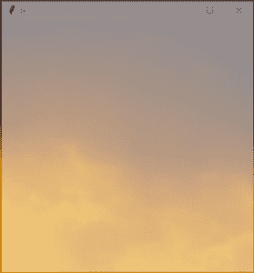

# Tkinter 中的透明窗口

> 原文:[https://www . geesforgeks . org/transparent-window-in-tkinter/](https://www.geeksforgeeks.org/transparent-window-in-tkinter/)

**先决条件:** [Python 图形用户界面–tkinter](https://www.geeksforgeeks.org/python-gui-tkinter/)

Python 为开发图形用户界面提供了多个选项。在所有的 GUI 方法中，tkinter 是最常用的方法。它是 Python 附带的 Tk 图形用户界面工具包的标准 Python 接口。

要创建透明窗口，我们将使用*属性()*方法。

**语法:**

```py
root.attributes('-alpha',transparency value)

```

要创建透明背景，我们需要使用*属性()*方法中的 *-alpha* 参数。阿尔法用于透明。

如果透明度值为 0.0，则表示完全透明，1.0 表示完全不透明范围为[0.0，1.0]。这不是所有系统都支持的，Tkinter 总是使用 1.0。注意在这个版本中，这个属性必须给出为 *-alpha* 。

下面是一个程序，创建一个普通的 Tkit*窗口。*

## *蟒蛇 3*

```py
*# Import module
from tkinter import *

# Create object
root = Tk()

# Adjust size
root.geometry("400x400")

# Execute tkinter
root.mainloop()*
```

***输出:***

*

**不透明窗口*** 

*现在，下面的程序使用 *tkinter* 模块创建一个透明窗口。*

## *蟒蛇 3*

```py
*# Import module
from tkinter import *

# Create object
root = Tk()

# Adjust size
root.geometry("400x400")

# Create transparent window
root.attributes('-alpha',0.5)

# Execute tkinter
root.mainloop()*
```

***输出:***

*

**透明窗***