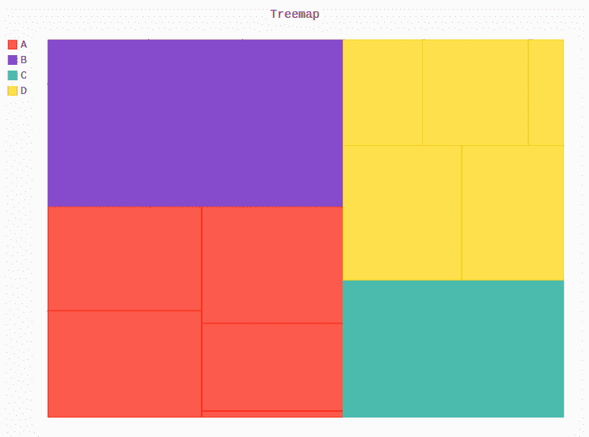
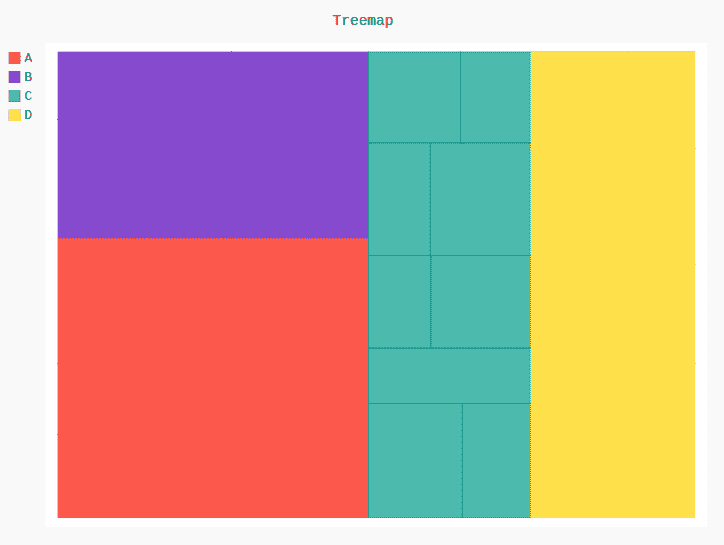

# Pygal 的树形图

> 原文:[https://www.geeksforgeeks.org/treemap-in-pygal/](https://www.geeksforgeeks.org/treemap-in-pygal/)

**Pygal** 是一个 Python 模块，主要用于构建 SVG(标量矢量图形)图形和图表。SVG 是一种基于矢量的 XML 格式的图形，可以在任何编辑器中编辑。Pygal 可以用最少的代码行创建图表，这些代码行易于理解和编写。

## Pygal 的树形图

**树状图**是一个图表，用于显示梯队数据使用种植的数字主要是矩形。树的每个分支都是矩形，然后用更小的矩形代表子分支。颜色和图案以这样的方式固定在树形结构中，这样就不难理解材料了。制作 treemap 的第二个优点是它们在布局中占用的空间更少，并且可以在屏幕上同时显示成千上万个项目。可以使用`Treemap()`方法创建。

**语法:**

```
treemap = pygal.Treemap()
```

**例 1:**

```
# importing pygal
import pygal
import numpy

# creating the chart object
treemap = pygal.Treemap()

# naming the title
treemap.title = 'Treemap'

# Random data
treemap.add('A', numpy.random.rand(5))
treemap.add('B', numpy.random.rand(5))
treemap.add('C', numpy.random.rand(5))
treemap.add('D', numpy.random.rand(5))

treemap
```

**输出:**



**例 2:**

```
# importing pygal
import pygal
import numpy

# creating the chart object
treemap = pygal.Treemap()

# naming the title
treemap.title = 'Treemap'        

# Random data
treemap.add('A', [26, 22, 39, 39, 32, 30, 33, 24, 24, 30])
treemap.add('B', [31, 40, None, None, None, None, 40, 32, 25, 31])
treemap.add('C', [37, 27, 31, 20, None, 32, 24, 39, 29, 22])
treemap.add('D', [38, None, 20, 29, 33, 23, 32, 33, 32, 23])

treemap
```

**输出:**

