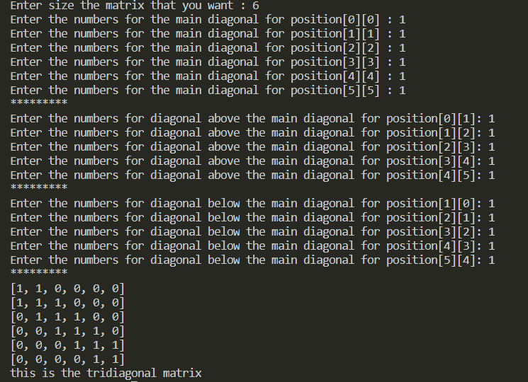

# python 中的三对角矩阵

> 原文:[https://www.geeksforgeeks.org/tridiagonal-matrix-in-python/](https://www.geeksforgeeks.org/tridiagonal-matrix-in-python/)

三对角矩阵是只在主对角线上、对角线下和对角线上有非零元素的矩阵。所有其他元素都为零。因此，维数小于或等于 3 的三对角矩阵似乎没有意义。

> **例 1:**
> 
> [a11，a22，0，0，0，0，0 ]
> 
> [a21，a22，a23，0，0，0 ]
> 
> [0，a32，a33，a34，0，0 ]
> 
> [0，0，a43，a44，a55，0 ]
> 
> [0，0，0，a54，a55，a56]
> 
> [0，0，0，0，a65，a66]
> 
> **例 2:**
> 
> [1,  1,  0,  0,  0,  0]   
> 
> [1,  1,  1,  0,  0,  0]
> 
> [0,  1,  1,  1,  0,  0]
> 
> [0,  0,  1,  1,  1,  0]
> 
> [0,  0,  0,  1,  1,  1]
> 
> [0,  0,  0,  0,  1,  1]

### 方法

*   以矩阵的大小作为输入
*   检查是否大于 3
    *   如果没有，退出
    *   如果是，继续
*   将矩阵的元素作为输入
*   现在除了主对角线和主对角线上下的对角线外，在任何地方都放零。

**程序:**

## 蟒蛇 3

```py
# if you enter number n it will automatically 
# be considered as a square matrix of size n by n
size_of_a_matrix = int(input("Enter size the matrix that you want : "))

if size_of_a_matrix <= 3:

    # since size should be greater than 3
    print("Please enter the size that is greater than 3")
    exit()

diagonal = []
numbers1 = [[0 for j in range(0, size_of_a_matrix)]
            for i in range(0, size_of_a_matrix)]

# created a loop to enter numbers
for a in range(size_of_a_matrix):
    numbers1 = int(input(f"Enter the numbers for the main diagonal for position[{a}][{a}] : "))

    # appending the values to the list
    diagonal.append(numbers1)

diagonalAbove = []
print("*********")

# created a loop to enter numbers
for k in range(size_of_a_matrix-1):
    numbers2 = int(input(f"Enter the numbers for diagonal above the main diagonal for position[{k}][{k+1}]: "))

    # appending the values to the list
    diagonalAbove.append(numbers2)

diagonalBelow = []
print("*********")

# created a loop to enter numbers
for z in range(size_of_a_matrix-1):
    numbers3 = int(input(f"Enter the numbers for diagonal below the main diagonal for position[{z+1}][{z}]: "))

    # appending the values to the list
    diagonalBelow.append(numbers3)
print("*********")

def tridiagonal(size_of_a_matrix, diagonal, diagonalAbove, diagonalBelow):

    matrix = [[0 for j in range(size_of_a_matrix)]
              for i in range(size_of_a_matrix)]

    for k in range(size_of_a_matrix-1):
        matrix[k][k] = diagonal[k]
        matrix[k][k+1] = diagonalAbove[k]
        matrix[k+1][k] = diagonalBelow[k]

    matrix[size_of_a_matrix-1][size_of_a_matrix - 1] = diagonal[size_of_a_matrix-1]

    # so that the values will print row by row
    for row in matrix:
        print(row)

    return "this is the tridiagonal matrix"

# printing final values
print(tridiagonal(size_of_a_matrix, diagonal, diagonalAbove, diagonalBelow))
```

**输出:**



我们程序的输出