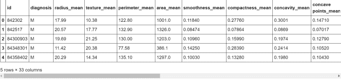

# 使用分类的肿瘤检测–机器学习和 Python

> 原文:[https://www . geesforgeks . org/肿瘤-检测-使用-分类-机器学习-和-python/](https://www.geeksforgeeks.org/tumor-detection-using-classification-machine-learning-and-python/)

在本文中，我们将通过 Python 语言制作一个项目，该项目也将使用一些机器学习算法。这将是一个令人兴奋的项目，因为在这个项目之后，你将理解使用人工智能和脚本语言的概念。以下库/包将用于本项目:

*   [**numpy**](https://www.geeksforgeeks.org/numpy-in-python-set-1-introduction/) **:** 这是一个用于科学计算的 Python 库。除了其他内容之外，它还包含一个强大的数组对象、数学和统计工具，用于与其他语言的代码(即 C/C++和 Fortran 代码)集成。
*   [**熊猫**](https://www.geeksforgeeks.org/pandas-tutorial/) **:** 这是一个 Python 包，提供快速、灵活和富有表现力的数据结构，旨在轻松直观地处理“关系”或“标签”数据。
*   [**Matplotlib**](https://www.geeksforgeeks.org/matplotlib-tutorial/)**:**Matplotlib 可能是 Python 编程语言的一个绘图库，它生成 2D 图来呈现可视化，并帮助探索信息集。matplotlib.pyplot 可以是命令风格函数的集合，使 matplotlib 像 MATLAB 一样工作。
*   [**【塞尔伯恩】**](https://www.geeksforgeeks.org/python-seaborn-tutorial/) **:** 。Seaborn 是一个建立在 matplotlib 之上的开源 Python 库。它用于数据可视化和探索性数据分析。Seaborn 可以轻松处理数据帧和熊猫库。

## 蟒蛇 3

```
# Checking for any warning
import warnings
warnings.filterwarnings('ignore')
```

在这一步之后，我们将安装一些**依赖关系**:依赖关系是您的项目所需的所有软件组件，以便它按预期工作并避免运行时错误。我们将需要**数字图书馆、熊猫、matplotlib &海底图书馆/附属建筑。**因为我们需要一个 CSV 文件来进行操作，所以对于这个项目，我们将使用一个包含 [**【肿瘤】**](https://raw.githubusercontent.com/ingledarshan/AIML-B2/main/data.csv) (脑部疾病)数据的 CSV 文件。所以在这个项目中，我们最终将能够预测一个受试者(候选人)是否有患肿瘤的可能性？

**第一步:数据预处理:**

## 蟒蛇 3

```
# Importing dependencies
import numpy as np
import pandas as pd
import matplotlib.pyplot as plt
import seaborn as sns

# Including & Reading the CSV file:
df = pd.read_csv("https://raw.githubusercontent.com/ingledarshan/AIML-B2/main/data.csv")
```

现在我们将检查 CSV 文件是否已被成功读取？因此我们将使用 [**head 方法**](https://www.geeksforgeeks.org/python-pandas-dataframe-series-head-method/) **:** head()方法用于返回数据帧或序列的前 n(默认为 5)行。

## 蟒蛇 3

```
df.head()
```



## 蟒蛇 3

```
# Check the names of all columns
df.columns
```