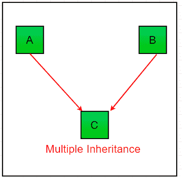

# 继承 Python 的类型

> 原文:[https://www.geeksforgeeks.org/types-of-inheritance-python/](https://www.geeksforgeeks.org/types-of-inheritance-python/)

继承被定义为一个类从其他类中派生或继承属性并在需要时使用它的能力。继承提供以下属性:

*   它很好地代表了现实世界的关系。
*   它提供了代码的可重用性。我们不必一次又一次地编写相同的代码。此外，它允许我们在不修改类的情况下向类添加更多的特性。
*   它本质上是可传递的，这意味着如果 B 类从另一个 A 类继承，那么 B 的所有子类都将自动从 A 类继承。

**例:**

## 蟒蛇 3

```py
# A Python program to demonstrate
# inheritance 

# Base class or Parent class
class Child:

    # Constructor
    def __init__(self, name):
        self.name = name

    # To get name
    def getName(self):
        return self.name

    # To check if this person is student
    def isStudent(self):
        return False

# Derived class or Child class
class Student(Child):

    # True is returned
    def isStudent(self):
        return True

# Driver code
# An Object of Child
std = Child("Ram")
print(std.getName(), std.isStudent())

# An Object of Student
std = Student("Shivam")
print(std.getName(), std.isStudent())
```

**输出:**

```py
Ram False
Shivam True

```

## Python 中的继承类型

继承的类型取决于所涉及的子类和父类的数量。Python 中有四种继承类型:

**单一继承:**单一继承使派生类能够从单个父类继承属性，从而实现代码的可重用性和向现有代码添加新功能。


**示例:**

## 蟒蛇 3

```py
# Python program to demonstrate
# single inheritance

# Base class
class Parent:
     def func1(self):
          print("This function is in parent class.")

# Derived class
class Child(Parent):
     def func2(self):
          print("This function is in child class.")

# Driver's code
object = Child()
object.func1()
object.func2()
```

**输出:**

```py

This function is in parent class.
This function is in child class.

```

**多重继承:**当一个类可以从多个基类派生时，这种类型的继承称为多重继承。在多重继承中，基类的所有特性都被继承到派生类中。



**示例:**

## 蟒蛇 3

```py
# Python program to demonstrate
# multiple inheritance

# Base class1
class Mother:
    mothername = ""
    def mother(self):
        print(self.mothername)

# Base class2
class Father:
    fathername = ""
    def father(self):
        print(self.fathername)

# Derived class
class Son(Mother, Father):
    def parents(self):
        print("Father :", self.fathername)
        print("Mother :", self.mothername)

# Driver's code
s1 = Son()
s1.fathername = "RAM"
s1.mothername = "SITA"
s1.parents()
```

**输出:**

```py
Father : RAM
Mother : SITA

```

**多级继承**
在多级继承中，基类和派生类的特征被进一步继承到新的派生类中。这类似于代表孩子和祖父的关系。


**示例:**

## 蟒蛇 3

```py
# Python program to demonstrate
# multilevel inheritance

# Base class
class Grandfather:

    def __init__(self, grandfathername):
        self.grandfathername = grandfathername

# Intermediate class
class Father(Grandfather):
    def __init__(self, fathername, grandfathername):
        self.fathername = fathername

        # invoking constructor of Grandfather class
        Grandfather.__init__(self, grandfathername)

# Derived class
class Son(Father):
    def __init__(self,sonname, fathername, grandfathername):
        self.sonname = sonname

        # invoking constructor of Father class
        Father.__init__(self, fathername, grandfathername)

    def print_name(self):
        print('Grandfather name :', self.grandfathername)
        print("Father name :", self.fathername)
        print("Son name :", self.sonname)

#  Driver code
s1 = Son('Prince', 'Rampal', 'Lal mani')
print(s1.grandfathername)
s1.print_name()
```

**输出:**

```py
Lal mani
Grandfather name : Lal mani
Father name : Rampal
Son name : Prince

```

**层次继承:**当从单个基创建多个派生类时，这种类型的继承称为层次继承。在这个程序中，我们有一个父类(基类)和两个子类(派生类)。


**示例:**

## 蟒蛇 3

```py
# Python program to demonstrate
# Hierarchical inheritance

# Base class
class Parent:
      def func1(self):
          print("This function is in parent class.")

# Derived class1
class Child1(Parent):
      def func2(self):
          print("This function is in child 1.")

# Derivied class2
class Child2(Parent):
      def func3(self):
          print("This function is in child 2.")

# Driver's code
object1 = Child1()
object2 = Child2()
object1.func1()
object1.func2()
object2.func1()
object2.func3()
```

**输出:**

```py
This function is in parent class.
This function is in child 1.
This function is in parent class.
This function is in child 2.

```

**杂交遗传:**由多种遗传类型组成的遗传称为杂交遗传。

**示例:**

## 蟒蛇 3

```py
# Python program to demonstrate
# hybrid inheritance

class School:
     def func1(self):
         print("This function is in school.")

class Student1(School):
     def func2(self):
         print("This function is in student 1\. ")

class Student2(School):
     def func3(self):
         print("This function is in student 2.")

class Student3(Student1, School):
     def func4(self):
         print("This function is in student 3.")

# Driver's code
object = Student3()
object.func1()
object.func2()
```

**输出:**

```py
This function is in school.
This function is in student 1.

```