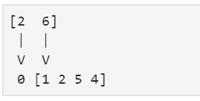
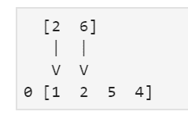
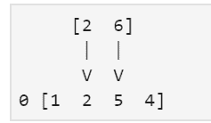
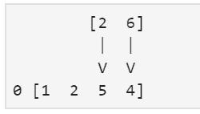

# 卷积层中填充的类型

> 原文:[https://www . geeksforgeeks . org/卷积层填充类型/](https://www.geeksforgeeks.org/types-of-padding-in-convolution-layer/)

让我们讨论卷积层中的填充及其类型。在卷积层，我们有核，为了使最终的滤波器更有信息，我们在图像矩阵或任何类型的输入数组中使用填充。我们有三种填充类型，如下所示。

1.  **Padding Full :**

    让我们假设内核是一个滑动窗口。我们必须想出在输入数组中填充零的解决方案。这是一个非常著名的实现，通过一个简单的例子将更容易展示它是如何工作的，考虑 x 作为过滤器，h 作为输入数组。

    x[i] = [6，2]
    h[i] = [1，2，5，4]

    使用零填充，我们可以计算卷积。

    你必须反转滤波器 x，否则运算将是互相关的。第一步，(现在有零填充):
    

    = 2 * 0 + 6 * 1 = 6

    第二步:
    

    = 2 * 1 + 6 * 2 = 14

    第三步:

    

    = 2 * 2 + 6 * 5 = 34

    第四步:

    

    = 2 * 5 + 6 * 4 = 34

    第五步:

    = 2 * 4 + 6 * 0 = 8

    这个例子的卷积结果，列出了上面所有的步骤，将是:Y = [6 14 34 34 8]

    ```
    # importing numpy
    import numpy as np

    x = [6, 2]
    h = [1, 2, 5, 4]

    y = np.convolve(x, h, "full")
    print(y)  
    ```

    **Output:**

    ```
    [ 6 14 34 34  8]

    ```

2.  **Padding same :**

    在这种类型的填充中，我们只在数组的左边和 2D 输入矩阵的顶部添加零。

    ```
    # importing numpy
    import numpy as np

    x = [6, 2]
    h = [1, 2, 5, 4]

    y = np.convolve(x, h, "same")
    print(y)
    ```

    **Output:**

    ```
    [ 6 14 34 34]

    ```

3.  **Padding valid :**

    在这种类型的填充中，随着输出数组的大小减小，我们得到了减小的输出矩阵。只有当我们在 h 数组上有一个兼容的位置时，我们才应用内核，在某些情况下，你需要降维。

    ```
    # importing numpy
    import numpy as np

    x = [6, 2]
    h = [1, 2, 5, 4]

    y = np.convolve(x, h, "valid")
    print(y)
    ```

    **Output:**

    ```
    [14 34 34]

    ```