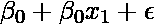
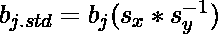
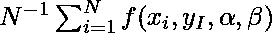
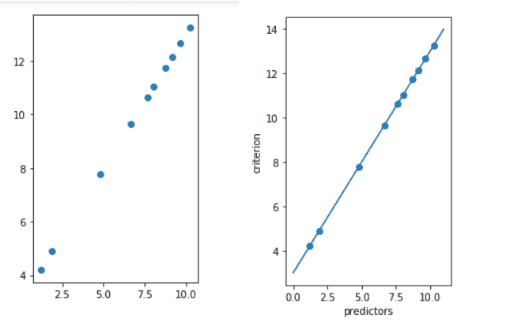

# ML |回归技术的类型

> 原文:[https://www . geeksforgeeks . org/回归技术类型/](https://www.geeksforgeeks.org/types-of-regression-techniques/)

**何时选择回归？**
一个回归问题是当输出变量是实值或连续值时，比如“工资”或“权重”。可以使用许多不同的模型，最简单的是线性回归。它试图用通过这些点的最佳超平面来拟合数据。

**回归分析**是估计因变量或标准变量与一个或多个自变量或预测值之间关系的统计过程。回归分析解释了与选定预测因子变化相关的标准变化。标准的条件期望基于预测器，当自变量改变时，因变量的平均值被给出。回归分析的三个主要用途是确定预测因子的强度、预测效果和趋势预测。

**回归类型:**

*   [**线性回归**](https://www.geeksforgeeks.org/ml-linear-regression/) 用于预测分析。线性回归是一种线性方法，用于模拟标准或标量响应与多个预测因子或解释变量之间的关系。线性回归关注给定预测值时响应的条件概率分布。对于线性回归，存在过度拟合的危险。线性回归的公式为:Y' = bX + A。
*   [**多项式回归**](https://www.geeksforgeeks.org/python-implementation-of-polynomial-regression/) 用于曲线数据。多项式回归用最小二乘法拟合。回归分析的目的是模拟因变量 y 相对于自变量 x 的期望值。多项式回归的方程是:l = 。
*   **逐步回归**用于拟合回归模型和预测模型。它是自动执行的。随着每一步，变量被添加或从解释变量集合中减去。逐步回归的方法有向前选择、向后消除和双向消除。逐步回归的公式是。
*   **岭回归**是一种分析多元回归数据的技术。当多重共线性发生时，最小二乘估计是无偏的。一定程度的偏差被添加到回归估计中，结果，岭回归减少了标准误差。岭回归的公式是。
*   **套索回归**是一种同时执行变量选择和正则化的回归分析方法。套索回归使用软阈值。套索回归只选择提供的协变量的一个子集用于最终模型。套索回归是。
*   **ElasticNet 回归**是一种正则化回归方法，线性组合了套索和脊线方法的惩罚。ElasticNet 回归用于支持向量机、度量学习和投资组合优化。罚函数由给出。
    下面是简单的实现:

## 蟒蛇 3

```
# importing libraries
import numpy as np
import matplotlib.pyplot as plt
from sklearn.linear_model import LinearRegression

x = 11 * np.random.random((10, 1))

# y = a * x + b
y = 1.0 * x + 3.0

# create a linear regression model
model = LinearRegression()
model.fit(x, y)

# predict y from the data where the x is predicted from the x
x_pred = np.linspace(0, 11, 100)
y_pred = model.predict(x_pred[:, np.newaxis])

# plot the results
plt.figure(figsize =(3, 5))
ax = plt.axes()
ax.scatter(x, y)

ax.plot(x_pred, y_pred)
ax.set_xlabel('predictors')
ax.set_ylabel('criterion')
ax.axis('tight')

plt.show()
```

**输出:**

