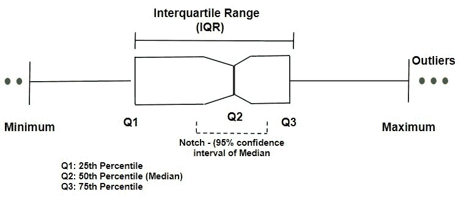
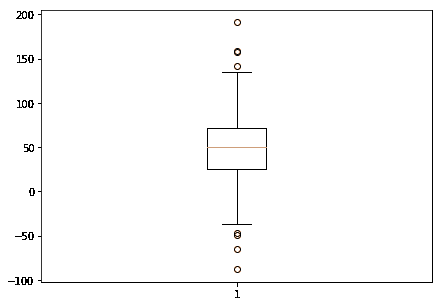
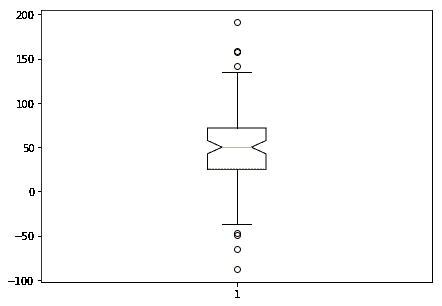
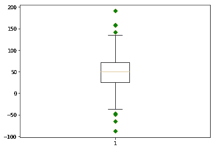
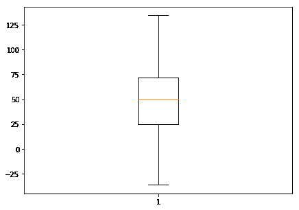
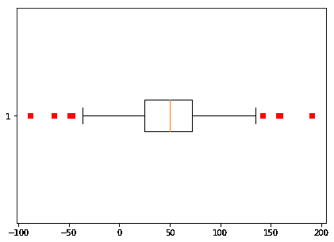
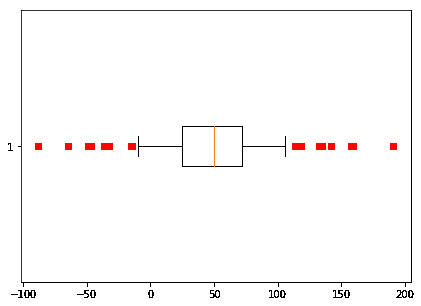

# 可视化理解不同的箱线图

> 原文:[https://www . geeksforgeeks . org/understand-box-plot-with-vision/](https://www.geeksforgeeks.org/understanding-different-box-plot-with-visualization/)

让我们看看 boxplot 如何以不同的方式发挥作用。



**加载库**

```
import numpy as np
import pandas as pd
import matplotlib.pyplot as plt
```

**准备数据**

```
spread = np.random.rand(50) * 100
center = np.ones(25) * 50
flier_high = np.random.rand(10) * 100 + 100
flier_low = np.random.rand(10) * -100
data = np.concatenate((spread, center, flier_high, flier_low), 0)

print (data)
```

**输出:**

```
[ 35.94741387  98.49500418  37.2487085   93.19618571   6.34263359
  49.10532713  53.86860981  58.59362227  36.96325746  62.27757508
  65.44118887  73.79592156  95.15399991  79.94114982  16.64273792
  88.35737021  14.84581489   0.76759854  91.61486239  16.03299406
  73.12589808   8.63636833  33.25606049  46.05712779  81.60993207
  95.0390852   43.94169286   2.96961334  38.21446718  12.15763603
   8.79716665  61.18542821  70.93695599  48.90136391  54.6233727
  77.27315695  14.63597135  68.22763576  52.23548596  14.34491407
  55.53669512  93.63144771  15.66242535  72.47360029  67.82493039
   0.34568417  63.39884046   0.46750944  70.39370656  83.42420235
  50\.          50\.          50\.          50\.          50.
  50\.          50\.          50\.          50\.          50.
  50\.          50\.          50\.          50\.          50.
  50\.          50\.          50\.          50\.          50.
  50\.          50\.          50\.          50\.          50.
 134.61039367 133.42423423 132.77938791 157.75858139 105.99552891
 159.1713425  190.9938417  118.33354777 142.13310114 113.54291724
 -32.73427425 -34.92884623 -49.28116565 -15.24891626 -14.57460618
  -9.48256045 -46.74250253 -36.3992666  -88.14980994 -64.49187441]
```

**代码#1:** 正常箱线图

```
plt.figure(figsize = (7, 5))
plt.boxplot(data)

plt.show()
```

**输出:**


**代码#2:** 凹口方框图

```
plt.figure(figsize = (7, 5))
plt.boxplot(data, 1)

plt.show()
```

**输出:**


**代码#3:** 显示异常值的箱线图

```
plt.figure(figsize = (7, 5))
plt.boxplot(data, 0, 'gD')

plt.show()
```

**输出:**


**代码#4:** 无异常值的箱线图

```
plt.figure(figsize = (7, 5))
plt.boxplot(data, 0, '')

plt.show()
```

**输出:**


**代码#5:** 水平方框图

```
plt.figure(figsize = (7, 5))
plt.boxplot(data, 0, 'rs', 0)

plt.show()
```

**输出:**


**代码#6:** 改变胡须长度的水平方框图

```
plt.figure(figsize = (7, 5))
plt.boxplot(data, 0, 'rs', 0, 0.75)

plt.show()
```

**输出:**
