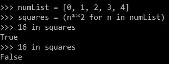
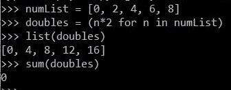
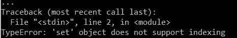
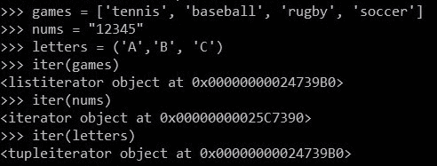
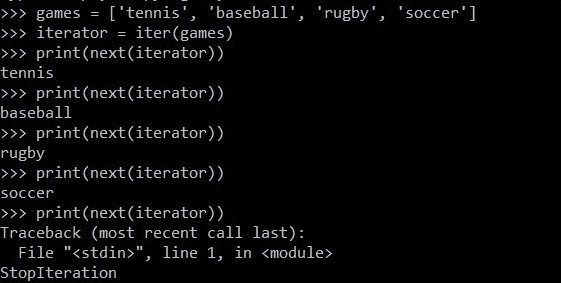
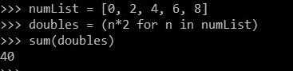

# 理解 Python 中的 for-loop

> 原文:[https://www . geesforgeks . org/理解为 python 中的循环/](https://www.geeksforgeeks.org/understanding-for-loop-in-python/)

Pythonic for 循环与其他编程语言的 for 循环非常不同。Python 中的 for 循环用于循环迭代器，而在其他语言中，它用于循环条件。在本文中，我们将更深入地探讨皮托尼克循环，并见证这种不同背后的原因。让我们从熟悉循环陷阱开始:

## 循环中有陷阱

如果一个人不知道“gotcha”是什么意思:*编码中的“gotcha”是一个术语，用于描述一种编程语言的特征(比如 for-loop、function、return 语句等)，这种语言可能会通过表现出与预期结果不匹配的行为来耍花招。*以下是两个臭名昭著的 for-loop 陷阱:

考虑这个例子:

```py
numList = [0, 1, 2, 3, 4]
squares = (n**2 for n in numList)
```

这里，变量`squares`包含`numList`元素的可迭代平方。如果我们检查 16 是否在`squares`，我们得到真，但是如果我们再次检查，我们得到假。



**一个 for 循环的和:**

看看这个:

```py
numList = [0, 2, 4, 6, 8]
doubles = (n * 2 for n in numList)
```

我们可以把这个`doubles`做成一个列表或者元组来查看它的元素。让我们计算双打中元素的总和。按照预期结果应该是 40。
但是，我们得到的却是 0。



为了理解这种异常，让我们首先看看 for 循环的“幕后”工作。

## 在 for 循环中

如前所述，其他编程语言(如 C、C++、Java)的 for 循环会在一个条件上循环。例如:

```py
let numList = [0, 1, 2, 3, 4];
for (let i = 0; i < numList.length; i += 1) {
    print(numList[i])
}
```

上面的代码是用 Javascript 写的。正如所看到的，for 循环与我们在 Python 中看到的完全不同。这是因为我们在 Python 中所说的 for 循环实际上是一个“ [foreach](https://en.wikipedia.org/wiki/Foreach_loop) ”循环。foreach 循环不像 for 循环那样维护计数器。for 循环处理可迭代元素的索引，而不是元素本身。但是 foreach 循环直接作用于元素而不是它们的索引，因此没有条件，没有初始化，也没有索引的递增。

```py
numList = [0, 1, 2, 3, 4]

# for loop in Python
for n in numList: 
    print(n)
```

因此，说我们在 Python 中没有 for 循环，但是我们有 foreach 循环，它们是作为 for 循环实现的，这并没有错！
有人可能会认为 Python 使用引擎盖下的索引在 for 循环中循环。但答案是否定的。让我们看一个例子来证明这一点:
我们将借助 while 循环来使用索引。

```py
games = { 'tennis', 'baseball', 'rugby', 'soccer' } 
i = 0

while i < len(games):
    print(games[i])
    i += 1
```

**输出:**



这证明 Python 没有使用索引进行循环，因此我们不能使用索引来循环所有内容。现在出现了一个简单的问题，Python 使用什么来循环？答案是，迭代器！

## 迭代程序

我们知道什么是 iterables(列表、字符串、元组等)。迭代器可以被认为是迭代器的电源。iterable 由迭代器组成，这是帮助 Python 在 iterable 上循环的事实。为了从可迭代表中提取迭代器，我们使用 Python 的`iter`函数。



让我们看一个例子:

```py
games = ['tennis', 'baseball', 'rugby', 'soccer']
iterator = iter(games)

# we use the next() function to 
# print the next item of iterable
print(next(iterator)) 
print(next(iterator))
print(next(iterator))
```

如果我们继续使用`next()`函数，即使我们到达最后一项，我们也会得到一个停止迭代错误。

**注意:**迭代器中的一个项一旦全部用完(迭代)，就会从内存中删除！



现在我们知道了循环是如何工作的，让我们试着利用迭代器的能力来创建我们自己的循环。

```py
# Python program to demonstrate
# power of iterators

# creating our own loop
def newForLoop(iterable): 

    # extracting iterator out of iterable
    iterator = iter(iterable) 

    # condition to check if looping is done
    loopingFinished = False 

    while not loopingFinished:
        try:
            nextItem = next(iterator)
        except StopIteration:
            loopingFinished = True
        else:
            print(nextItem)

# Driver's code
newForLoop([1, 2, 3, 4])
```

**输出:**

```py
1
2
3
4

```

我们需要学习迭代器，因为我们几乎每次都使用迭代器，甚至都不知道它。最常见的例子是发电机。生成器是迭代器。我们可以将迭代器的每一个函数应用于生成器。

```py
numList = [0, 2, 4]

# creating a generator named "squares"
squares = (n**2 for n in numList) 

print(next(squares))
print(next(squares))
print(next(squares))
```

**输出:**

```py
0 
4 
16

```

## 解决循环问题

现在我们知道了 for-loops 的确切含义以及它们在 Python 中是如何工作的，我们将从我们开始的地方结束这篇文章，也就是说，尝试推理出前面看到的循环陷阱。

**部分耗尽迭代器:**

当我们这样做的时候:

```py
numList = [0, 1, 2, 3, 4]
squares = (n**2 for n in numList)
```

并询问 9 是否在`squares`中，我们得到了 True。但是再次询问会得到一个假的结果。这是因为当我们第一次问 9 是否存在时，它会遍历迭代器(生成器)来找到 9，我们知道一旦到达迭代器中的下一项，前一项就会被删除。这就是为什么一旦我们找到 9，9 之前的所有数字都会被删除，再次询问会返回 False。因此，我们已经部分用完了迭代器。

**完全耗尽迭代器:**

在本代码中:

```py
numList = [0, 2, 4, 6, 8]
doubles = (n * 2 for n in numList)
```

当我们将`doubles`转换为列表时，我们已经通过这样做在迭代器中迭代了每个项目。因此，迭代器完全耗尽，最后，没有项目保留在其中。这就是元组上的函数`sum()`返回 0 的原因。如果我们在没有把它转换成列表的情况下进行求和，它将返回正确的输出。

