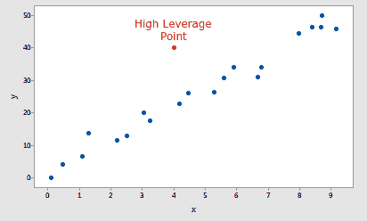
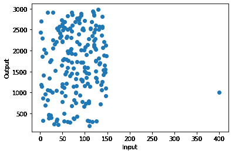
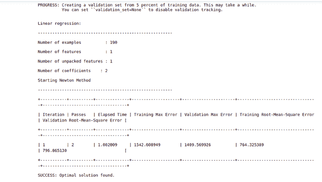
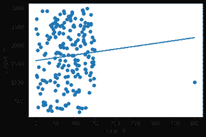
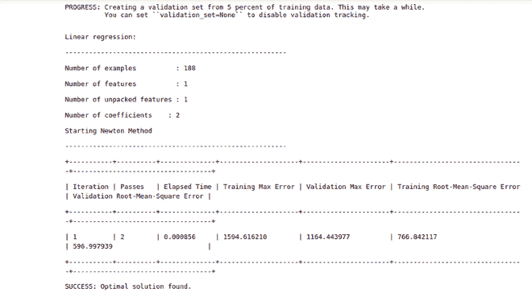
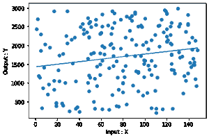
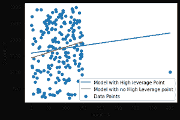
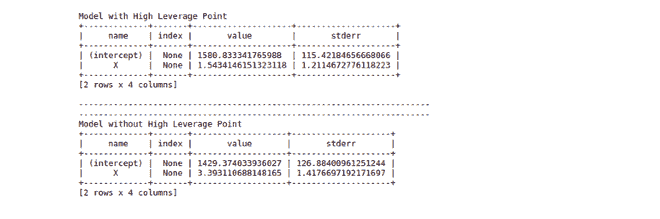

# 使用图创建

了解高杠杆点

> 原文:[https://www . geeksforgeeks . org/了解-高杠杆-使用点-turicreate/](https://www.geeksforgeeks.org/understanding-high-leverage-point-using-turicreate/)

**高杠杆点:**如果某个数据点具有极端预测值输入值，则该数据点被视为高杠杆点。与整个数据集中的其他数据点相比，极端输入值仅仅意味着极低或极高的值。它之所以在机器学习中是一个如此重要的概念，是因为它可能会极大地影响您的模型在特定数据上的适用性。



高杠杆点示例

> 在本教程中，我们将使用 turicreate 来理解高杠杆点的概念，因此请确保您的系统中安装了 turicreate，以便遵循本教程。更多关于 Turicreate 的信息，你可以在 [Turicreate](https://www.geeksforgeeks.org/guide-to-install-turicreate-in-python3-x/) 上查看这篇好文章。

所以让我们一步步来理解这个概念。

**步骤 1:** 我们将从导入本教程中需要的所有必需库开始。

*   [图创建](https://www.geeksforgeeks.org/guide-to-install-turicreate-in-python3-x/)来拟合我们的回归模型。
*   [Matplotlib](https://www.geeksforgeeks.org/python-introduction-matplotlib/) 用于可视化数据。
*   **随机数**用于生成随机数。

## 蟒蛇 3

```py
import turicreate 
import matplotlib.pyplot as plt
import random
```

**步骤 2:** 接下来，我们将生成一些数据来拟合我们的模型，并使用 matplotlib 可视化数据。

## 蟒蛇 3

```py
#Creating data point for this tutorial
X = [random.randrange(1, 150) for i in range(200)]
Y = [random.randrange(200, 3000) for i in range(200)]

#Creating a separate point to demonstrate high leverage points
X.append(400)
Y.append(1000)

#Creating a SArray and SFRame
Xs = turicreate.SArray(X)
Ys = turicreate.SArray(Y)
data_points = turicreate.SFrame({"X" : Xs, "Y" : Ys})

#Plotting the Data
plt.scatter(Xs, Ys)
plt.xlabel("Input")
plt.ylabel("Output")
plt.show()
```



输出

如图所示，与其他数据相比，在(400，1000)坐标中有一点沿着 x 轴非常远。那个点叫做**高杠杆点。**

**第三步:**现在，我们将在数据上拟合一个回归模型。

## 蟒蛇 3

```py
#Fitting a linear Regression model with the given data
model = turicreate.linear_regression.create(data_points, 
                                            target = "Y", 
                                            features = ["X"])

#Plotting the fitted model
plt.scatter(data_points["X"], data_points["Y"])
plt.xlabel("Input : X")
plt.ylabel("Output : Y")
plt.plot(data_points["X"], model.predict(data_points))
plt.show()
```



输出



拟合图

**第 4 步:**现在再次拟合回归模型，但这次我们将移除**高杠杆数据点**。

## 蟒蛇 3

```py
#Training the regression model with the data that do not
#contain high leverage point
model_nohlp = turicreate.linear_regression.create(
  data_points_with_no_high_leverage_points, target = "Y", features = ["X"])

#Plotting the fitted model having no high leverage point
plt.scatter(data_points_with_no_high_leverage_points["X"], 
            data_points_with_no_high_leverage_points["Y"])
plt.xlabel("Input : X")
plt.ylabel("Output : Y")
plt.plot(data_points_with_no_high_leverage_points["X"], 
         model_nohlp.predict(data_points_with_no_high_leverage_points))
plt.show()
```



输出



拟合图

**第五步:**到目前为止你还无法确定这两款车型的实际区别。因此，让我们将这两种情况想象成同一幅图，以便更好地理解差异。

## 蟒蛇 3

```py
#Plotting both the fitted model in order to compare the results better
plt.scatter(data_points["X"], data_points["Y"], label = "Data Points")
plt.xlabel("Input : X")
plt.ylabel("Output : Y")

plt.plot(data_points["X"], model.predict(data_points), 
         label = "Model with High leverage Point")
plt.plot(data_points_with_no_high_leverage_points["X"], 
         model_nohlp.predict(data_points_with_no_high_leverage_points), 
         label = "Model with no High Leverage point")

plt.legend()
plt.show()
```

## 蟒蛇 3

```py
#Plotting both the fitted model in order to compare the results better
plt.scatter(data_points["X"], data_points["Y"], label = "Data Points")
plt.xlabel("Input : X")
plt.ylabel("Output : Y")

plt.plot(data_points["X"], model.predict(data_points), 
         label="Model with High leverage Point")

plt.plot(data_points_with_no_high_leverage_points["X"], 
         model_nohlp.predict(data_points_with_no_high_leverage_points), 
         label = "Model with no High Leverage point")

plt.legend()
plt.show()
```



输出

正如你在图中可以清楚地看到的那样，两个图之间有一点不同，这只是通过去掉一个点而产生的。

**第六步:**现在我们来计算一下这两个拟合的实际差值。为此，我们将计算两个模型的回归系数。

## 蟒蛇 3

```py
#Compairing the regression coefficients of both the models
print(f"""
Model with High Leverage Point
{model.coefficients}
-----------------------------------------------------------------------
-----------------------------------------------------------------------
Model without High Leverage Point
{model_nohlp.coefficients}
""")
```



输出

从图中可以清楚地看到，两个模型的系数之间的差异并没有那么大，但是在有实际数据和数据量确实巨大的现实项目中，它可能会极大地影响模型的拟合度，但是分析师仍然需要在不急于得出任何结论的情况下，找出一个数据点是否实际上是高杠杆。

在这种情况下，我们使用[简单线性回归](https://www.geeksforgeeks.org/linear-regression-python-implementation/)来拟合我们的数据，所以我们可以简单地在二维图中可视化数据，但是在多元线性回归的情况下，我们没有那么奢侈。在这种情况下，我们必须依靠各种措施来帮助我们确定一个数据点是否是高杠杆点。