# 理解逻辑回归

> 原文:[https://www . geesforgeks . org/understanding-logistic-revolution/](https://www.geeksforgeeks.org/understanding-logistic-regression/)

**先决条件:** [线性回归](https://www.geeksforgeeks.org/linear-regression-python-implementation/)
本文讨论了逻辑回归的基础知识及其在 Python 中的实现。逻辑回归基本上是一种监督分类算法。在分类问题中，目标变量(或输出)y 只能取给定特征集(或输入)x 的离散值。
与普遍看法相反，逻辑回归是一种回归模型。该模型建立了一个回归模型来预测给定的数据条目属于编号为“1”的类别的概率。就像线性回归假设数据遵循线性函数一样，逻辑回归使用 sigmoid 函数对数据建模。
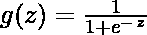

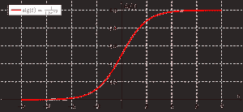

逻辑回归只有在考虑到决策阈值时才成为一种分类技术。阈值的设置是逻辑回归的一个非常重要的方面，并且取决于分类问题本身。
阈值值的决定主要受[精度和召回率的影响。](https://www.geeksforgeeks.org/confusion-matrix-machine-learning/)理想情况下，我们希望精确度和召回率都为 1，但这种情况很少发生。在精度-召回权衡的情况下，我们使用以下参数来决定阈值:-
**1。低精度/高召回率:**在我们希望减少假阴性而不一定减少假阳性的应用中，我们选择精度值低或召回率值高的决策值。例如，在癌症诊断应用中，如果患者被错误地诊断为癌症，我们不希望任何受影响的患者被归类为未受影响，而不给予太多关注。这是因为癌症的缺失可以通过进一步的医学疾病来检测，但是疾病的存在不能在已经被拒绝的候选人中检测到。
**2。高精度/低召回率:**在我们希望减少误报而不一定减少漏报的应用中，我们选择具有高精度值或低召回率值的决策值。例如，如果我们对客户进行分类，他们对个性化广告的反应是积极的还是消极的，我们希望绝对确定客户对广告的反应是积极的，因为否则，消极的反应会导致客户潜在销售额的损失。
根据类别数，逻辑回归可分为:

1.  **二项式:**目标变量只能有 2 种可能的类型:“0”或“1”，可能代表“赢”vs“输”，“通过”vs“失败”，“死”vs“活”等。
2.  **多项式:**目标变量可以有 3 种或 3 种以上没有排序的可能类型(即类型没有数量意义)，如“疾病 A”vs“疾病 B”vs“疾病 C”。
3.  **序数:**用有序的类别处理目标变量。例如，考试分数可以分为:“非常差”、“差”、“好”、“非常好”。在这里，每个类别都可以得到一个像 0，1，2，3 这样的分数。

首先，我们探索逻辑回归最简单的形式，即**二项逻辑回归**。

### **二项逻辑回归**

考虑一个示例数据集，它将学习小时数与考试结果进行了映射。结果只能取两个值，即通过(1)或失败(0):

```py
Hours(x)
0.50
0.75
1.00
1.25
1.50
1.75
2.00
2.25
2.50
2.75
3.00
3.25
3.50
3.75
4.00
4.25
4.50
4.75
5.00
5.50

Pass(y)
0
0
0
0
0
0
1
0
1
0
1
0
1
0
1
1
1
1
1
1
```

所以，我们有

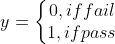

即 y 是一个分类目标变量，只能有两种可能类型:“0”或“1”。
为了推广我们的模型，我们假设:

*   数据集具有“p”个特征变量和“n”个观察值。
*   特征矩阵表示为:

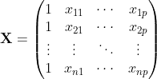

*   这里，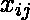表示观测的特征的值。
    在这里，我们保持着让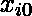 = 1 的惯例。(继续读，一会儿就明白逻辑了)。
*   观察，，可以表示为:

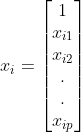

*   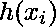代表观测的预测响应，即。我们用来计算的公式叫做**假设**。

如果你经历过线性回归，你应该记得在线性回归中，我们用于预测的假设是:

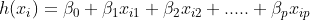

其中，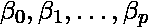为回归系数。
设回归系数矩阵/向量，为:

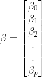

然后，以更紧凑的形式，

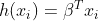

> 服用 = 1 的原因现在已经很清楚了。
> 我们需要做一个矩阵乘积，但是在原始假设公式中没有
> 实际的乘以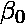。所以，我们定义 = 1。

现在，如果我们尝试将线性回归应用于上述问题，我们可能会使用上面讨论的假设获得连续值。同样，取大于 1 或小于 0 的值是没有意义的。
因此，对分类假设进行了一些修改:

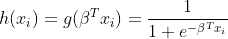

其中，

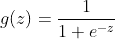

被称为逻辑函数或 T2 函数。
这里有一个显示 g(z)的图:

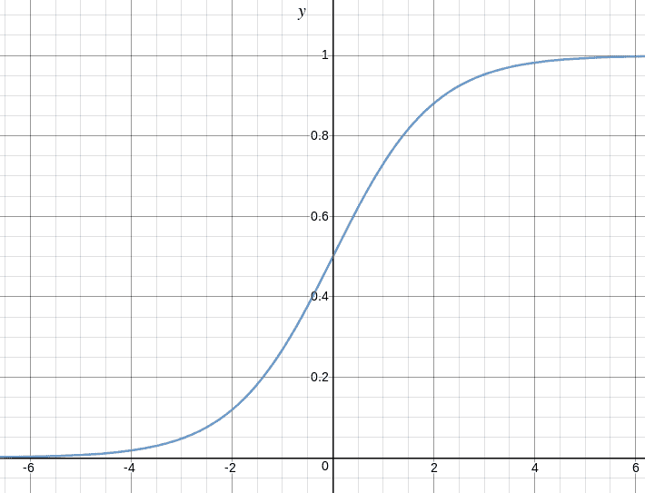

从上图我们可以推断:

*   当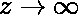时，g(z)趋于 1
*   当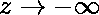时，g(z)趋于 0
*   g(z)总是在 0 和 1 之间有界

因此，现在，我们可以将观察的 2 个标签(0 和 1)的条件概率定义为:

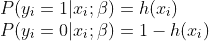

我们可以更简洁地写为:

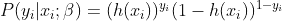

现在，我们定义另一个术语，参数的**可能性为:** 

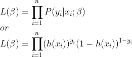

> *可能性无非是数据的概率(训练示例)，给定一个模型和具体的参数值(这里，*  *)。它测量数据为*  *的每个可能值提供的支持。我们通过将所有*  *乘以给定的*  *得到它。*

为了便于计算，我们采用**对数似然:**

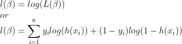

逻辑回归的**成本函数**与参数似然性的倒数成正比。因此，我们可以使用对数似然方程获得成本函数 J 的表达式为:

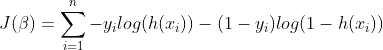

而我们的目标是估算使成本函数最小化！！

**使用梯度下降算法**

首先，我们对每个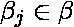取的偏导数来推导随机梯度下降规则(这里我们只给出最终的推导值):

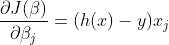

这里，y 和 h(x)分别表示响应向量和预测响应向量。此外，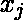是表示特征的观察值的向量。
现在，为了得到敏，


其中称为**学习率**，需要明确设置。
让我们在一个样本数据集上看看上述技术的 python 实现(从[这里](https://github.com/nikhilkumarsingh/Machine-Learning-Samples/blob/master/Logistic_Regression/dataset1.csv)下载):2.25
2.50
2.75
3.00
3.25
3.50
3.75
4.00
4.25
4.50
4.75
5.00
5.25

## 计算机编程语言

```py
import csv
import numpy as np
import matplotlib.pyplot as plt

def loadCSV(filename):
    '''
    function to load dataset
    '''
    with open(filename,"r") as csvfile:
        lines = csv.reader(csvfile)
        dataset = list(lines)
        for i in range(len(dataset)):
            dataset[i] = [float(x) for x in dataset[i]]    
    return np.array(dataset)

def normalize(X):
    '''
    function to normalize feature matrix, X
    '''
    mins = np.min(X, axis = 0)
    maxs = np.max(X, axis = 0)
    rng = maxs - mins
    norm_X = 1 - ((maxs - X)/rng)
    return norm_X

def logistic_func(beta, X):
    '''
    logistic(sigmoid) function
    '''
    return 1.0/(1 + np.exp(-np.dot(X, beta.T)))

def log_gradient(beta, X, y):
    '''
    logistic gradient function
    '''
    first_calc = logistic_func(beta, X) - y.reshape(X.shape[0], -1)
    final_calc = np.dot(first_calc.T, X)
    return final_calc

def cost_func(beta, X, y):
    '''
    cost function, J
    '''
    log_func_v = logistic_func(beta, X)
    y = np.squeeze(y)
    step1 = y * np.log(log_func_v)
    step2 = (1 - y) * np.log(1 - log_func_v)
    final = -step1 - step2
    return np.mean(final)

def grad_desc(X, y, beta, lr=.01, converge_change=.001):
    '''
    gradient descent function
    '''
    cost = cost_func(beta, X, y)
    change_cost = 1
    num_iter = 1

    while(change_cost > converge_change):
        old_cost = cost
        beta = beta - (lr * log_gradient(beta, X, y))
        cost = cost_func(beta, X, y)
        change_cost = old_cost - cost
        num_iter += 1

    return beta, num_iter

def pred_values(beta, X):
    '''
    function to predict labels
    '''
    pred_prob = logistic_func(beta, X)
    pred_value = np.where(pred_prob >= .5, 1, 0)
    return np.squeeze(pred_value)

def plot_reg(X, y, beta):
    '''
    function to plot decision boundary
    '''
    # labelled observations
    x_0 = X[np.where(y == 0.0)]
    x_1 = X[np.where(y == 1.0)]

    # plotting points with diff color for diff label
    plt.scatter([x_0[:, 1]], [x_0[:, 2]], c='b', label='y = 0')
    plt.scatter([x_1[:, 1]], [x_1[:, 2]], c='r', label='y = 1')

    # plotting decision boundary
    x1 = np.arange(0, 1, 0.1)
    x2 = -(beta[0,0] + beta[0,1]*x1)/beta[0,2]
    plt.plot(x1, x2, c='k', label='reg line')

    plt.xlabel('x1')
    plt.ylabel('x2')
    plt.legend()
    plt.show()

if __name__ == "__main__":
    # load the dataset
    dataset = loadCSV('dataset1.csv')

    # normalizing feature matrix
    X = normalize(dataset[:, :-1])

    # stacking columns with all ones in feature matrix
    X = np.hstack((np.matrix(np.ones(X.shape[0])).T, X))

    # response vector
    y = dataset[:, -1]

    # initial beta values
    beta = np.matrix(np.zeros(X.shape[1]))

    # beta values after running gradient descent
    beta, num_iter = grad_desc(X, y, beta)

    # estimated beta values and number of iterations
    print("Estimated regression coefficients:", beta)
    print("No. of iterations:", num_iter)

    # predicted labels
    y_pred = pred_values(beta, X)

    # number of correctly predicted labels
    print("Correctly predicted labels:", np.sum(y == y_pred))

    # plotting regression line
    plot_reg(X, y, beta)
```

```py
Estimated regression coefficients: [[  1.70474504  15.04062212 -20.47216021]]
No. of iterations: 2612
Correctly predicted labels: 100
```

[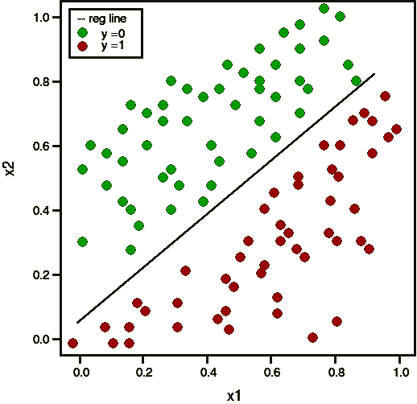](https://media.geeksforgeeks.org/wp-content/uploads/estimated-regression-result.png)

注:梯度下降是众多估算的方法之一。
基本上，这些是更高级的算法，一旦定义了成本函数和梯度，就可以很容易地在 Python 中运行。这些算法是:

*   BFGS(布赖登-弗莱彻-戈德法布-尚诺算法)
*   BFGS(像 BFGS 一样，但使用有限的内存)
*   共轭梯度

**使用这些算法中的任何一个相对于梯度下降的优点/缺点:**

*   优势
    *   不需要挑学习率
    *   经常跑得更快(并非总是如此)
    *   可以用数字近似梯度(并不总是有效)
*   不足之处
    *   更复杂
    *   更多的是一个黑匣子，除非你了解细节

### **多项式逻辑回归**

在多项式逻辑回归中，输出变量可以有**两个以上可能的离散输出**。考虑[数字数据集](http://archive.ics.uci.edu/ml/datasets/Pen-Based+Recognition+of+Handwritten+Digits)。这里，输出变量是可以取值的数字值(0，12，3，4，5，6，7，8，9)。
下面给出了使用 scikit-learn 对数字数据集进行预测的多项式逻辑回归的实现。

## 计算机编程语言

```py
from sklearn import datasets, linear_model, metrics

# load the digit dataset
digits = datasets.load_digits()

# defining feature matrix(X) and response vector(y)
X = digits.data
y = digits.target

# splitting X and y into training and testing sets
from sklearn.model_selection import train_test_split
X_train, X_test, y_train, y_test = train_test_split(X, y, test_size=0.4,
                                                    random_state=1)

# create logistic regression object
reg = linear_model.LogisticRegression()

# train the model using the training sets
reg.fit(X_train, y_train)

# making predictions on the testing set
y_pred = reg.predict(X_test)

# comparing actual response values (y_test) with predicted response values (y_pred)
print("Logistic Regression model accuracy(in %):",
metrics.accuracy_score(y_test, y_pred)*100)
```

```py
 Logistic Regression model accuracy(in %): 95.6884561892
```

最后，这里有几点关于逻辑回归的思考:

*   不假设因变量和自变量之间的线性关系，但假设解释变量的**逻辑和**响应**之间的线性关系。**
*   自变量甚至可以是原始自变量的幂项或其他一些非线性变换。
*   因变量不需要正态分布，但它通常假设指数族的分布(如二项式、泊松、多项式、正态……)；二元逻辑回归假设反应的二项分布。
*   不需要满足方差的同质性。
*   错误需要是独立的，但不是正态分布的。
*   它使用最大似然估计(MLE)而不是普通的最小二乘(OLS)来估计参数，因此依赖于**大样本近似**。

参考文献:

*   [http://cs229.stanford.edu/notes/cs229-notes1.pdf](http://cs229.stanford.edu/notes/cs229-notes1.pdf)
*   [http://machinelearning master . com/logistic-回归机器学习/](http://machinelearningmastery.com/logistic-regression-for-machine-learning/)
*   [https://onlinecourses.science.psu.edu/stat504/node/164](https://onlinecourses.science.psu.edu/stat504/node/164)

本文由**尼克尔·库马尔**供稿。如果你喜欢 GeeksforGeeks 并想投稿，你也可以使用[write.geeksforgeeks.org](http://www.write.geeksforgeeks.org)写一篇文章或者把你的文章邮寄到 review-team@geeksforgeeks.org。看到你的文章出现在极客博客主页上，帮助其他极客。
如果你发现任何不正确的地方，或者你想分享更多关于上面讨论的话题的信息，请写评论。