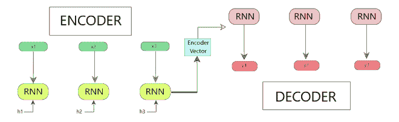
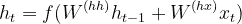
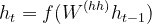
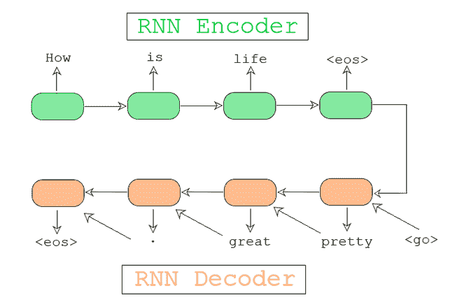
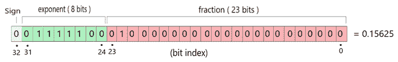
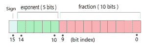
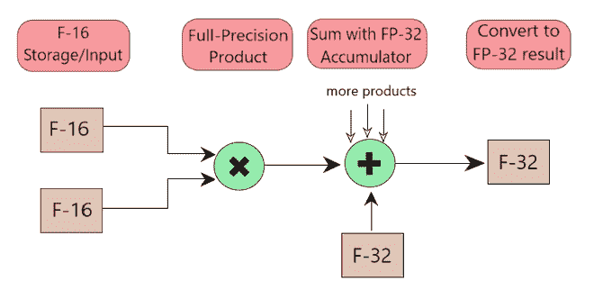
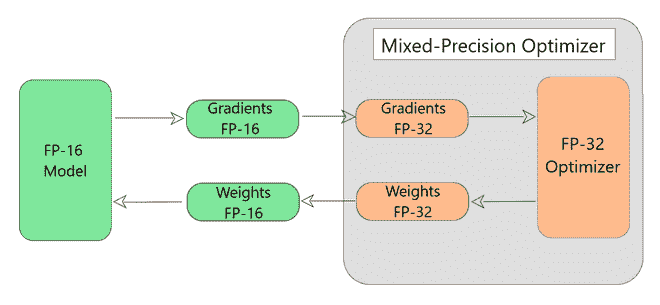

# 对 OpenSeq2Seq 的理解

> 原文:[https://www.geeksforgeeks.org/understanding-of-openseq2seq/](https://www.geeksforgeeks.org/understanding-of-openseq2seq/)

**前提条件:**[【ltm】](https://www.geeksforgeeks.org/long-short-term-memory-networks-explanation/)、[起重机](https://www.geeksforgeeks.org/gated-recurrent-unit-networks/)

在本文中，我们将讨论一个深度学习工具包，用于提高当前**语音识别**模型的训练时间，以及**自然语言翻译**、**语音合成**和**语言建模**等。使用该工具包构建的模型以 1.5-3 倍的训练时间提供了最先进的性能。

**OpenSeq2Seq**

OpenSeq2Seq 是一个基于开源 TensorFlow 的工具包，具有多 GPU 和混合精度训练的特点，可以显著减少各种 NLP 模型的训练时间。例如，

```py
1\. Natural Language Translation: GNMT, Transformer, ConvS2S
2\. Speech Recognition: Wave2Letter, DeepSpeech2
3\. Speech Synthesis: Tacotron 2

```

它使用序列到序列范例来构建和训练模型，以执行各种任务，如机器翻译、文本摘要。

**序列到序列模型**

该模型由 3 部分组成:*编码器*、*编码器矢量*和*解码器*。

<center>

**图 1:编码器-解码器序列到序列模型**

</center>

*   **编码器**
    *   在这种情况下，像 LTSM *(长短期记忆)*和 GRU *(门控循环单位)*这样的循环单位用于增强性能。
    *   这些循环单元中的每一个都接受输入序列中的单个元素，收集该元素的信息并将其向前传播。
    *   输入序列是问题中所有单词的集合。
    *   隐藏状态(h <sub>1</sub> 、h<sub>2</sub>……、h <sub>n</sub> )使用以下公式计算。**【等式 1】**

<center>

**等式 1**

</center>

```py
where, 
ht = hidden state
ht-1 = previous hidden state
W(hh) = weights attached to the previous hidden state. (ht-1) 
xt = input vector 
W(hx) = weights attached to the input vector.

```

*   **编码器矢量**
    *   最终隐藏状态是使用模型编码器部分的等式 1 计算的。
    *   编码器向量收集所有输入元素的信息，以帮助解码器做出准确的预测。
    *   它作为模型解码器部分的初始隐藏状态。

*   **解码器**
    *   在这种情况下，存在几个循环单元，其中每个单元在时间步长 t 预测输出 y <sub>t</sub>
    *   每个循环单元接受前一个单元的隐藏状态，并产生一个输出以及它自己的隐藏状态。
    *   隐藏状态(h <sub>1</sub> 、h<sub>2</sub>……、h <sub>n</sub> )使用以下公式计算。**【方程 2】**

<center>

**Eqn 2**

</center>

例如，图 1。显示对话系统的顺序到顺序模型。

<center>

**图 2:对话系统的序列到序列模型**

</center>

每个序列到序列模型都有一个编码器和一个解码器。例如，

<figure class="table">

| 不。 | 工作 | 编码器 | 解码器 |
| --- | --- | --- | --- |
| 1. | 情感分析 | RNN | 线性软件最大值 |
| 2. | 图像分类 | 美国有线电视新闻网 | 线性软件最大值 |

</figure>

**设计与建筑**

OpenSeq2Seq 工具包提供了各种类，用户可以从中继承自己的模块。该模型分为 5 个不同的部分:

1.  数据层
2.  编码器
3.  解码器
4.  损失函数
5.  超参数
    *   【计算机】优化程序
    *   学习率
    *   拒绝传统社会的人
    *   正规化
    *   批次大小等。

```py
For example, an OpenSeq2Seq model for Machine Translation would look like :

Encoder - GNMTLikeEncoderWithEmbedding
Decoder - RNNDecoderWithAttention
Loss Function - BasicSequenceLoss
Hyperparameters - 
    Learning Rate = 0.0008
    Optimizer = 'Adam'
    Regularization = 'weight decay' 
    Batch_Size = 32

```

**混合精度训练:**

当使用 float16 训练大型神经网络模型时，有时需要应用某些算法技术，并将一些输出保存在 float32 中。(因此得名，混合精度)。

**混合精度支持【使用算法】**

该模型使用张量流作为其基础，因此具有张量核，该张量核提供了训练大型神经网络所需的性能。它们允许以两种方式进行矩阵-矩阵乘法:

*   **单精度**浮点 **(FP-32)**
    *   单精度浮点格式是一种在计算机内存中占据 32 位(现代计算机中为 4 字节)的计算机数字格式。
    *   在 32 位浮点运算中，8 位用于指数(“幅度”)，23 位用于尾数(“精度”)。

*   **半精度浮点(FP-16)**
    *   半精度是二进制浮点格式是一种计算机数字格式，在计算机内存中占据 16 位(在现代计算机中是两个字节)。

此前，在训练神经网络时，由于各种原因，使用 **FP-32** (如图 2 所示)来表示网络中的权重，例如:

*   **更高的精度—** 32 位浮点运算具有足够的精度，因此我们可以区分不同幅度的数字。

*   **大范围—** 32 位浮点具有足够的范围来表示比大多数应用所需的更小(10^-45)和更大(10^38)的数量级。

*   **可支持—** 所有硬件(GPU、CPU)和 API 都非常高效地支持 32 位浮点指令。

<center>

**图 3: FP-32 表示**

</center>

但是，后来发现，对于最大深度学习模型，不需要这么大的规模和精度。因此，英伟达创建了支持 16 位浮点指令的硬件，并观察到大多数权重和梯度都在 16 位可表示范围内。

因此，在 OpenSeq2Seq 模型中，使用了 **FP-16** 。利用这一点，我们可以有效地防止浪费所有这些额外的比特。使用 FP-16，我们将位数减半，将指数从 8 位减少到 5 位，尾数从 23 位减少到 10 位。(如图 3 所示)

<center>

**图 4: FP-16 表示**

</center>

> **使用 FP-16** 的风险:
> 
> **1。下溢:**试图表示小到可以箝位到零的数字。
> T3】2。溢出:数字如此之大(在 FP-16 范围之外)，以至于它们变成了 NaN，而不是一个数字。
> 
> *   有了底流，我们的网络永远学不到任何东西。
> *   有了溢出，它就学会了垃圾。
> *   对于混合精度训练，我们遵循一个包含以下 2 个步骤的算法:

```py
Step 1 - Maintain float32 master copy of weights for weights update while using the float16 
     weights for forward and back propagation.     
Step 2 - Apply loss scaling while computing gradients to prevent underflow during backpropagation.

```



**图 FP16 中的算术运算和 FP32 中的累加**

OpenSeq2Seq 模型的混合精度训练涉及三件事:

1.  混合精度优化器
2.  混合精度正则化器
3.  自动损耗比例

**1。混合精度优化器**

默认情况下，模型的所有变量和梯度都是 FP-16，如图 6 所示。在此过程中会发生以下步骤:

<center>

**图 6:张量流优化器的混合精度包装器**

</center>

```py
Working of Mixed Precision Wrapper (Step by Step)

Each Iteration
{
    Step 1 - The wrapper automatically converts FP-16 gradients and FP-32 and feed them 
          to the tensorflow optimizer. 
    Step 2 - The tensorflow optimizer then updates the copy of weights in FP-32.
    Step 3 - The updated FP-32 weights are then converted back to FP-16.
    Step 4 - The FP-16 weights are then used by the model for the next iteration.   
}

```

**2。混合精度正则化**

如前所述，使用 F-16 的风险包括数值上溢/下溢。混合精度正则化确保这种情况不会在训练期间发生。因此，为了克服这些问题，我们采取了以下步骤:

```py
Step 1 - All regularizers should be defined during variable creation.

Step 2 - The regularizer function should be wrapped with the 'Mixed Precision Wrapper*'*. This takes care of 2 things:
    2.1 - Adds the regularized variables to a tensorflow collection.
    2.2 - Disables the underlying regularization function for FP-16 copy.

Step 3 - This collection is then retrieved by Mixed Precision Optimizer Wrapper.

Step 4 - The corresponding functions obtained from the MPO wrapper will be applied to the FP-32 copy 
of the weights ensuring that their gradients always stay in full precision. 

```

**3。自动损耗缩放**

OpenSeq2Seq 模型涉及自动损耗缩放。因此，用户不必手动选择损失值。优化器在每次迭代后分析梯度，并为下一次迭代更新损失值。

**涉及的车型**

OpenSeq2Seq 目前提供了各种模型的完整实现:

*   [机器翻译](https://nvidia.github.io/OpenSeq2Seq/html/machine-translation.html#machine-translation)
*   [语音识别](https://nvidia.github.io/OpenSeq2Seq/html/speech-recognition.html#speech-recognition)
*   [语音合成](https://nvidia.github.io/OpenSeq2Seq/html/speech-synthesis.html#speech-synthesis)
*   [情绪分析](https://nvidia.github.io/OpenSeq2Seq/html/sentiment-analysis.html#sentiment-analysis)
*   [图像分类](https://nvidia.github.io/OpenSeq2Seq/html/image-classification.html#image-classification)

OpenSeq2Seq 具有多种模型，用于语言建模、机器翻译、语音合成、语音识别、情感分析等。它旨在提供一个丰富的常用编码器和解码器库。这是 OpenSeq2Seq 模型的基本概述，涵盖了直觉、架构和相关概念。如有任何疑问/疑问，请在下面评论。