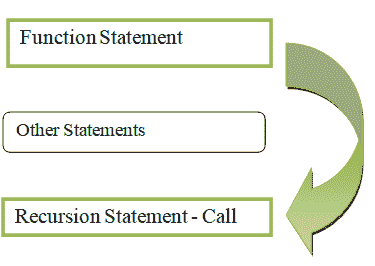

# 用 Python 理解递归函数

> 原文:[https://www . geesforgeks . org/understanding-recursive-functions-with-python/](https://www.geeksforgeeks.org/understanding-recursive-functions-with-python/)

[**递归**](https://www.geeksforgeeks.org/recursion-in-python/) 的特点是用事物本身来描述事物的过程；换句话说，就是函数自己命名的过程。递归是函数直接或隐式调用自身的机制，得到的函数称为**递归函数**。

### **优势:**

*   代码可重用性
*   容易理解
*   时间复杂度有时很低
*   代码数量减少

### **缺点:**

*   如果条件超过，导致溢出
*   更多内存
*   这很难理解
*   很难调试
*   递归中的终止条件是必须的

**语法:**

> def 函数名():
> 
> ……………..
> 
> |(递归调用)
> 
> ………………….
> 
> 函数名()



递归调用已经被调用的函数，并将调用多次，直到条件变为假。之后，它将返回值

### **应用:**

*   [河内塔](https://www.geeksforgeeks.org/c-program-for-tower-of-hanoi/)
*   堆栈实现
*   斐波那契实现
*   操作系统中的循环问题。

除了上面的应用之外，下面是一些描述如何在程序中使用递归函数的例子。

**例 1:**

Python 程序打印给定条件下的斐波那契数列。

> **斐波那契:**
> 
> 数字=两个先前数字的总和
> 
> 0,1
> 
> 0+1=1
> 
> 0+1=2
> 
> 2+1=3
> 
> 3+2=5
> 
> 5+3=8
> 
> 所以斐波那契数是 0，1，1，2，3，5，8。

在这个程序中，值是在 till_range 变量中定义的，然后我们将该变量传递给一个参数，然后调用递归函数。

```py
recursive_function(a-1) + recursive_function(a-2)
```

**实施:**

## 蟒蛇 3

```py
# Recursive function
def recursive_function(a):

    # Check number
    if a <= 1:
        return a
    else:

        # Get next term
        return(recursive_function(a-1) + recursive_function(a-2))

# Display first fibonacci number
print("\nFibonacci series upto 1 number:")
for i in range(1):
    print(recursive_function(i),
          end=" ")   

# Display first 5 fibonacci numbers
print("\nFibonacci series upto 5 numbers:")
for i in range(5):
    print(recursive_function(i),
          end=" ")

# Display first 10 fibonacci numbers
print("\nFibonacci series upto 10 numbers:")
for i in range(10):
    print(recursive_function(i),
          end=" ")   
```

**输出:**

```py
Fibonacci series upto 1 number:
0 
Fibonacci series upto 5 numbers:
0 1 1 2 3 
Fibonacci series upto 10 numbers:
0 1 1 2 3 5 8 13 21 34 
```

**例 2:**

Python 程序求一个数的阶乘。

> **因子**
> 
> Number = Number *(Number-1)*(Number-2)……*(Number-(Number+1))
> 
> 3 的阶乘= 3*2*1
> 
> 5 的阶乘= 5*4*3*2*1
> 
> 7 的阶乘= 7*6*5*4*3*2*1

在这个 python 程序中，我们将返回整数的阶乘。我们将变量 n 的值传递给一个参数，然后调用函数。

```py
a* recursion_factorial(a-1)
```

**实施:**

## 蟒蛇 3

```py
# recursive function
def recursion_factorial(a):

    # check number
    if a == 1:
        return 1
    else:

        # multiply with next number
        return (a * recursion_factorial(a-1))

# factorial of 7
n = 7
print("Factorial of", n, "is", recursion_factorial(n))

# factorial of 2
n = 2
print("Factorial of", n, "is", recursion_factorial(n))

# factorial of 4
n = 4
print("Factorial of", n, "is", recursion_factorial(n))

# factorial of 9
n = 9
print("Factorial of", n, "is", recursion_factorial(n))

# factorial of 10
n = 10
print("Factorial of", n, "is", recursion_factorial(n))
```

**输出:**

```py
Factorial of 7 is 5040
Factorial of 2 is 2
Factorial of 4 is 24
Factorial of 9 is 362880
Factorial of 10 is 3628800
```