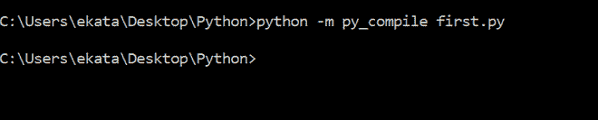
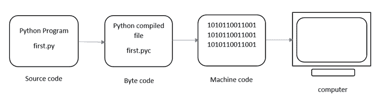
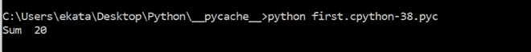
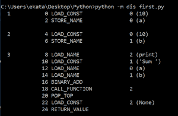

# 了解 Python 程序的执行

> 原文:[https://www . geesforgeks . org/了解-执行-python-program/](https://www.geeksforgeeks.org/understanding-the-execution-of-python-program/)

本文旨在提供对 Python 程序执行的详细了解。让我们考虑下面的例子。

**示例:**

## 蟒蛇 3

```py
a = 10
b = 10
print("Sum ", (a+b))
```

**输出:**

```py
Sum  20
```

假设上面的 python 程序先保存为**py**。首先是名字和。py 是扩展名。Python 程序的执行包括 2 个步骤:

*   汇编
*   解释者

## 汇编

程序被转换成**字节码。**字节码是一组固定的指令，代表算术、比较、内存操作等。它可以在任何操作系统和硬件上运行。字节码指令在**中创建。pyc** 文件。那个。pyc 文件不是显式创建的，因为 Python 在内部处理它，但是可以使用以下命令查看它:



-m 和 py_compile 分别代表模块和模块名。该模块负责生成。pyc 文件。编译器创建一个名为 __pycache__ 的目录，在其中存储第一个. cpython-38.pyc 文件。

## 解释者

下一步涉及转换字节码(。pyc 文件)转换成机器代码。这一步是必要的，因为计算机只能理解机器代码(二进制代码)。Python 虚拟机(PVM)首先了解计算机中的操作系统和处理器，然后将其转换为机器代码。此外，这些机器代码指令由处理器执行，并显示结果。



Python 程序的执行

然而，PVM 内部的解释器一行行地翻译程序，从而消耗大量时间。为了克服这一点，PVM 增加了一个名为“准时”的编译器。JIT 编译器提高了 Python 程序的执行速度。该编译器并不用于所有 Python 环境，如标准 Python 软件 CPython。

要执行 first.cpython-38.pyc，我们可以使用以下命令:



要查看文件的字节码–first . py，我们可以键入以下命令:



**dis** 命令被称为“反汇编程序”，它以可理解的格式显示字节码。该代码表示 5 列:

1.  行数
2.  字节码的偏移位置
3.  字节码指令的名称
4.  指令的论点
5.  常数或名称(括号中)