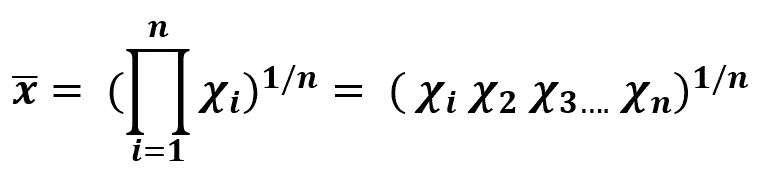
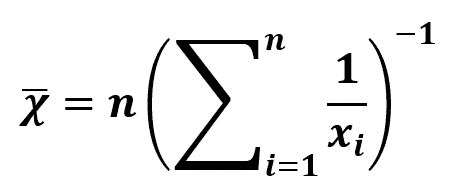
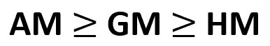

# 了解平均值的类型|第 2 集

> 原文:[https://www . geesforgeks . org/understanding-type-of-mean-set-2/](https://www.geeksforgeeks.org/understanding-types-of-mean-set-2/)

它是统计学中最重要的概念之一，是学习机器学习的关键学科。

*   **Geometric Mean:** Like arithmetic mean is the sum of all the discrete values in the set, Geometric mean is the product of discrete values in the set. It is useful for the set of positive discrete values.
    
    **Example –**

    ```
    Sequence = {1, 3, 9}

    product         = 27
    n, Total values = 3
    Harmonic Mean   = (27)^(1/3)

    ```

    **代码–**

    ```
    # Geometric Mean 

    import numpy as np

    # discrete set of numbers
    from scipy.stats.mstats import gmean
    x = gmean([1, 3, 9])

    # Mean 
    print("Geometric Mean is :", x) 
    ```

    **输出:**

    ```
    Geometric Mean is : 3
    ```

*   **Harmonic Mean :** Harmonic mean plays it roles when it comes to calculate the mean of the terms which are in defined in relation to any unit. It is the reciprocal of the mean of the reciprocals of the data. Itis used where inverse variation in relation is involved in the data.
    

    **示例–**

    ```
    Sequence = {1, 3, 9}

    sum of reciprocals = 1/1 + 1/3 + 1/9
    n, Total values    = 3
    Harmonic Mean      = 3 / (sum of reciprocals)

    ```

    **代码–**

    ```
    # Harmonic Mean 

    import numpy as np

    # discrete set of numbers
    from scipy.stats.mstats import hmean
    x = hmean([1, 3, 9])

    # Mean 
    print("Harmonic Mean is :", x) 
    ```

    **输出:**

    ```
    Harmonic Mean is : 2.076923076923077
    ```

*   **算术(AM)、调和(HM)和几何平均(GM)之间的关系:**
    
    **例–**

    ```
    Sequence = {1, 3, 9}

    sum of reciprocals = 1/1 + 1/3 + 1/9
    Sum                = 10
    Product            = 27
    n, Total values    = 3

    Arithmetic Mean = 4.33
    Geometric Mean  = 3 
    Harmonic Mean   = 3 / (sum of reciprocals) = 2.077

    ```