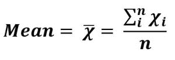
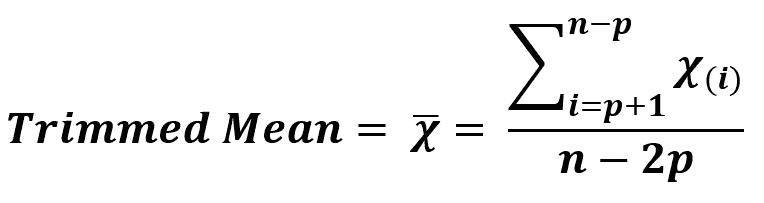
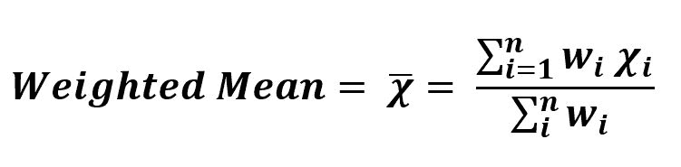

# 了解手段类型|第 1 套

> 原文:[https://www . geesforgeks . org/understanding-type-of-means-set-1/](https://www.geeksforgeeks.org/understanding-types-of-means-set-1/)

它是统计学中最重要的概念之一，是学习机器学习的关键学科。

*   **算术平均值:**是一组离散数字或平均值的数学期望。
    由 **X̂** 表示，发音为“x-bar”。它是集合中所有离散值的总和除以集合中值的总数。
    计算 n 值平均值的公式–x<sub>1</sub>，x <sub>2</sub> ，…..x <sub>n</sub>



*   **示例–**

```
Sequence = {1, 5, 6, 4, 4}

Sum             = 20
n, Total values = 5
Arithmetic Mean = 20/5 = 4
```

*   **代码–**

## 蟒蛇 3

```
# Arithmetic Mean

import statistics

# discrete set of numbers
data1 = [1, 5, 6, 4, 4]

x = statistics.mean(data1)

# Mean
print("Mean is :", x)
```

*   **输出:**

```
Mean is : 4
```

*   **修剪平均值:**算术平均值受数据中异常值(极值)的影响。因此，当我们在机器学习中处理这类数据时，在预处理时使用修剪平均值。
    这是一种有变化的算术，即通过从给定数据序列的每一端删除固定数量的排序值，然后计算剩余值的平均值(平均值)来计算。



*   **示例–**

```
Sequence = {0, 2, 1, 3}
p        = 0.25

Remaining Sequence  = {2, 1}
n, Total values = 2
Mean = 3/2 = 1.5
```

*   **代码–**

## 蟒蛇 3

```
# Trimmed Mean

from scipy import stats

# discrete set of numbers
data = [0, 2, 1, 3]

x = stats.trim_mean(data, 0.25)

# Mean
print("Trimmed Mean is :", x)
```

*   **输出:**

```
Trimmed Mean is : 1.5
```

*   **加权平均值:**算术平均值或修剪平均值对所有相关参数同等重要。但是每当我们在机器学习预测中工作时，有可能一些参数值比其他参数值更重要，因此我们为这些参数值分配了高权重。此外，我们的数据集可能有一个高度可变的参数值，因此我们给这些参数值分配较小的权重。



*   **示例–**

```
Sequence = [0, 2, 1, 3]
Weight   = [1, 0, 1, 1]

Sum (Weight * sequence)  = 0*1 + 2*0 + 1*1 + 3*1
Sum (Weight) = 3
Weighted Mean = 4 / 3 = 1.3333333333333333
```

*   **代码 1–**

## 蟒蛇 3

```
# Weighted Mean

import numpy as np

# discrete set of numbers
data = [0, 2, 1, 3]

x = np.average(data, weights =[1, 0, 1, 1])

# Mean
print("Weighted Mean is :", x)
```

*   **输出 1 :**

```
Weighted Mean is : 1.3333333333333333
```

*   **代码 2–**

## 蟒蛇 3

```
# Weighted Mean

data = [0, 2, 1, 3]
weights = [1, 0, 1, 1]

x = sum(data[i] * weights[i]
    for i in range(len(data))) / sum(weights)

print ("Weighted Mean is :", x)
```

*   **输出 2 :**

```
Weighted Mean is : 1.3333333333333333
```