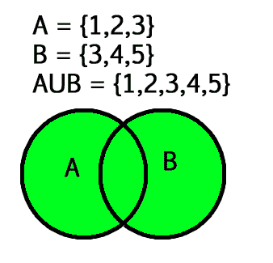

# Python 中的 Union()函数

> 原文:[https://www.geeksforgeeks.org/union-function-python/](https://www.geeksforgeeks.org/union-function-python/)

**Python 集合 Union()函数**返回一个包含原始集合中所有项目的新集合。

两个给定集合的并集是包含两个集合的所有元素的最小集合。两个给定集合 A 和 B 的并集是由 A 的所有元素和 B 的所有元素组成的集合，因此没有元素重复。



表示集合并的符号是**‘U’**

**示例:**

> **输入:**让集合 A = {2，4，5，6}和集合 B = {4，6，7，8}
> 
> **输出:** {2，4，5，6，7，8}
> 
> **说明:**取集合 A 和集合 B 的每个元素，不重复任何元素，得到一个新的集合= {2，4，5，6，7，8}。这个新集合包含集合 A 的所有元素和集合 B 的所有元素，没有重复的元素，被命名为集合 A 和集合 B 的并集。

### **Python 集 Union()语法:**

> set1.union(set2，set3，set4…)
> 
> 在参数中，可以给出任意数量的集合

### **Python 集 Union()返回值:**

> union()函数返回一个集合，它包含所有集合(set1，set2，set3…)与 set1 的并集。只有在没有传递参数的情况下，它才会返回 set1 的副本。

## **Python 集合 Union()方法示例:**

### 示例 1:使用 **Python 集合 Union()方法**

## 蟒蛇 3

```py
# Python3 program for union() function

set1 = {2, 4, 5, 6}
set2 = {4, 6, 7, 8}
set3 = {7, 8, 9, 10}

# union of two sets
print("set1 U set2 : ", set1.union(set2))

# union of three sets
print("set1 U set2 U set3 :", set1.union(set2, set3))
```

**输出:**

```py
set1 U set2 :  {2, 4, 5, 6, 7, 8}
set1 U set2 U set3 : {2, 4, 5, 6, 7, 8, 9, 10}
```

### 示例 2:使用|运算符设置联合

我们可以使用“|”运算符来寻找集合的并集。

## 蟒蛇 3

```py
# Python3 program for union with | operator

set1 = {2, 4, 5, 6}
set2 = {4, 6, 7, 8}
set3 = {7, 8, 9, 10}

# union of two sets
print("set1 U set2 : ", set1 | set2)

# union of three sets
print("set1 U set2 U set3 :", set1 |set2 | set3)
```

**输出:**

```py
set1 U set2 :  {2, 4, 5, 6, 7, 8}
set1 U set2 U set3 : {2, 4, 5, 6, 7, 8, 9, 10}
```