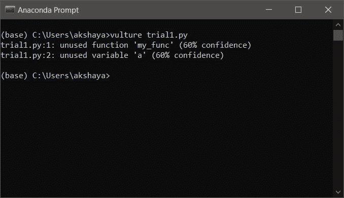
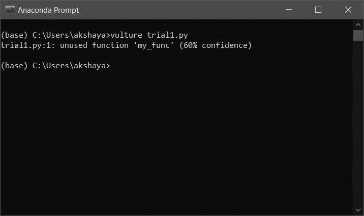

# Python 中未使用的局部变量

> 原文:[https://www . geesforgeks . org/unused-local-variable-in-python/](https://www.geeksforgeeks.org/unused-local-variable-in-python/)

定义在功能块或循环块内的变量在该块外失去作用域，该块的局部变量称为 ad**。局部变量不能在它被定义的块之外被访问。**

****示例:****

## **蟒蛇 3**

```py
# simple display function
def func(num):

  # local variable
    a = num
    print("The number is :", str(a))

func(10)

# generates error
print(a)
```

****输出:****

```py
NameError: name 'a' is not defined 
```

**这里我们得到一个错误，因为**‘a’**是函数 **func()** 的局部，它失去了在该块之外的作用域。这里，局部变量**‘a’**用于保存传递的数字，并在打印语句中使用。但是在某些情况下，局部变量可以通过赋值来声明，并保留用于任何过程。仅仅分配一些值并不是利用变量，其中的值必须被读取并用于一些计算。**

**[垃圾收集](https://www.geeksforgeeks.org/garbage-collection-python/)在 Python 中是自动的，当对象的引用计数为零时，该对象将被清除。我们都知道，某个代码块的局部变量会在该代码块之外失去作用域。当对象分配和对象解除分配之间的差异超过某个阈值时，垃圾收集会自动调用。如果脚本是几行代码，那么内存管理就不是一个繁琐的过程。如果脚本很长，任务很复杂，并且有许多未使用的局部变量，那么它会对代码执行时间和内存管理产生相当大的影响。然而，内存管理的问题很少。**

**由于这些未使用的变量而产生的主要问题是它降低了可读性。当代码有几千行时，当另一个程序员需要使用它时，他可能不得不花很长时间来分析变量使用了什么，而实际上没有使用。人们可能会忘记声明的未使用的变量，并在后面的部分使用它，这可能会导致不希望的输出。移除未使用的局部变量始终是一种好的做法。**

**具有许多未使用的局部变量、未使用的导入或未使用的代码行的代码被认为是**死代码**。当您不确定某个局部变量在代码中的作用时，可以使用一些命名约定来将其与其他变量区分开来。将变量命名为**‘虚拟’‘未使用’**或任何表示该变量当前未在任何地方使用的名称。**

## **如何抑制警告“未使用的变量”？**

**像 **VScode、PyCharm、Eclipse、PyDev** 这样的一些编辑器有时会对这些未使用的变量发出警告。警告不会中断程序执行。要消除警告，只需用下划线(' **_** ')来命名变量即可。Python 将它视为未使用的变量，并忽略它而不给出警告消息。**

## **计算机编程语言**

```py
# unused function
def my_func():

    # unused local variable
    _ = 5

    b=2
    c=b+10
    print(b,c)

for i in range(0, 5):
    print(i)
```

****Output**

```py
0
1
2
3
4

```** 

### **秃鹫套餐**

**有一些包可以用来查找脚本中的死代码。其中一个就是**秃鹫**。秃鹫包找到未使用的局部变量、未使用的导入和未使用的线部件，并给出报告。要安装此软件包，请在 anaconda 提示符下键入以下命令。**

> **pip 安装秃鹫**

**现在输入一个 python 脚本并用**保存。py 分机**。该文件应存储在默认情况下在 anaconda 提示符下打开的目录中或某个特定位置。如果将文件存储在其他位置，则必须移动到该目录。现在以下面的脚本为例。保存为**试用版****

## **计算机编程语言**

```py
# unused function
def my_func():

    # unused local variables
    a = 5

    b=2
    c=b+10
    print(b,c)

for i in range(0, 5):
    print(i)
```

****Output**

```py
0
1
2
3
4

```** 

**文件保存到所需目录后，在 anaconda 提示符下键入以下命令来查找死代码。**

> **C:\user > >秃鹫 trial1.py**

****输出:****

****

**秃鹫包装理解下面解释的命名约定，以避免警告。因此，当单独使用下划线作为变量名时，警告消息将被隐藏。考虑一下 **trial1.py** ，其中未使用的局部变量的名称被更改为下划线**(“_”)。****

## **蟒蛇 3**

```py
# unused function
def my_func():

    # unused local variables
    _ = 5

    b=2
    c=b+10
    print(b,c)

for i in range(0, 5):
    print(i)
```

 ****