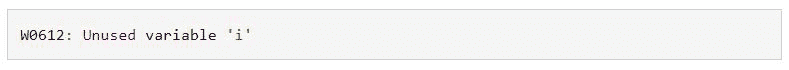
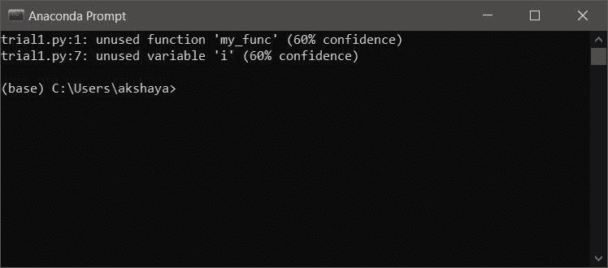
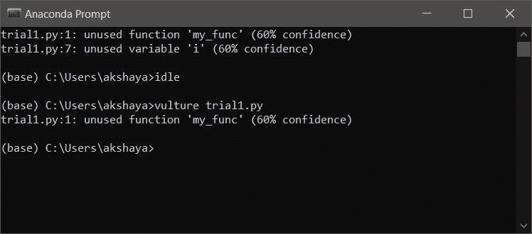

# Python 中 for 循环中未使用的变量

> 原文:[https://www . geesforgeks . org/未使用的 python 循环变量/](https://www.geeksforgeeks.org/unused-variable-in-for-loop-in-python/)

**先决条件:** [Python For loops](https://www.geeksforgeeks.org/python-for-loops/)

循环的**有一个控制迭代的循环变量。并非所有的循环都在循环中执行的过程中使用循环变量。**

**示例:**

## 蟒蛇 3

```py
# i,j - loop variable

# loop-1
print("Using the loop variable inside :")

# used loop variable
for i in range(0, 5):

    x = (i+1)*2
    print(x, end=" ")

# loop-2
print("\nUsing the loop variable only for iteration :")

# unsused loop variable
for j in range(0, 5):

    print('*', end=" ")
```

**Output**

```py
Using the loop variable inside :
2 4 6 8 10 
Using the loop variable only for iteration :
* * * * * 
```

在上面的代码片段中，在**循环-1** 、中，循环控制变量“ **i** 在循环内部用于计算。但是在**循环-2** 中，循环控制变量 **j** 只关心保持迭代次数的跟踪。因此，**‘j’**是 for 循环中未使用的变量。最好避免声明无用的变量。像 **Pycharm、PyDev、VSCode** 这样的 ide 会为循环结构中这些未使用的变量生成警告消息。该警告可能如下所示:



为了避免此类警告，可以使用仅用下划线(“_”)命名未使用变量的约定。这避免了 for 循环中未使用变量的问题。考虑下面的脚本，它使用 Python 中的**秃鹫模块**测试了一个未使用的循环变量。一旦使用 pip 命令安装了秃鹫模块，它就可以用于测试**。蟒蛇提示中的 py 脚本**。

**示例:试验 1.py**

## 蟒蛇 3

```py
# unused function
def my_func():

    # unused local variable
    a = 5
    b = 2
    c = b+2
    print(b, c)

# unused loop variable 'i'
for i in range(0, 5):
    print("*", end=" ")
```

**Output**

```py
* * * * * 
```

### 用秃鹫模块检查



为了避免这种**未使用变量‘I’**的警告，循环变量可以简单地用下划线(' _ '代替。请看下面的代码片段

## 蟒蛇 3

```py
# unused function
def my_func():
    b = 2
    c = b+2
    print(b, c)

# unused loop variable 'i'
for _ in range(0, 5):
    print("*", end=" ")
```



有些人使用[**【py lint】**](https://www.geeksforgeeks.org/pylint-module-in-python/)，这是一种在 Python 中跟踪代码风格和死代码的工具。当 for 循环中的变量未被使用时，这种工具会发出警告。为了抑制这种情况，最好对未使用的变量使用下划线命名约定。