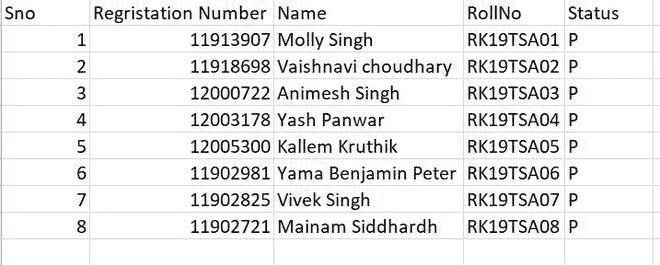
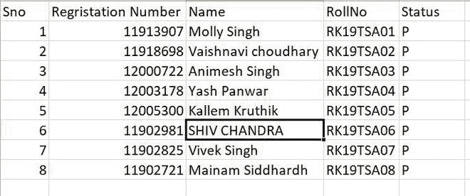
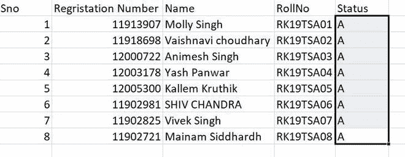
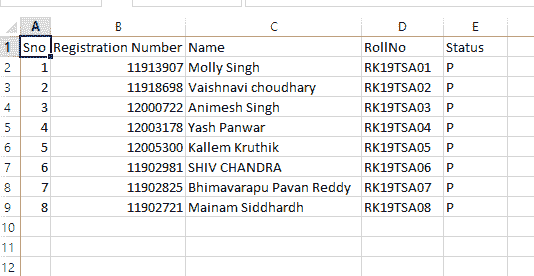

# 更新 Python 中 CSV 的列值

> 原文:[https://www . geesforgeks . org/update-column-value-of-CSV-in-python/](https://www.geeksforgeeks.org/update-column-value-of-csv-in-python/)

**先决条件:**T2】熊猫

在本文中，我们将讨论更新列值的方法。更新 CSV 的任何列值的最佳方式是使用熊猫库和数据框函数。

正在使用的 CSV 文件的链接–[单击此处](https://drive.google.com/file/d/1qcZXxvgMEqcbzU40kYbm5YRlC_iMssQT/view?usp=sharing)

### **方法 1**

**接近**

*   导入模块
*   打开 CSV 文件并读取其数据
*   查找要更新的列
*   使用 to_csv()函数更新 CSV 文件中的值

[to_csv()](https://www.geeksforgeeks.org/python-pandas-series-to_csv/) 方法将 Data Frame 转换为 csv 数据作为输出返回到文件中，它以文件对象或文件名为参数，应该提到**索引=False** 这样索引就不会写入 CSV 文件中。但是，当您想要更新多次出现的类似值时，这种方法非常繁琐且不可靠。

**更新前文件中的详细信息:**



**示例:**

## 蟒蛇 3

```py
# importing the pandas library
import pandas as pd

# reading the csv file
df = pd.read_csv("AllDetails.csv")

# updating the column value/data
df.loc[5, 'Name'] = 'SHIV CHANDRA'

# writing into the file
df.to_csv("AllDetails.csv", index=False)

print(df)
```

**更新后详情:**



### **方法二:**

**接近**

*   导入模块
*   打开 csv 文件并读取其数据
*   查找要更新的列
*   使用 replace()函数更新 csv 文件中的值

当我们必须更新多次出现的数据时， [replace()](https://www.geeksforgeeks.org/python-pandas-dataframe-replace/#:~:text=replace()%20function%20is%20used,as%20it%20has%20many%20variations.) 方法非常有用。我们只需指定列名，并需要将值作为字典传递到 replace()方法中，该方法采用键和值对的形式，键将具有该列的先前数据，值将具有要更新的数据。

**更新列数据/值前:**


**示例:**

## 蟒蛇 3

```py
# importing the pandas library
import pandas as pd

# reading the csv file
df = pd.read_csv("AllDetails.csv")

# updating the column value/data
df['Status'] = df['Status'].replace({'P': 'A'})

# writing into the file
df.to_csv("AllDetails.csv", index=False)

print(df)
```

**更新列数据/值后:**



### 方法 3:

在这种方法中，我们使用了 csv 模块，这是一个为读取、写入和更新 csv 文件而集中创建的专用模块。

方法:

*   导入模块
*   将数据作为字典读取
*   更新所需的列值，将其存储为字典列表
*   一行一行地插回去
*   正在关闭文件。

**更新前文件:**


**程序:**

## 蟒蛇 3

```py
import csv

op = open("AllDetails.csv", "r")
dt = csv.DictReader(op)
print(dt)
up_dt = []
for r in dt:
    print(r)
    row = {'Sno': r['Sno'],
           'Registration Number': r['Registration Number'],
           'Name': r['Name'],
           'RollNo': r['RollNo'],
           'Status': 'P'}
    up_dt.append(row)
print(up_dt)
op.close()
op = open("AllDetails.csv", "w", newline='')
headers = ['Sno', 'Registration Number', 'Name', 'RollNo', 'Status']
data = csv.DictWriter(op, delimiter=',', fieldnames=headers)
data.writerow(dict((heads, heads) for heads in headers))
data.writerows(up_dt)

op.close()
```

**输出:**

