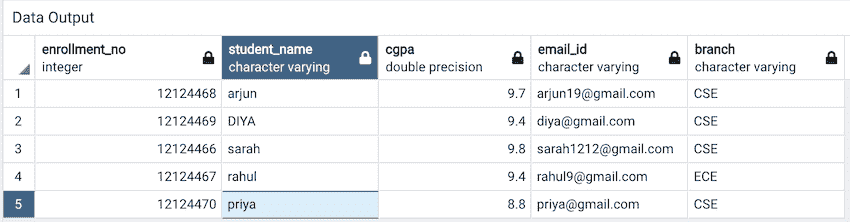
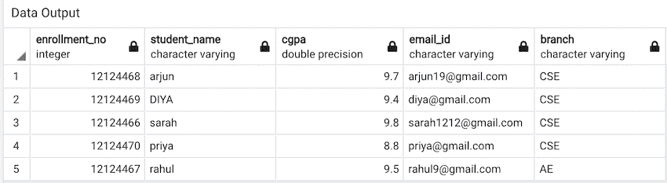

# 使用 Pyscopg2-Python 在 PostgreSQL 中更新同一查询中的多行

> 原文:[https://www . geesforgeks . org/update-多行同查询-in-PostgreSQL-using-pyscopg 2-python/](https://www.geeksforgeeks.org/update-multiple-rows-in-same-query-in-postgresql-using-pyscopg2-python/)

在本文中，我们将使用 Python 中的 Pyscopg2in 更新 PostgreSQL 中同一查询中的多行。

我们可以使用 PostgreSQL 中的 [update](https://www.geeksforgeeks.org/sql-update-statement/) 子句一次更新多个值。首先，我们导入 psycopg2 包，并使用 [pyscopg2.connect()](https://www.geeksforgeeks.org/postgresql-connect-to-postgresql-database-server-in-python/) 方法建立到 PostgreSQL 数据库的连接。

### 更新子句的语法:

```
UPDATE "table"
SET "column_one" = value1, 
"column_two" = value2, 
"column_three" = valueN
WHERE condition;
```

### 使用的数据库



### 下面是实现:

## 蟒蛇 3

```
import psycopg2

conn = psycopg2.connect(
    database="classroom_database",
      user='postgres', password='pass',
    host='127.0.0.1', port='5432'
)

conn.autocommit = True
cursor = conn.cursor()

sql = ''' update  student_details  set
          cgpa = 9.5 ,
          branch = 'AE'
        where student_name = 'rahul';'''

cursor.execute(sql)

sql1 = '''select * from student_details;'''
cursor.execute(sql1)

for i in cursor.fetchall():
    print(i)

conn.commit()
conn.close()
```

**输出:**

```
(12124468, 'arjun', 9.7, 'arjun19@gmail.com', 'CSE')
(12124469, 'DIYA', 9.4, 'diya@gmail.com', 'CSE')
(12124466, 'sarah', 9.8, 'sarah1212@gmail.com', 'CSE')
(12124470, 'priya', 8.8, 'priya@gmail.com', 'CSE')
(12124467, 'rahul', 9.5, 'rahul9@gmail.com', 'AE')
```

**PostgreSQL 中的输出:**

