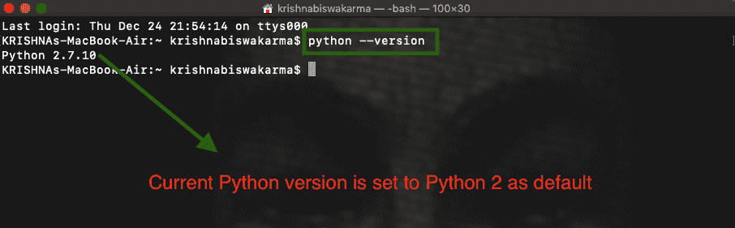
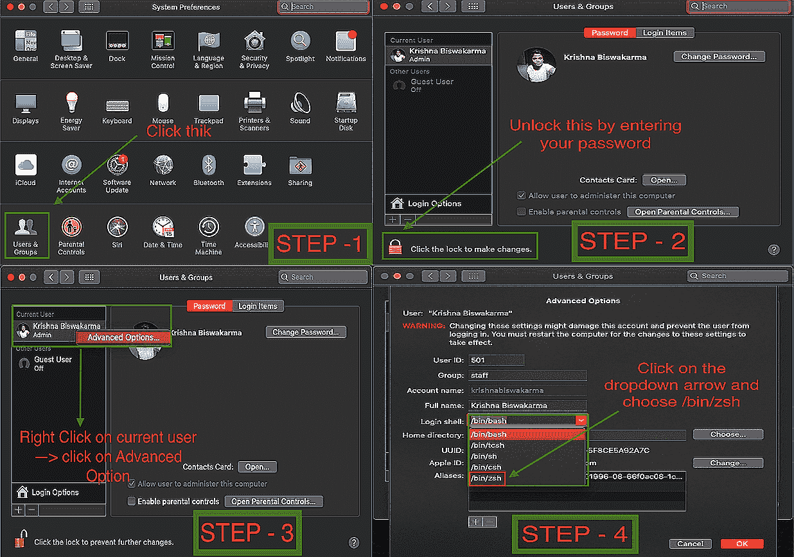
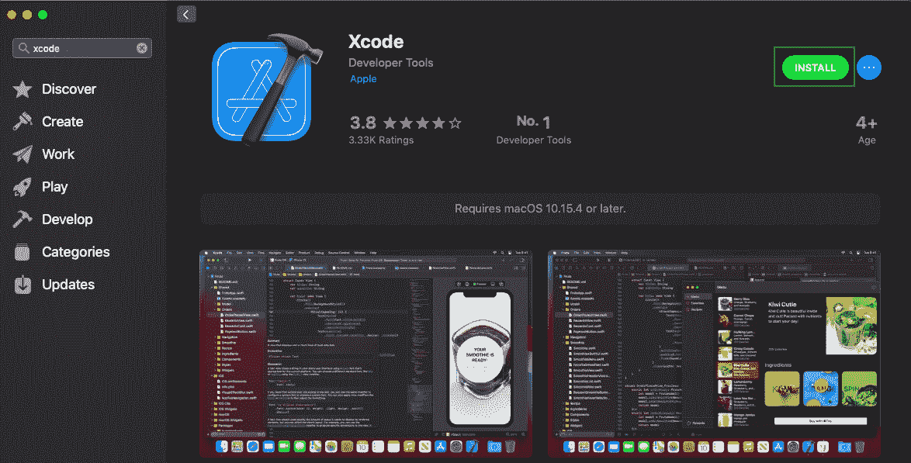
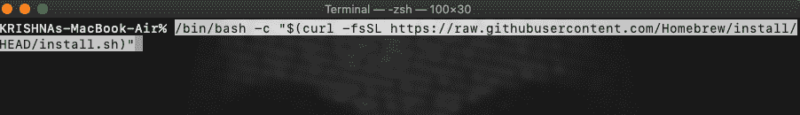
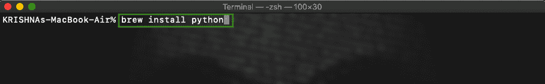
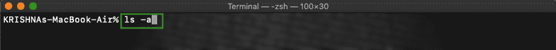
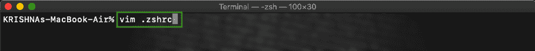
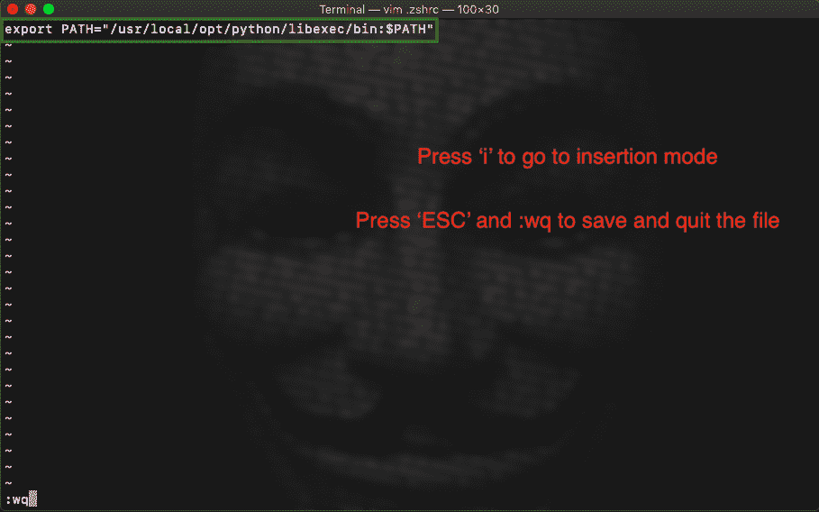
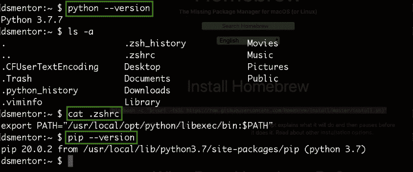

# 在 MacOS 上从 Python2 升级到 python 3

> 原文:[https://www . geeksforgeeks . org/upgrading-from-python 2-to-python 3-on-macos/](https://www.geeksforgeeks.org/upgrading-from-python2-to-python3-on-macos/)

Python 是一种高级和通用的编程语言。它被广泛应用于各种领域，以满足前端、后端或两者兼有的开发人员的需求。它正被严格地用于机器学习、人工智能、网络开发以及各种其他领域。

但是，有一个问题，mac 设备自带 python 2 作为默认，您不能在设备中使用 Python 3 作为默认。在本文中，我们将研究将默认 python 设置更改为 Python 3 的步骤，并讨论其优缺点。

### Python 2 的缺点:

以下是在您的苹果电脑上使用 Python 2 的缺点:

1.  摆脱 Python 2 的主要原因是它已经从 2020 年 1 月 1 日起停产了。
2.  Python 2 的社区支持正在灾难性地减少。
3.  Python 2 的语法比较难理解。
4.  要存储 Unicode 字符串值，需要用**“u”来定义。**
5.  对于迭代，使用 **xrange()** 。
6.  排序比较的规则相当复杂。

### Python 3 相对于 Python 2 的优势:

下面的列表陈述了 Python 3 相对于 Python 2 的优势:

1.  由于 Python 2 已经停产，并且不会在 Python 2 中进行更多的开发，所以坚持使用 Python 2 是没有意义的。因此，Python 显然是一个首选。
2.  Python 3 的社区支持令人难以置信。
3.  Python 3 的语法变得更加简单易懂。
4.  Python 3 将 Unicode 字符串值存储为默认值。
5.  对于迭代，使用 range()。
6.  我们可以将 Python 2 移植到 Python 3，但它并不那么可靠。
7.  排序比较的规则已经简化。
8.  Python 3 的库支持非常棒。

随着时间的推移，又增加了几个特性，要了解 Python 2 和 Python 3 之间的更多区别，请参考这篇[极客博客](https://www.geeksforgeeks.org/important-differences-between-python-2-x-and-python-3-x-with-examples/#Unicode)文章。你们中的许多人一定已经从(python.org)安装了 python 3，但是它可能显示 python 版本是 python 2。通过在终端中运行以下命令，确保这个事实是真的或者不是真的，请检查您的 python 版本:

```py
python --version
```

**输出:**



检查 Python 版本

要解决此问题，请执行以下步骤:

### 在系统上安装 Python 3:

**第一步:**首先我们要把登录 Shell 从 Bash 改成 Zsh。要进行更改，请导航至**系统** **偏好设置**，然后单击**用户和群组。**现在点击锁定**图标**并使用您的凭据进行身份验证。认证后右键点击**当前用户**，选择**高级选项**，将登录外壳从 ***/bin/bash*** 改为 ***/bin/zsh。***



将 bash Shell 更改为 Zsh shell

在这个阶段，你会发现你的终端外壳从 bash 外壳变成了 Zsh 外壳。


确认您的 bash 是否转换为 zsh shell

**步骤 2:** 现在你必须从应用商店安装 Xcode。要安装 Xcode，请前往**应用商店**并搜索 **Xcode。**现在点击**获取**，点击**T9**安装**按钮获取 Xcode **。****



安装 XCode

**步骤 3:** 安装 Xcode 后，您必须使用以下命令为 mac 安装命令行工具:

```py
xcode-select --install
```

现在点击**安装按钮**和**同意**条款和条件，这时弹出如下所示的窗口:


安装命令行工具

**第 4 步:**现在你必须为 mac 安装一个包管理器(例如:HomeBrew、MacPorts、Fink 等)，这使得安装过程变得非常简单和容易。这里我们使用**自制软件包管理器**。要安装它，请在您的终端上运行以下命令:

```py
/bin/bash -c "$(curl -fsSL https://raw.githubusercontent.com/Homebrew/install/HEAD/install.sh
```



安装自制软件包管理器

也可以从[<u>链接</u>](https://brew.sh/) 手动安装。

**第五步:**现在我们都设置好安装 python 了，要安装 python，使用下面的命令并按回车键:

```py
brew install python
```

这将需要一些时间在您的系统中安装 python。该命令将安装最新版本的 Python。



安装 Python

### 将 Python 3 设置为默认值:

要将 Python 3 设置为 Mac 系统上的默认设置，请执行以下步骤:

**第一步:**复制安装 Python 的目录路径，如下图:


Python 3 路径

**第二步:**在你的终端中运行 ***ls -a 命令*** 但是要确保你在你的主目录中或者简单的运行 ***cd ~命令*** 移动到主目录。



使用此命令列出所有隐藏文件

**步骤 3:** 现在我们必须使用 ***vim 创建一个文件。zshrc 命令*** 覆盖路径，使 python 3 成为默认。



正在创建名为。zshrc

**第四步:**要写入文件，从键盘按“I”进入插入模式。现在使用以下命令添加路径:

```py
export PATH=copied path from the above point:$PATH
```

现在要保存它，请按 ESC 并写入( **:wq** )并按回车键。我们结束了。



用 Python 3 的路径覆盖 Python 2 的路径

**第 5 步:**退出终端进行更改，现在编写 ***python 命令*** 来查看 python 3 现在被设置为 mac 设备的默认 python。



Python 3 版本的确认