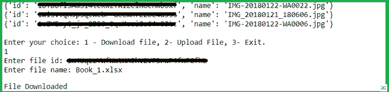

# 使用 Python 从 Google Drive 存储上传和下载文件

> 原文:[https://www . geesforgeks . org/上传-下载-文件-从谷歌-驱动器-存储-使用-python/](https://www.geeksforgeeks.org/upload-and-download-files-from-google-drive-storage-using-python/)

在这篇文章中，我们将看到如何使用 Python 中的应用编程接口将文件从我们的谷歌驱动器下载到我们的电脑，并将文件从我们的电脑上传到谷歌驱动器。这是一个 REST 应用编程接口，允许您从应用程序或程序中利用谷歌硬盘存储。因此，让我们继续编写一个 Python 脚本来实现这一点。

**要求:**

*   Python (2.6 或更高版本)
*   启用了谷歌驱动的谷歌帐户
*   谷歌应用编程接口客户端和谷歌 OAuth 库

**安装:**

通过运行以下命令安装所需的库:

> pip 安装–升级 Google-API-python-client Google-auth-httplicb 2 Google-auth-oauthlib

**设置:**

*   现在，要使用谷歌驱动应用编程接口，我们必须设置我们的账户并启用**谷歌驱动应用编程接口。**
*   要设置您的帐户，您可以按照[文章](https://www.geeksforgeeks.org/get-list-of-files-and-folders-in-google-drive-storage-using-python/)中给出的步骤操作。
*   所以，现在我们准备好编写 Python 脚本了。

请确保文件**凭证. json** 在同一个目录中。

### 入门指南

首先，我们将导入所需的库。然后我们将定义一个类 **DriveAPI** ，它有一个构造函数和两个上传和下载文件的函数。在构造函数中，我们将检查文件“**token . pickle”**是否存在。如果它存在，这意味着我们可以访问谷歌硬盘存储，我们不需要再次请求它。如果令牌已经使用了很长时间，我们可能需要刷新令牌。如果它不存在或无效，脚本将在浏览器中打开一个新的选项卡，并要求访问 Google Drive。

一旦获得访问权限，它将连接到该驱动器，并为该帐户获取谷歌驱动器存储中的文件列表，并打印该列表。列表中的每一项都包含谷歌驱动器中该文件的 id 和名称。

现在，在**文件下载**功能中，我们将编写下载文件的代码。我们需要两件事来做这件事。首先是驱动器中该文件的 **id** ，其次是您希望将其保存为的**名称**。现在，我们将向驱动服务发出请求，以获取给定 **id 的文件。**然后，我们将使用一个 **BytesIO** 对象将文件写入内存。我们将使用**mediaiobaseddownload**类从服务器接收文件，并用 **BytesIO** 对象将其写入内存。因为文件大小可能从几个字节到非常大不等，所以我们更喜欢以块的形式下载文件。如果我们不想使用默认的，我们也可以传递块大小。现在，我们将运行一个 while 循环，在这个循环的每次迭代中，我们将下载一大块文件。完成后，我们会将文件从内存写入硬盘存储器。我们将在 try-except 块中包装整个过程，以便在出现问题时，我们的脚本不会抛出错误。

要上传文件，我们将使用**文件上传**功能。我们只需要文件路径来上传文件。从文件路径中，我们可以使用 **mimetypes** 模块轻松提取文件名并找到其 mime 类型。我们将用包含文件名的关键字“name”创建一个字典。现在，我们将使用**媒体文件上传**类来生成媒体文件，然后我们将使用创建功能在驱动器中创建一个新文件，并将我们的文件数据保存到该新创建的文件中。

**实施:**

## 蟒蛇 3

```py
# import the required libraries
from __future__ import print_function
import pickle
import os.path
import io
import shutil
import requests
from mimetypes import MimeTypes
from googleapiclient.discovery import build
from google_auth_oauthlib.flow import InstalledAppFlow
from google.auth.transport.requests import Request
from googleapiclient.http import MediaIoBaseDownload, MediaFileUpload

class DriveAPI:
    global SCOPES

    # Define the scopes
    SCOPES = ['https://www.googleapis.com/auth/drive']

    def __init__(self):

        # Variable self.creds will
        # store the user access token.
        # If no valid token found
        # we will create one.
        self.creds = None

        # The file token.pickle stores the
        # user's access and refresh tokens. It is
        # created automatically when the authorization
        # flow completes for the first time.

        # Check if file token.pickle exists
        if os.path.exists('token.pickle'):

            # Read the token from the file and
            # store it in the variable self.creds
            with open('token.pickle', 'rb') as token:
                self.creds = pickle.load(token)

        # If no valid credentials are available,
        # request the user to log in.
        if not self.creds or not self.creds.valid:

            # If token is expired, it will be refreshed,
            # else, we will request a new one.
            if self.creds and self.creds.expired and self.creds.refresh_token:
                self.creds.refresh(Request())
            else:
                flow = InstalledAppFlow.from_client_secrets_file(
                    'credentials.json', SCOPES)
                self.creds = flow.run_local_server(port=0)

            # Save the access token in token.pickle
            # file for future usage
            with open('token.pickle', 'wb') as token:
                pickle.dump(self.creds, token)

        # Connect to the API service
        self.service = build('drive', 'v3', credentials=self.creds)

        # request a list of first N files or
        # folders with name and id from the API.
        results = self.service.files().list(
            pageSize=100, fields="files(id, name)").execute()
        items = results.get('files', [])

        # print a list of files

        print("Here's a list of files: \n")
        print(*items, sep="\n", end="\n\n")

    def FileDownload(self, file_id, file_name):
        request = self.service.files().get_media(fileId=file_id)
        fh = io.BytesIO()

        # Initialise a downloader object to download the file
        downloader = MediaIoBaseDownload(fh, request, chunksize=204800)
        done = False

        try:
            # Download the data in chunks
            while not done:
                status, done = downloader.next_chunk()

            fh.seek(0)

            # Write the received data to the file
            with open(file_name, 'wb') as f:
                shutil.copyfileobj(fh, f)

            print("File Downloaded")
            # Return True if file Downloaded successfully
            return True
        except:

            # Return False if something went wrong
            print("Something went wrong.")
            return False

    def FileUpload(self, filepath):

        # Extract the file name out of the file path
        name = filepath.split('/')[-1]

        # Find the MimeType of the file
        mimetype = MimeTypes().guess_type(name)[0]

        # create file metadata
        file_metadata = {'name': name}

        try:
            media = MediaFileUpload(filepath, mimetype=mimetype)

            # Create a new file in the Drive storage
            file = self.service.files().create(
                body=file_metadata, media_body=media, fields='id').execute()

            print("File Uploaded.")

        except:

            # Raise UploadError if file is not uploaded.
            raise UploadError("Can't Upload File.")

if __name__ == "__main__":
    obj = DriveAPI()
    i = int(input("Enter your choice:
                  "1 - Download file, 2- Upload File, 3- Exit.\n"))

    if i == 1:
        f_id = input("Enter file id: ")
        f_name = input("Enter file name: ")
        obj.FileDownload(f_id, f_name)

    elif i == 2:
        f_path = input("Enter full file path: ")
        obj.FileUpload(f_path)

    else:
        exit()
```

**输出:**



这将尝试在默认浏览器中打开一个新窗口。如果失败，请从控制台复制网址，并在浏览器中手动打开它。现在，如果您还没有登录，请登录您的谷歌帐户。如果有多个帐户，将要求您选择其中一个。然后，单击允许按钮继续。身份验证完成后，您的浏览器将显示一条消息，提示“**身份验证流程已完成。你可以关闭这个窗口。**“现在，程序会在你的 Google 驱动器中打印一个文件列表，并询问你是否要上传或下载文件。