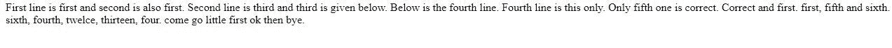

# 上传文件，用奇瑞皮 python 读取其内容

> 原文:[https://www . geesforgeks . org/upload-file-read-it-in-cherrypy-python/](https://www.geeksforgeeks.org/upload-file-and-read-its-content-in-cherrypy-python/)

**CherryPy** 是 Python 的一个 web 框架，为 Python 开发人员提供了一个友好的 HTTP 协议接口。它也被称为 web 应用程序库。它允许开发人员构建网络应用程序，就像他们构建任何其他面向对象的 Python 程序一样。这导致用更少的时间开发更小的源代码。

该框架主要面向希望使用 Python 创建可移植的数据库驱动的 web 应用程序的开发人员，因为它提供了创建、检索、更新和删除功能。

**先决条件–**

安装奇瑞派框架的基本要求包括？

*   python 2.4 或更高版本
*   CherryPy 3.0

    **安装–**
    要安装 cherrypy，请在终端中运行以下命令:

    > pip 安装 cherrypy

    **简单的应用–**

    奇瑞派应用程序通常如下所示:

    > 进口奇瑞皮
    > 
    > 类 HelloWorld(对象):
    > @ cherrypy . expose
    > def index(self):
    > 返回“Hello World！”
    > 
    > cherrypy.quickstart(HelloWorld())

    **上传文件并读取其内容的项目–**

    使用 cherrypy 上传文件并读取其内容所采取的步骤:

    1.  创建任何文本文件来阅读或现有的文件也可以使用。程序中使用了 Geeks.txt 文件。
    2.  创建从系统上传文件的用户界面
    3.  编写读取文件内容并显示其内容的 cherrypy 程序。**HTML code that uploads the file from system:**

    ```py
    <html>
    <head>
      <style>
        .container{
          height: 300px;
          width: 600px;
          background-color: maroon;
          margin-top: 12%;
          margin-left: 25%;
          color: white;
        }
        .container h2{
          font-size: 40px;
          text-align: center;  

        }
        .off{
          font-size: 25px;
          margin-left: 23%;
          color: yellow;
          background-color: ;
        }
        .on{
          font-size: 25px;
          border-top-right-radius: 25px;
          border-top-left-radius: 25px;
          border-bottom-left-radius: 25px;
          border-bottom-right-radius: 25px;
          margin-top: 20px;   }
      </style>
      </head>
    <body>

      <div class="container">  
        <h2><u><i>Upload a file</i></u></h2>
        <form action="store" id="form" method="GET">
        <input class="off" type="file" name="myFile" /><br />

        <input style="margin-left: 250px;" class="on" id=" submit" type="submit" /></div>
      </div>    
        </form>
      </div>

    </body>
    </html>
    ```

    **读取文件:**

    ```py
    # import files
    import random
    import string
    import cherrypy

    # function to read file content
    def readf(filename):
        file = open(filename)
        read = file.read()
        return read

    class Root(object):

        @cherrypy.expose
        def index(self):
            return """<html>
    <head>
      <style>
        .container{
          height: 300px;
          width: 600px;
          background-color: maroon;
          margin-top: 12 %;
          margin-left: 25 %;
          color: white;
        }
        .container h2{
          font-size: 40px;
          text-align: center;  

        }
        .off{
          font-size: 25px;
          margin-left: 23 %;
          color: yellow;
          background-color: ;
        }
        .on{
          font-size: 25px;
          border-top-right-radius: 25px;
          border-top-left-radius: 25px;
          border-bottom-left-radius: 25px;
          border-bottom-right-radius: 25px;
          margin-top: 20px;   }
          p{ margin-top:100px;
          font-size: 50px;
          color: green}
      </style>
      </head>
    <body>
     <center><p> GEEKSFORGEEKS</p></center>
      <div class ="container">  
        <h2><u><i>Upload a file</i></u></h2>

        <form action ="store" id ="form" method ="GET">
        <input class ="off" type ="file" name ="myFile" /><br />   

        <input style ="margin-left: 250px;" class ="on" id =" submit" type ="submit" /></div>
      </div>    
        </form>
      </div>

    </body>
    </html>
    """

        @cherrypy.expose
        def store(self, myFile):       
            f = readf(myFile)                # read the uploaded file

            return f

    if __name__=="__main__":
        # set port address to 8089
        cherrypy.config.update({'server.socket_port': 8089})   
        cherrypy.quickstart(Root())
    ```

    要停止发动机，使用以下代码:

    > cherrypy.engine.exit()

    **输出(文件上传前):**
    
    **输出(文件上传后):**
    
    **提交后:**
    