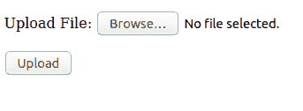

# 用 Python 上传文件

> 原文:[https://www.geeksforgeeks.org/upload-files-in-python/](https://www.geeksforgeeks.org/upload-files-in-python/)

在本文中，我们将研究使用 **cgi 环境**在 Python 中上传文件的过程。人们经常会遇到各种网络应用程序，其中要求客户端或用户以文件的形式上传数据(例如，图像文件、音频文件、文本文件等)。上传文件有两个方面，因为特定交互有两个方面，客户端和服务器端。需要创建一个表单来接受文件形式的用户输入。
一个 HTML 表单有不同的属性可以设置，例如，上传的数据要提交到哪个 URL 是通过动作属性完成的。需要一个名为**的 **enctype 属性**多部分/表单数据**才能上传文件。其次，我们将被要求使用 HTML 的**输入标签**，并将其设置为“文件”。这将在表单中添加一个上传按钮和一个输入按钮。下面的代码示例很好地展示了这一点:

## 超文本标记语言

```py
<html>
<body>
   <form enctype = "multipart/form-data" action = "python_script.py" method = "post">

<p>Upload File: <input type = "file" name = "filename" /></p>

<p><input type = "submit" value = "Upload" /></p>

</form>
</body>
</html>
```

上述 HTML 代码的输出如下所示:



在上面的代码中，属性**动作**有一个 python 脚本，当用户上传一个文件时，该脚本就会被执行。在服务器端，当 python 脚本接受上传的数据时，字段存储对象从表单的“文件名”中检索提交的文件名。现在，服务器需要做的就是读取上传的文件，并将其写入“fileitem”(比如，)。在整个过程结束时，上传的文件将被写入服务器。
所以，python 脚本看起来有点像下面的代码:

## 蟒蛇 3

```py
import os

fileitem = form['filename']

# check if the file has been uploaded
if fileitem.filename:
    # strip the leading path from the file name
    fn = os.path.basename(fileitem.filename)

   # open read and write the file into the server
    open(fn, 'wb').write(fileitem.file.read())
```

**注意:**上面的 python 脚本并不能在每台服务器上运行，因为出于安全原因，每台服务器都有自己的依赖关系，允许在其服务器上运行脚本。例如，如果使用 Azure 服务器，需要导入 msvcrt(微软 visual C++运行时模块)才能工作。