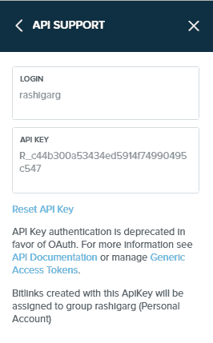
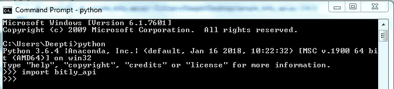
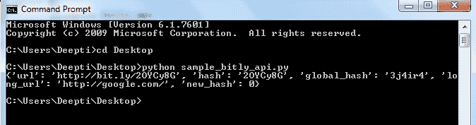

# Python 中的网址缩写及其应用编程接口| Set-1

> 原文:[https://www . geesforgeks . org/URL-shorteners-and-its-API-in-python-set-1/](https://www.geeksforgeeks.org/url-shorteners-and-its-api-in-python-set-1/)

顾名思义，URL Shortener 是一项有助于缩短 URL 长度的服务，这样就可以在 Twitter 这样的平台上轻松共享，在 Twitter 上，字符数量是一个问题。
现在市面上有这么多的 URL Shorteners，那肯定会帮你解决目的。我们将讨论 Bitly 网址快捷方式的应用编程接口实现和 Python 模块快捷方式的实现。这基本上是 Python 中的一个库，它提供了一些流行的网址快捷方式的实现。
**Bitly** : Bitly 提供了一个平台来缩短网址，分享它们，并跟踪缩短网址上的活动。在开始使用 Bitly 应用编程接口之前，您首先需要在网站上注册以获取应用编程接口密钥。这对于访问应用编程接口并将其用于编程非常重要。

*   注册使用:[点注册](https://bitly.com/)。
*   注册程序完成后，您将在右侧看到带有 4 行图标的名称。
*   从下拉菜单中选择**设置**。
*   转到**高级设置**，您会发现第一个选项是**应用编程接口支持**。
*   选择此选项后，您将获得您的用户名和应用编程接口密钥。要重置您的应用编程接口密钥，请在“应用编程接口支持”中选择位于您的应用编程接口密钥下方的**重置应用编程接口密钥**。



注意:不推荐使用应用编程接口密钥，我们建议您使用 OAuth。
所以我们将讨论使用 API 密钥和 OAuth 的 Bitly API 应用程序。
在继续之前，让我们先讨论什么是应用编程接口密钥。应用程序编程接口密钥是由调用应用编程接口的计算机传递的代码，用于识别用户、计算机或我们可以说调用程序。这基本上是用来在使用 API 时控制恶意活动的。

**Bitly API Python 模块安装:**

1.  以下链接显示了可用的 Bitly API 代码库列表: [Bitly API 代码库](https://dev.bitly.com/code_libraries.html)
    在这篇文章中，我们将使用 bitly-api-python 库，它也是官方 python 客户端。
2.  安装 python 模块的一种方法是使用 **pip** 命令

```
pip install bitly_api
```

2.  如果使用 pip 命令的安装显示错误，请使用以下命令卸载 bitly _ API:

```
pip uninstall bitly_api
```

1.  使用以下链接下载 Bitly API 模块 [bitly_api](https://github.com/bitly/bitly-api-python)
2.  解压缩下载的文件夹，然后使用以下命令导航到 bitly-api-python-master 文件夹:

```
cd bitly-api-python-master
```

1.  现在使用以下命令安装 bitly_api 模块:

```
python setup.py install
```

1.  在命令提示符下输入以下一组命令，检查模块安装是否成功

```
python
import bitly_api
```

1.  如果没有显示错误，这意味着模块安装成功。



1.  或者，您可以使用命令
    执行 test_bitly_api.py 文件

```
python test_bitly_api.py
```

1.  没有错误意味着模块安装成功。

**使用应用编程接口密钥实现位图应用编程接口:**

## 蟒蛇 3

```
import bitly_api

API_USER = "username"
API_KEY = "API_Key"
bitly = bitly_api.Connection(API_USER, API_KEY)

response = bitly.shorten('http://google.com/')

# Now let us print the Bitly URL
print(response)
```



**使用 OAuth 的 Bitly API 实现:**
首先我们需要为程序生成 OAuth 令牌。请注意，只有经过验证的电子邮件 id 才能用于生成 OAuth 令牌。

*   点击选项 **OAuth**
*   你会得到这样的菜单
*   点击**通用访问令牌**选项，输入密码，即可获得访问令牌。

## 蟒蛇 3

```
import bitly_api

BITLY_ACCESS_TOKEN ="ACCESS_TOKEN"

b = bitly_api.Connection(access_token = BITLY_ACCESS_TOKEN)

response = b.shorten('http://google.com/')
print(response)
```


**Pyshortner:****Pyshortner**是一个 Python 模块，为市场上提供的各种 URL 缩短服务提供实现。
使用 **pip** 命令安装模块:

```
pip install pyshorteners
```

现在我们来讨论一下 Google URL 缩短服务的代码实现和输出。
**谷歌网址快捷器:**在开始使用谷歌网址快捷器之前，我们首先需要注册，创建一个项目，并获得一个使用该应用编程接口的应用编程接口密钥。
创建应用编程接口密钥的步骤如下:

*   导航至[谷歌开发者](https://developers.google.com/)主页，点击页面右上角**登录**。使用有效谷歌帐户的凭据登录。如果您没有谷歌帐户，请先设置一个帐户，然后使用详细信息登录谷歌开发者主页。
*   现在导航到[开发者仪表盘](https://console.developers.google.com/apis/dashboard?project=gurl-project-1541962189248&folder&organizationId)并点击**启用应用编程接口**选项。
*   在搜索栏中，搜索**网址快捷方式**，并选择下拉列表中的**网址快捷方式应用编程接口**选项。
*   您将被重定向到一个显示 URL Shortener API 相关信息的屏幕，以及两个选项: **MANAGE** 和 **TRY API**
*   点击**管理**选项，创建一个项目，开始使用 API。
*   您将再次被重定向到搜索页面。点击搜索栏上方的**启用**。
*   您将看到一个显示消息**的栏。要使用该应用编程接口，您可能需要凭据。单击“创建凭据”开始。**
*   点击右上角**创建凭证**。
*   您将被重定向到添加凭据的页面。
*   对于**你用的是哪个 API？**如果尚未选择，选择**网址快捷应用程序接口**。
*   对于**你将从哪里调用 API？**选择**其他界面(如窗口、命令行工具)**
*   对于**您将访问哪些数据？**选择**公共数据**
*   点击**我需要什么凭证？**。您将被重定向到一个页面，上面写着**向您的项目**添加凭据。该页面还将为您提供**应用编程接口密钥。**

## 蟒蛇 3

```
from pyshorteners import Shortener

long_url = 'http://www.google.com'

API_Key = 'AIzaSyBBS...jXKIGh1fNU'

url_shortener = Shortener('Google', api_key = API_Key)
print ("Short URL is {}".format(url_shortener.short(long_url)))
```

**输出:**


**扩展缩短网址的代码:**

## 蟒蛇 3

```
from pyshorteners import Shortener

short_url ='https://goo.gl/fbsS'

API_Key = 'AIzaSyBBSL...jXKIGh1fNU'

url_expander = Shortener('Google', api_key = API_Key)

print ("Long URL is {}".format(url_expander.expand(short_url)))
```

**输出:**


**参考文献:**

*   https://dev.bitly.com/
*   https://pypi.org/project/pyshorteners/
*   https://developers.google.com/