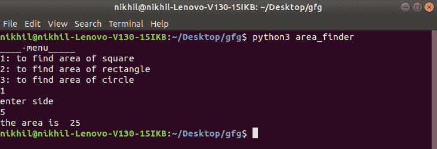

# _ _ main _ _ 的用法。Python 中的 py

> 原文:[https://www . geesforgeks . org/usage-of-main _ _-py-in-python/](https://www.geeksforgeeks.org/usage-of-__main__-py-in-python/)

我们中的许多人都曾在 Python 中创建过自己的定制模块，并且非常熟悉候选模块“`__init__.py`”。如果你不知道，那么让我们得到一个简短的描述。在深入探讨相关话题之前。实际上，当我们试图默认将一个模块导入 Python 时。Python 访问 py 来寻找必要的导入。

现在有两种情况。

*   组织良好以作为模块导入的 Python 文件
*   可以通过命令行直接运行的 Python 文件(单文件结构)<lippython files="" file="" structure="" which="" can="" be="" run="" directly="" by="" command="" line="" li=""></lippython>

在第一种情况下，当我们试图将其作为模块导入时`__init__.py`开始发挥作用。对于第二个场景，我们使用了一些类似于

```py
def main ():
    pass

if __name__ == '__main__':
    main()
```

这种语法可能与其他语言如 JAVA 和 C++中 main 的启动有关。但是这个语法**在第三种情况下并不理想。那么如果我们想直接从命令行运行这样的文件怎么办呢？
**这里是 __main__。py 前来救援。****

举个例子，我们会找到矩形、正方形和圆形的面积。为了便于理解，我们把这三个操作分成三个独立的部分。py 文件并将其存储在名为 src 的模块中。

文件树将如下所示

```py
+---src
|   |   circle.py
|   |   rectangle.py
|   |   square.py
|   |   __init__.py
|   |   

```

现在，如果添加到 path 中，src 可以作为模块从任何其他 Python 程序中导入。但是如果我们想从命令行运行它呢？为此，我们将 src 文件夹存储在一个名为 say **area_finder** 的文件夹下，并添加一个名为 **__main__ 的文件。py** 在它下面。这棵树看起来像

```py
area_finder
|   readme.md
|   __main__.py
|   
+---src
|   |   circle.py
|   |   rectangle.py
|   |   square.py
|   |   __init__.py
|   |   

```

**主要内容。py**

```py
print("____-menu_____")
print("1: to find area of square \n\
2: to find area of rectangle\n\
3: to find area of circle")

ch = int(input())

if ch == 1:
    from src.square import square
    print("enter side")
    s = int(input())
    print ("the area is ", square(s))

if ch == 2:
    from src.rectangle import rectangle
    print("enter length and breadth")
    l = int(input())
    b = int(input())
    print("the area is ", rectangle(l, b))

if ch == 3:
    from src.circle import circle 
    print("enter radius")
    r = int(input())
    print("the area is ", circle(r))
```

现在，当我们像这样从终端/命令提示符运行它们时

```py
python area_finder

```

输出将是–



那么当我们执行命令时会发生什么呢？Python 查找名为**_ _ main _ _ _ 的文件。py** 自动开始执行。如果它没有找到它，它将抛出一个错误，否则它将执行 main.py，从代码中，您可以很好地理解它将从 src 导入模块来找到该区域。

所以现在我们已经了解了。py 有效。现在，让我们来看看它最大的优势:

*   它消除了最终用户对程序入口点的模糊性，就像 Python 自动做的那样
*   它有助于代码的干净执行