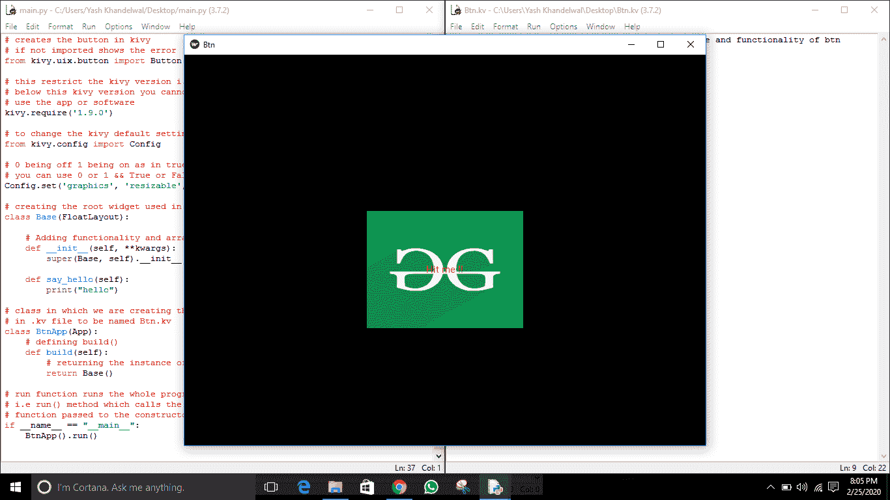
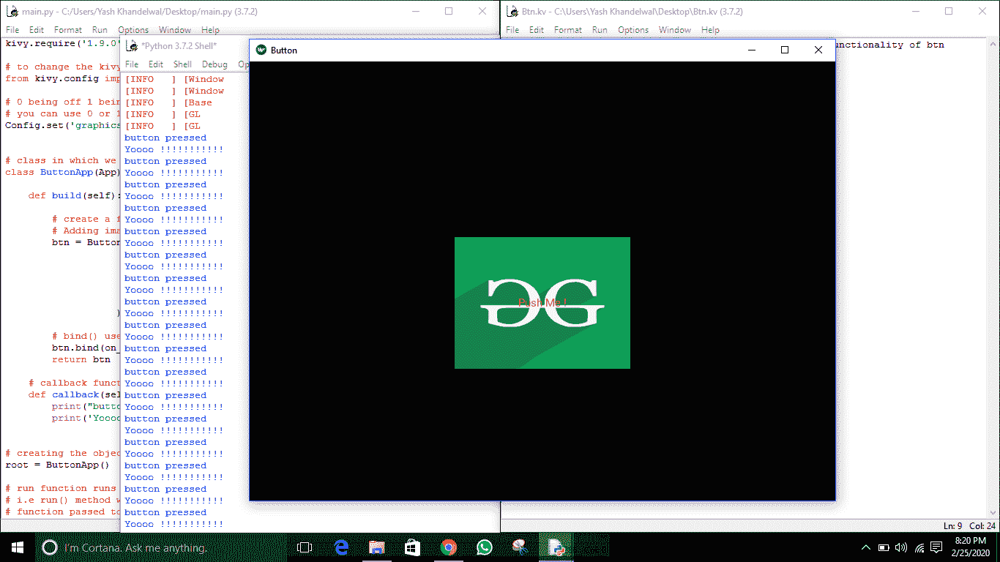
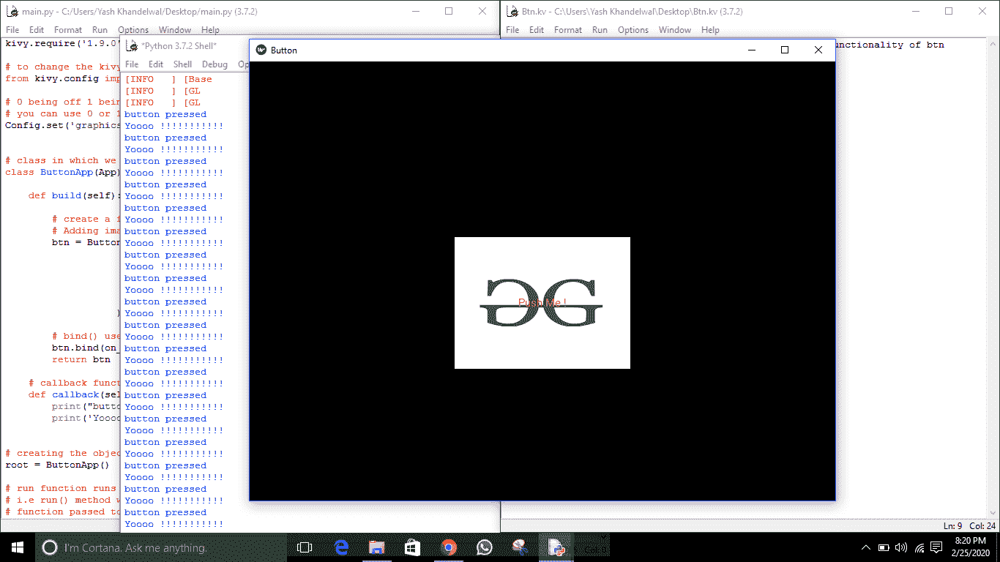

# 在 kivy

中使用图像作为按钮

> 原文:[https://www . geesforgeks . org/use-image-as-a-button-in-kivy/](https://www.geeksforgeeks.org/use-image-as-a-button-in-kivy/)

Kivy 是 Python 中独立于平台的 GUI 工具。因为它可以在安卓、IOS、linux 和 Windows 等平台上运行。它基本上是用来开发安卓应用程序的，但并不意味着它不能在桌面应用程序上使用。

正如我们之前讨论的[如何处理图像](https://www.geeksforgeeks.org/python-adding-image-in-kivy-using-kv-file/)，现在我们将学习如何使用图像并使用它们创建一个按钮。在本文中，我们将学习如何将图像用作按钮，以及如何在该图像上添加功能和样式。

> 要了解它，您必须了解一些属性，即–
> 
> **background_down :**
> 1)按钮的背景图像，用于按钮按下时的默认图形表示。
> 2) background_down 是 StringProperty。
> 
> **background_normal :**
> 1)按钮的背景图像，用于按钮未被按下时的默认图形表示。
> 2) background_normal 也是 StringProperty。
> 
> **Background _ disabled _ normal:**
> 1)按钮禁用且未按下时，用于默认图形表示的按钮背景图像。
> 2)background _ disabled _ normal 也是 StringProperty。
> 
> **注意:**
> 1)现在只需要理解 string 属性意味着它们只接受 string 中的值，这意味着像 background_down 这样:“normal.png”。
> 2)点击图像时，它看起来像一个简单的按钮(因为我们在按钮中使用它)。

**本文所用图像为:**

**正常。png:**


**向下. png:**


```
Basic Approach  :

-> import kivy
-> import kivy App
-> import button
-> set minimum version(optional)
-> Extend the class :  
              -> create an image a  button
              -> Do styling
              -> Arrange call back if needed 
-> Add and return a button
-> Run an instance of the class
```

> [Kivy 教程——用例子学习 Kivy。](https://www.geeksforgeeks.org/kivy-tutorial/)

**Simple Implementation that how to create a button using image**

```
## Sample Python application demonstrating that   
## how to create button using image in kivy

##################################################      
# import kivy module 
import kivy 

# this restrict the kivy version i.e 
# below this kivy version you cannot 
# use the app or software 
kivy.require("1.9.1") 

# base Class of your App inherits from the App class. 
# app:always refers to the instance of your application 
from kivy.app import App 

# creates the button in kivy 
# if not imported shows the error 
from kivy.uix.button import Button

# this restrict the kivy version i.e   
# below this kivy version you cannot   
# use the app or software   
kivy.require('1.9.0')  

# to change the kivy default settings we use this module config 
from kivy.config import Config 

# 0 being off 1 being on as in true / false 
# you can use 0 or 1 && True or False 
Config.set('graphics', 'resizable', True)

# class in which we are creating the image button 
class ButtonApp(App): 

    def build(self): 

        # create an image a button 
        # Adding images normal.png image as button
        # decided its position and size 
        btn = Button(text ="Push Me !",
                     color =(1, 0, .65, 1),
                     background_normal = 'normal.png',
                     background_down ='down.png',
                     size_hint = (.3, .3),
                     pos_hint = {"x":0.35, "y":0.3}
                   ) 

        return btn 

# creating the object root for ButtonApp() class  
root = ButtonApp() 

# run function runs the whole program 
# i.e run() method which calls the target 
# function passed to the constructor. 
root.run()
```

**输出:**


**实现样式和安排按钮回调的代码–**

```
## Sample Python application demonstrating that   
## how to create button using image in kivy 

##################################################      
# import kivy module 
import kivy 

# this restrict the kivy version i.e 
# below this kivy version you cannot 
# use the app or software 
kivy.require("1.9.1") 

# base Class of your App inherits from the App class. 
# app:always refers to the instance of your application 
from kivy.app import App 

# creates the button in kivy 
# if not imported shows the error 
from kivy.uix.button import Button

# this restrict the kivy version i.e   
# below this kivy version you cannot   
# use the app or software   
kivy.require('1.9.0')  

# to change the kivy default settings we use this module config 
from kivy.config import Config 

# 0 being off 1 being on as in true / false 
# you can use 0 or 1 && True or False 
Config.set('graphics', 'resizable', True)

# class in which we are creating the imagebutton 
class ButtonApp(App): 

    def build(self): 

        # create a fully styled functional button
        # Adding images normal.png and down.png
        btn = Button(text ="Push Me !",
                     background_normal = 'normal.png',
                     background_down = 'down.png',
                     size_hint = (.3, .3),
                     pos_hint = {"x":0.35, "y":0.3}
                   ) 

        # bind() use to bind the button to function callback 
        btn.bind(on_press = self.callback) 
        return btn 

    # callback function tells when button pressed 
    def callback(self, event): 
        print("button pressed") 
        print('Yoooo !!!!!!!!!!!') 

# creating the object root for ButtonApp() class  
root = ButtonApp() 

# run function runs the whole program 
# i.e run() method which calls the target 
# function passed to the constructor. 
root.run()
```

**输出:**

