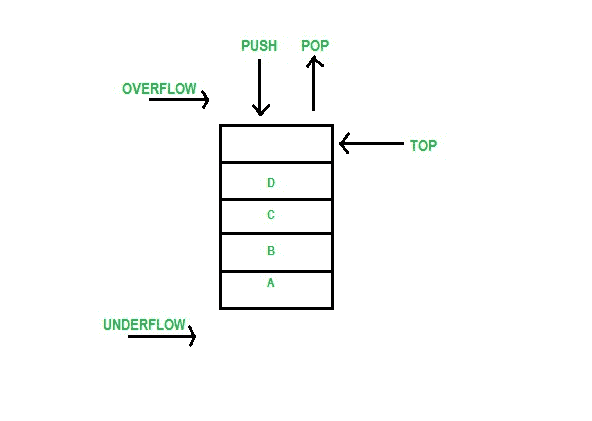
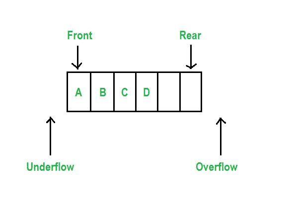
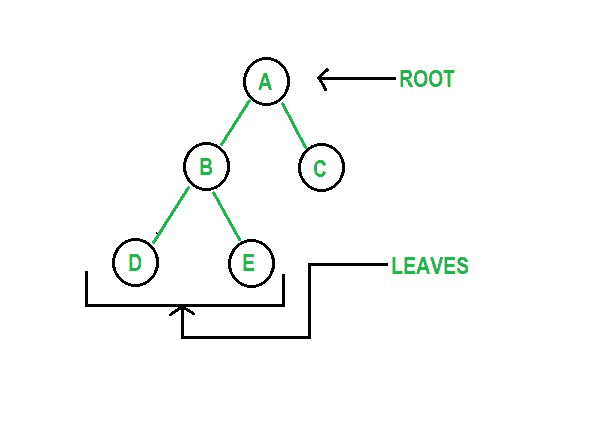

# Python 中的用户定义数据结构

> 原文:[https://www . geesforgeks . org/用户定义的数据结构-in-python/](https://www.geeksforgeeks.org/user-defined-data-structures-in-python/)

在计算机科学中，数据结构是在计算机内存中组织数据以便有效使用的一种逻辑方式。数据结构允许以结构化的方式添加、移除、存储和维护数据。Python 支持两种类型的数据结构:

*   **非基元数据类型:** Python 有列表、集合和字典作为其非基元数据类型，也可以认为是其内置的数据结构。
*   用户定义的**数据结构:**python 不支持但可以使用 python 支持的概念进行编程以反映相同功能的数据结构是用户定义的数据结构。有许多数据结构可以这样实现:
    *   [链表](https://www.geeksforgeeks.org/data-structures/linked-list/)
    *   [堆叠](https://www.geeksforgeeks.org/stack-data-structure/)
    *   队列
    *   [树](https://www.geeksforgeeks.org/binary-tree-data-structure/)
    *   [图形](https://www.geeksforgeeks.org/graph-data-structure-and-algorithms/)
    *   [哈希图](https://www.geeksforgeeks.org/hash-map-in-python/)

## 链接列表

一个[链表](https://www.geeksforgeeks.org/data-structures/linked-list/#singlyLinkedList)是一个线性数据结构，其中元素不存储在连续的存储位置。链表中的元素使用指针链接，如下图所示:


**程序:**

## 蟒蛇 3

```
llist = ['first', 'second', 'third']
print(llist)

print()

# adding elements
llist.append('fourth')
llist.append('fifth')
llist.insert(3, 'sixth')
print(llist)
print()

llist.remove('second')
print(llist)
print()
```

**输出:**

> [“第一”、“第二”、“第三”]
> 
> [“第一”、“第二”、“第三”、“第六”、“第四”、“第五”]
> 
> [“第一”、“第三”、“第六”、“第四”、“第五”]

## 堆

[堆栈](https://www.geeksforgeeks.org/stack-data-structure/)是一种线性结构，允许从同一端插入和移除数据，因此遵循后进先出(LIFO)系统。插入和删除分别称为 push()和 pop()。



**程序:**

## 蟒蛇 3

```
stack = ['first', 'second', 'third']
print(stack)

print()

# pushing elements
stack.append('fourth')
stack.append('fifth')
print(stack)
print()

# printing top
n = len(stack)
print(stack[n-1])
print()

# poping element
stack.pop()
print(stack)
```

**输出:**

> [“第一”、“第二”、“第三”]
> 
> [“第一”、“第二”、“第三”、“第四”、“第五”]
> 
> 第五
> 
> [“第一”、“第二”、“第三”、“第四”]

## 长队

[队列](https://www.geeksforgeeks.org/queue-data-structure/)是一种线性结构，允许从一端插入元素，从另一端删除元素。因此，遵循先入先出(先进先出)的方法。允许删除的一端称为队列的前端，另一端称为队列的后端。



**程序:**

## 蟒蛇 3

```
queue = ['first', 'second', 'third']
print(queue)

print()

# pushing elements
queue.append('fourth')
queue.append('fifth')
print(queue)
print()

# printing head
print(queue[0])

# printing tail
n = len(queue)
print(queue[n-1])
print()

# poping element
queue.remove(queue[0])
print(queue)
```

**输出:**

> [“第一”、“第二”、“第三”]
> 
> [“第一”、“第二”、“第三”、“第四”、“第五”]
> 
> 第一
> 
> 第五
> 
> [“第二”、“第三”、“第四”、“第五”]

## 树

一个[树](https://www.geeksforgeeks.org/binary-tree-data-structure/)是一个非线性的但是有层次的数据结构。最顶端的元素被称为树的根，因为树被认为从根开始。树末端的元素被称为树叶。树适用于存储相互之间不是线性连接而是形成层次结构的数据。



**程序:**

## 蟒蛇 3

```
class node:
    def __init__(self, ele):
        self.ele = ele
        self.left = None
        self.right = None

def preorder(self):
    if self:
        print(self.ele)
        preorder(self.left)
        preorder(self.right)

n = node('first')
n.left = node('second')
n.right = node('third')
preorder(n)
```

**输出:**

> 第一
> 
> 第二
> 
> 第三

## 图表

A [图](https://www.geeksforgeeks.org/graph-data-structure-and-algorithms/)是由节点和边组成的非线性数据结构。节点有时也称为顶点，边是连接图中任意两个节点的直线或圆弧。图由一组有限的顶点(或节点)和一组连接一对节点的边组成。


**程序:**

## 蟒蛇 3

```
class adjnode:
    def __init__(self, val):
        self.val = val
        self.next = None

class graph:
    def __init__(self, vertices):
        self.v = vertices
        self.ele = [None]*self.v

    def edge(self, src, dest):
        node = adjnode(dest)
        node.next = self.ele[src]
        self.ele[src] = node

        node = adjnode(src)
        node.next = self.ele[dest]
        self.ele[dest] = node

    def __repr__(self):
        for i in range(self.v):
            print("Adjacency list of vertex {}\n head".format(i), end="")
            temp = self.ele[i]
            while temp:
                print(" -> {}".format(temp.val), end="")
                temp = temp.next

g = graph(4)
g.edge(0, 2)
g.edge(1, 3)
g.edge(3, 2)
g.edge(0, 3)
g.__repr__()
```

**输出:**

> 顶点 0 的邻接列表
> 
> 头部-> 3 -> 2
> 
> 顶点 1 的邻接列表
> 
> 头部-> 3
> 
> 顶点 2 的邻接列表
> 
> 头部-> 3 -> 0
> 
> 顶点 3 的邻接列表
> 
> 表头-> 0 -> 2 -> 1

## Hashmap

[【哈希映射】](https://www.geeksforgeeks.org/hash-map-in-python/) 是索引数据结构。哈希映射利用 [哈希函数](https://www.geeksforgeeks.org/what-are-hash-functions-and-how-to-choose-a-good-hash-function/) 计算一个索引，该索引带有一个进入桶或槽数组的键。它的值被映射到具有相应索引的存储桶。密钥是唯一且不可变的。在 Python 中，字典是哈希映射的例子。

**程序:**

## 蟒蛇 3

```
def printdict(d):
    for key in d:
        print(key, "->", d[key])

hm = {0: 'first', 1: 'second', 2: 'third'}
printdict(hm)
print()

hm[3] = 'fourth'
printdict(hm)
print()

hm.popitem()
printdict(hm)
```

**输出:**

> 0 ->第一个
> 
> 1 ->秒
> 
> 2 ->第三
> 
> 0 ->第一个
> 
> 1 ->秒
> 
> 2 ->第三
> 
> 3 ->第四
> 
> 0 ->第一个
> 
> 1 ->秒
> 
> 2 ->第三