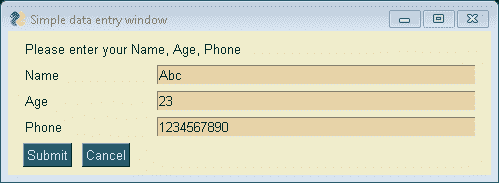

# PySimpleGUI 中的用户输入

> 原文:[https://www.geeksforgeeks.org/user-input-in-pysimplegui/](https://www.geeksforgeeks.org/user-input-in-pysimplegui/)

键如何**键**对于理解 PySimpleGUI 元素很重要。如果用户没有指定键，那么该元素将被称为输入元素，缺省情况下将以整数形式向用户提供键，从零开始编号。如果用户没有指定任何键，那么返回的值将作为一个列表返回，因为键是连续的整数。

下面的示例没有指定键。3 个输入字段将有键 0，1，2。您的第一个输入元素将作为值[0]被访问，第二个输入元素的值[1]，第三个输入元素的值[2]等等。

**示例:**使用 PySimpleGUI 进行用户输入的 Python 程序。

## 蟒蛇 3

```
import PySimpleGUI as sg

# Add some color
# to the window
sg.theme('SandyBeach')     

# Very basic window.
# Return values using
# automatic-numbered keys
layout = [
    [sg.Text('Please enter your Name, Age, Phone')],
    [sg.Text('Name', size =(15, 1)), sg.InputText()],
    [sg.Text('Age', size =(15, 1)), sg.InputText()],
    [sg.Text('Phone', size =(15, 1)), sg.InputText()],
    [sg.Submit(), sg.Cancel()]
]

window = sg.Window('Simple data entry window', layout)
event, values = window.read()
window.close()

# The input data looks like a simple list 
# when automatic numbered
print(event, values[0], values[1], values[2])   
```

**输出:**

[](https://media.geeksforgeeks.org/wp-content/uploads/20200515110507/b103.png)