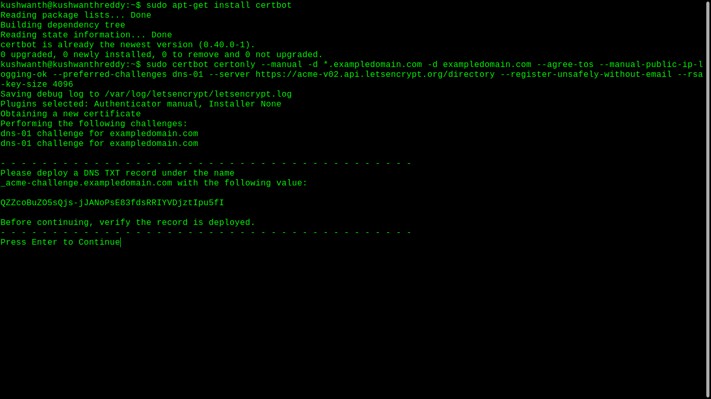
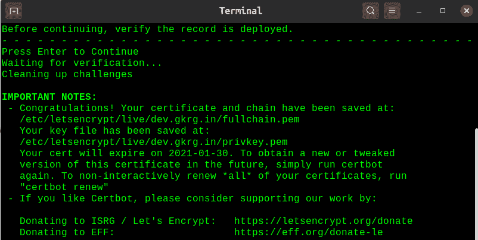

# 为 SSL 证书手动使用证书

> 原文:[https://www . geesforgeks . org/using-cert bot-manual-for-SSL-certificates/](https://www.geeksforgeeks.org/using-certbot-manually-for-ssl-certificates/)

让我们加密已经成为创建安全互联网的最重要组织之一。“让我们加密”是一个免费、自动化和开放的证书颁发机构(CA)，为公众利益而运行，是由互联网安全研究小组(ISRG)提供的一项服务。他们向人们提供他们需要的数字证书，以便免费为网站启用 HTTPS (SSL/TLS)。它得到了 EFF、ISRG、Linux 基金会、谷歌、脸书和更多公司的支持。2020 年 2 月，他们颁发了他们的第十亿张证书

“让我们加密”背后的关键原则是(如他们的网站所示):

*   **免费:**任何拥有域名的人都可以使用 Let's Encrypt 以零成本获得有效期为 9 天的可信证书。
*   **自动:**运行在网络服务器上的软件可以与 Let’s Encrypt 交互，轻松获得证书，安全配置使用，并自动处理更新，通常称为 certbot。
*   **安全:**Let’s Encrypt 将作为一个平台，在 CA 端和通过帮助站点运营商正确保护其服务器来推进 TLS 安全最佳实践。
*   **透明:**所有颁发或撤销的证书都将公开记录，供任何人查阅。
*   **开源:**自动发行和续费协议将作为开放标准发布，其他人可以采用。

Certbot 是一个免费的开源软件工具，用于在人工管理的网站上自动使用“让我们加密证书”来启用 HTTPS。它主要是由电子前沿基金会(EFF)用 python 构建的。几乎许多共享和一些云托管提供商在网站托管面板中集成了 certbot 或等效插件，允许您使用一些按钮来获取、续订和管理 SSL/TLS 证书。

在本文中，我们将学习如何通过手动使用 certbot 来获得 SSL 证书，这可以帮助您了解 certbot 是如何工作的，我将在本教程中使用 Ubuntu(您可以使用任何类似 UNIX 的操作系统)。

要求:

*   Certbot 意味着直接在网络服务器上运行。你可以在你的电脑上学习本教程
*   确保您安装了 python，这将加快安装速度
*   最好有 root 权限

对于 Ubuntu 或 Debian 系统，您可以使用 APT 安装 certbot

```
sudo apt-get install certbot
```

安装后，键入以下长命令

> cert bot certonly-manual-d * . example domain . com-d exampledomain.com-agree-tos-manual-public-IP-logging-ok-preferred-challenges DNS-01-server https://acme-v02.api.letsencrypt.org/directory-register-unsafly-不带电子邮件-RSA-key-size 4096

进入指挥室

*   **肯定机器人:T1】肯定机器人程序**
*   **certonly:** 运行一次 certbot，certbot-auto 自动运行 certbot
*   **手动:**在手动模式下运行 certbot
*   **d:** 要包含在证书中的域，请使用您的域及其通配符代替 exampledomain.com
*   **同意条款:**同意 letsencrypt 和 eff 的服务条款
*   **手动-公共-ip-记录-ok:** 记录您出于安全目的使用的系统的 IP
*   **首选-挑战:**用于验证域所有权的方式，我们使用了 DNS 挑战
*   **服务器:**letsencrypt ACME 服务器
*   **注册-无电子邮件不安全:**获取证书不注册无电子邮件不安全，但在生产过程中使用电子邮件接收有关获取、续订和撤销证书的信息
*   **rsa 密钥大小:**RSA 密钥大小的长度

这时你可以看到类似下图的东西



获取证书

现在登录到您的域名系统管理器，添加带有极致挑战的 TXT 记录，不要更改极致挑战


TXT 记录

验证完成后，certbot 将获得您的域的 SSL 证书。您可以在/etc/letsencrypt/live/example domain . com/文件夹中找到 SSL 证书



加密套接字协议层