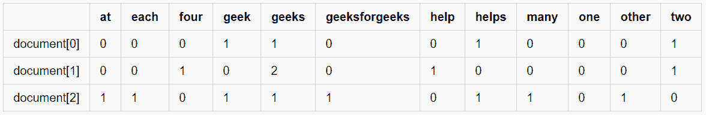
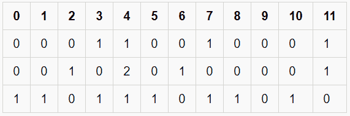

# 使用计数向量器从文本中提取特征

> 原文:[https://www . geeksforgeeks . org/using-count vectorizer-to-extracting-features-from-text/](https://www.geeksforgeeks.org/using-countvectorizer-to-extracting-features-from-text/)

**CountVectorizer** 是 Python 中 scikit-learn 库提供的一个很棒的工具。它用于根据在整个文本中出现的每个单词的频率(计数)将给定的文本转换为向量。当我们有多个这样的文本时，这很有帮助，我们希望将每个文本中的每个单词转换成向量(用于进一步的文本分析)。

让我们考虑文档中的几个示例文本(每个都是列表元素):

> document = [“一个极客帮助两个极客”、“两个极客帮助四个极客”、“每个极客在极客 forGeeks 帮助许多其他极客。”]

CountVectorizer 创建一个矩阵，其中每个唯一的单词都由矩阵的一列表示，文档中的每个文本样本都是矩阵中的一行。每个单元格的值只不过是特定文本样本中单词的计数。

这可以可视化如下–

<center></center>

**关键观察值:**

1.  文档中有 12 个唯一的单词，表示为表格的列。
2.  文档中有 3 个文本示例，每个示例都表示为表格的行。
3.  每个单元格都包含一个数字，代表该特定文本中单词的数量。
4.  所有单词都已转换成小写。
5.  列中的单词是按字母顺序排列的。

在 CountVectorizer 中，这些单词不会存储为字符串。相反，它们被赋予一个特定的索引值。在这种情况下，“at”的索引为 0，“每个”的索引为 1，“4”的索引为 2，依此类推。实际表示如下表所示–

<center>

稀疏矩阵

</center>

This way of representation is known as a **Sparse Matrix**.

**代码:CountVectorizer 的 Python 实现**

```py
from sklearn.feature_extraction.text import CountVectorizer

document = ["One Geek helps Two Geeks",
            "Two Geeks help Four Geeks",
            "Each Geek helps many other Geeks at GeeksforGeeks"]

# Create a Vectorizer Object
vectorizer = CountVectorizer()

vectorizer.fit(document)

# Printing the identified Unique words along with their indices
print("Vocabulary: ", vectorizer.vocabulary_)

# Encode the Document
vector = vectorizer.transform(document)

# Summarizing the Encoded Texts
print("Encoded Document is:")
print(vector.toarray())
```

**输出:**

```py
Vocabulary:  {'one': 9, 'geek': 3, 'helps': 7, 'two': 11, 'geeks': 4, 'help': 6, 'four': 2, 'each': 1, 'many': 8, 'other': 10, 'at': 0, 'geeksforgeeks': 5}

Encoded Document is:

[ [0 0 0 1 1 0 0 1 0 1 0 1]

  [0 0 1 0 2 0 1 0 0 0 0 1]

  [1 1 0 1 1 1 0 1 1 0 1 0] ]
```