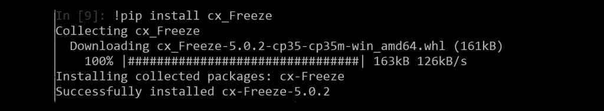
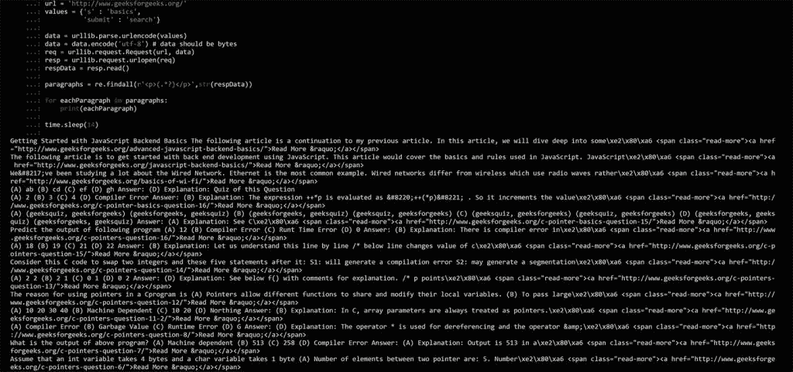

# 使用 Python 中的 CX _ Freeze

> 原文:[https://www.geeksforgeeks.org/using-cx_freeze-python/](https://www.geeksforgeeks.org/using-cx_freeze-python/)

我们用 Python 创建了许多有趣的项目和程序。也许有一天，我们创造了一些非常令人兴奋的东西，我们想分享它。通常，为了共享我们的 Python 程序，接收者需要安装相同版本的 Python，以及所有使用的模块。嗯，这可能是相当繁琐的要求。对转换为的兴趣。exe 对于发行版来说相当高，有几个选项。对于 Python 2.7 来说， [Py2exe](http://www.py2exe.org/) 是一个很好的选择&对于 Python 3 来说，cx_freeze 工作得相当好。

**CX _ 冻结|。py to。exe**

[cx_Freeze](https://pypi.python.org/pypi/cx_Freeze) 是一组用于将 Python 脚本冻结为可执行文件的脚本和模块，其方式与 [py2exe](http://www.py2exe.org/) 和 [py2app](https://py2app.readthedocs.io/en/latest/) 非常相似。与这两个工具不同，cx_Freeze 是跨平台的，应该可以在 Python 本身工作的任何平台上工作。它支持 Python 2.7 或更高版本(包括 Python 3)。
我们首先需要从[这里](https://pypi.python.org/pypi/cx_Freeze)下载 cx_Freeze:或者使用 pip:
安装

一旦我们有了 cx_freeze，我们就可以开始了。我们将使用正则表达式和 urllib 解析“geeksforgeeks.org”。

```py
import urllib.request
import urllib.parse
import re
import time

url = 'https://www.geeksforgeeks.org/'
values = {'s' : 'basics',
          'submit' : 'search'}

data = urllib.parse.urlencode(values)
data = data.encode('utf-8') # data should be bytes
req = urllib.request.Request(url, data)
resp = urllib.request.urlopen(req)
respData = resp.read()

paragraphs = re.findall(r'<p>(.*?)</p>',str(respData))

for eachParagraph in paragraphs:
    print(eachParagraph)

time.sleep(14)
```

**输出:**我们在最后增加了一个 14 秒的休眠，这样我们就可以在可执行文件关闭前运行并看到输出。所以，让我们把这个文件保存为


现在，我们创建第二个名为“setup.py”的文件

```py
from cx_Freeze import setup, Executable

setup(name = "GeeksforGeeks" ,
      version = "0.1" ,
      description = "" ,
      executables = [Executable("reandurllib.py")])
```

因此，这里我们从 cx_Freeze 设置和可执行文件导入，然后我们调用设置函数，添加 4 个参数。

1.  **名称:**这是我们希望我们的可执行文件成为的名称
2.  **版本:**只是给它一个版本号，
3.  **描述:**我们想给出的所有细节(可选)
4.  **可执行**最后我们要转换什么，使用可执行函数和要转换的 python 脚本路径作为参数。

接下来，我们打开 cmd.exe，或 bash，或我们拥有的任何 shell，导航到包含 setup.py 和要转换的脚本的目录，然后运行:

```py
python setup.py build
```

现在我们得到了一个构建目录。在其中，我们找到了另一个目录，在那个目录中，我们找到了我们的可执行文件！如果一切顺利，它应该从[geeksforgeeks.org](https://www.geeksforgeeks.org/)解析 basic 的搜索结果，并在关闭前显示文本结果 15 秒。查看，如何找到可执行文件:

有些事情不会这么简单。转换像 Pygame 和 Matplotlib 这样的东西是非常困难的，需要根据具体情况来解决。

**参考:**

*   [CX _ 冻结](https://anthony-tuininga.github.io/cx_Freeze/)
*   [文件 CX _ 冻结](https://cx-freeze.readthedocs.io/en/latest/)

本文由 **Amartya Ranjan Saikia** 供稿。如果你喜欢 GeeksforGeeks 并想投稿，你也可以使用[contribute.geeksforgeeks.org](http://www.contribute.geeksforgeeks.org)写一篇文章或者把你的文章邮寄到 contribute@geeksforgeeks.org。看到你的文章出现在极客博客主页上，帮助其他极客。

如果你发现任何不正确的地方，或者你想分享更多关于上面讨论的话题的信息，请写评论。