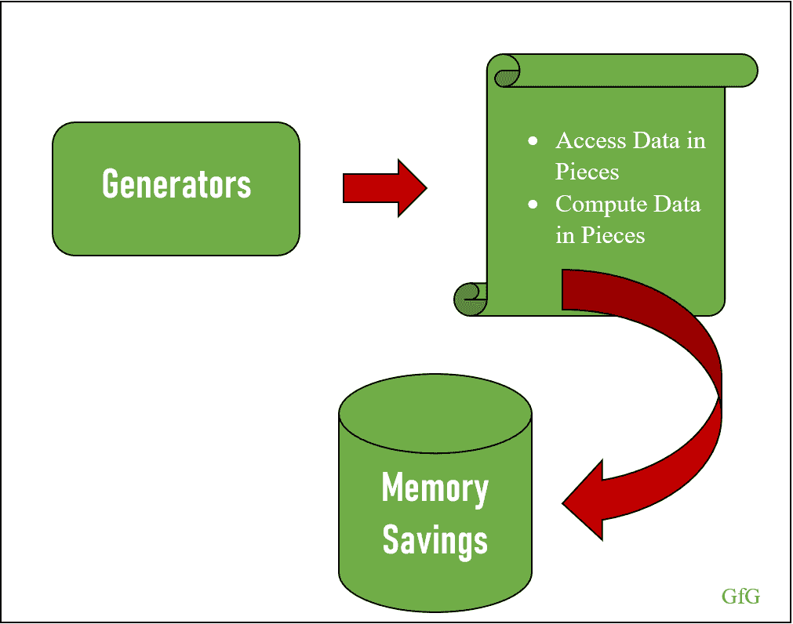
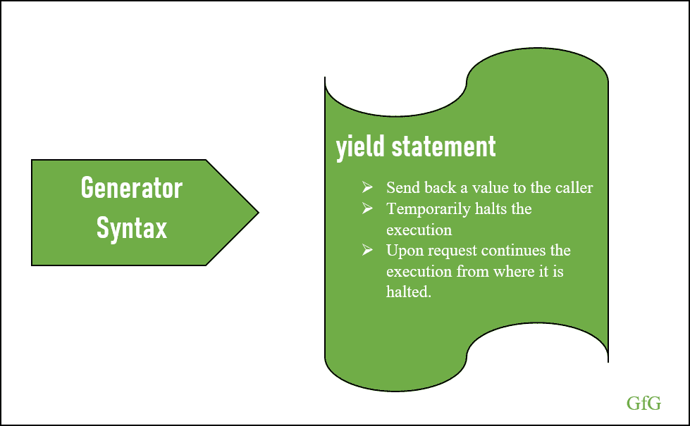
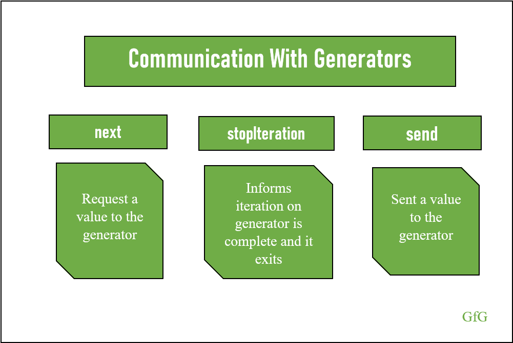
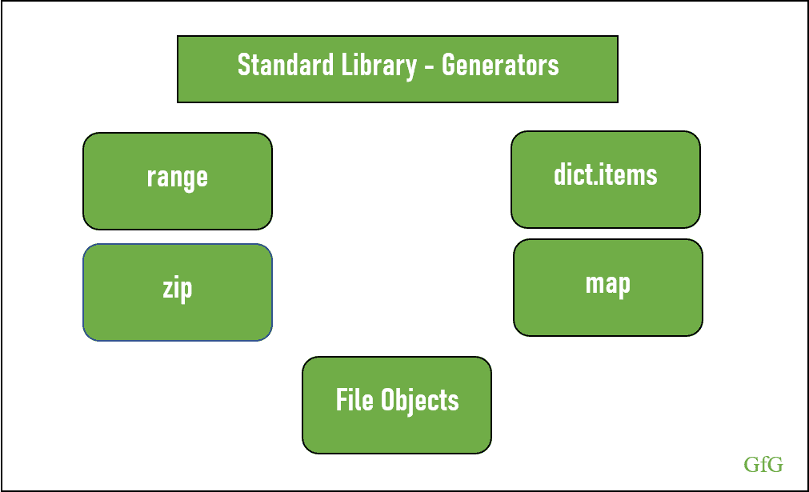
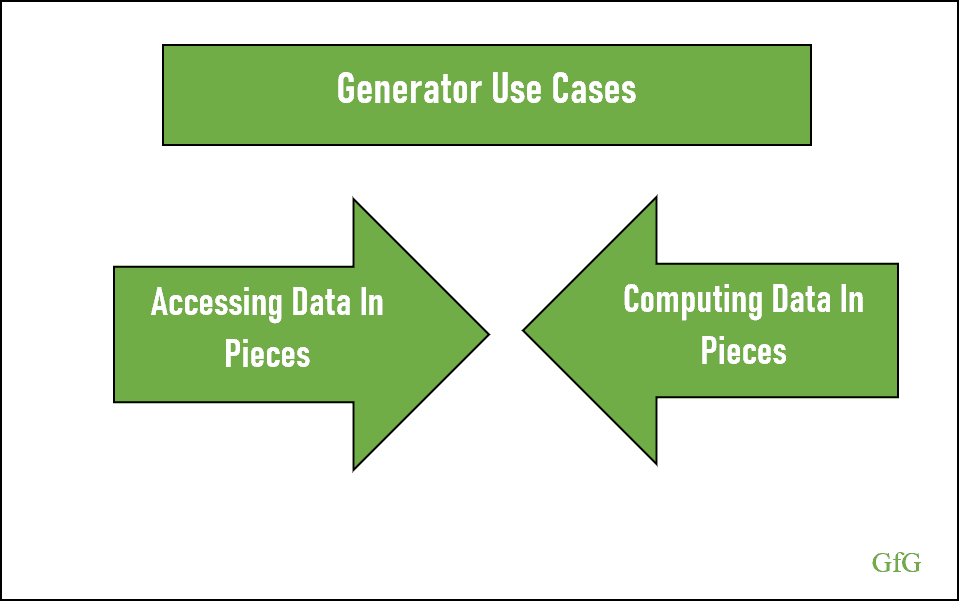
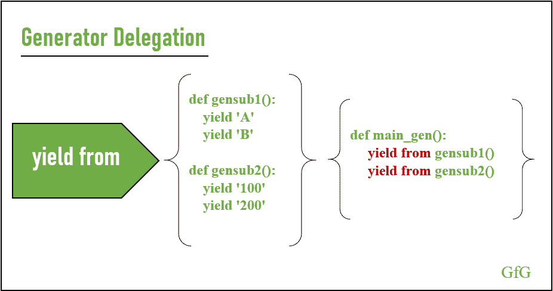

# 在 Python 中使用生成器节省大量内存

> 原文:[https://www . geeksforgeeks . org/使用生成器大幅节省 python 内存/](https://www.geeksforgeeks.org/using-generators-for-substantial-memory-savings-in-python/)

当内存管理和维护生成的值之间的状态成为程序员的一项艰巨工作时，Python 实现了一个友好的解决方案，称为**生成器**。



发电机

有了生成器，功能发展到**分块访问和计算数据**。因此，函数可以根据请求将结果返回给它的调用方，并且可以保持它的状态。**生成器通过在向调用者生成值后停止代码来维护函数状态，并根据请求从停止的地方继续执行。**
由于发电机按需访问和计算价值，大量数据不需要完全保存在内存中，从而节省了大量内存。

## 生成器语法



收益率报表

我们可以说，当一个函数在代码中有一个 yield 语句时，它就是一个生成器。像在 return 语句中一样，yield 语句也向调用者发送一个值，但是它不退出函数的执行。**相反，它会暂停执行，直到收到下一个请求。根据请求，生成器从停止的地方继续执行。**

```py
def primeFunction():
    prime = None
    num = 1
    while True:
        num = num + 1

        for i in range(2, num): 
            if(num % i) == 0:
                prime = False
                break
            else:
                prime = True

        if prime:

            # yields the value to the caller 
            # and halts the execution
            yield num

def main():

    # returns the generator object.
    prime = primeFunction()

    # generator executes upon request
    for i in prime:
        print(i)
        if i > 50:
            break

if __name__ == "__main__":
    main()
```

**输出**

```py
3
5
7
11
13
17
19
23
29
31
37
41
43
47
53

```

## 与发电机的通信



接下来，停止迭代并发送

呼叫者和生成器如何相互通信？这里我们将讨论 python 中的 3 个内置函数。它们是:

*   然后
*   停止迭代
*   派遣

### 然后

下一个函数可以**为其下一个值请求一个生成器。**根据请求，生成器代码执行，yield 语句将值提供给调用者。此时，生成器停止执行并等待下一个请求。让我们通过考虑一个斐波那契函数来深入挖掘。

```py
def fibonacci():
    values = []
    while True:

        if len(values) < 2:
            values.append(1)
        else :

            # sum up the values and 
            # append the result
            values.append(sum(values))

            # pop the first value in 
            # the list
            values.pop(0)

        # yield the latest value to 
        # the caller
        yield values[-1]
        continue

def main():
    fib = fibonacci()
    print(next(fib))  # 1
    print(next(fib))  # 1
    print(next(fib))  # 2
    print(next(fib))  # 3
    print(next(fib))  # 5

if __name__ == "__main__":
    main()
```

**输出**

```py
1
1
2
3
5

```

*   Creating the generator object by calling the fibonacci function and saving its returned value to fib. In this case, the code hasn’t run, the python interpreter recognizes the generator and returns the generator object. **Since the function has a yield statement the generator object is returned instead of a value.**

    ```py
    fib = fibonacci()
    fib
    ```

    **输出**

    ```py
    generator object fibonacci at 0x00000157F8AA87C8
    ```

*   Using next function, the caller requests a value to the generator and the execution begins.

    `next(gen)`
    **输出**

    ```py
    1
    ```

*   由于值列表为空，因此执行“if 语句”中的代码，并将“1”追加到值列表中。接下来，使用 yield 语句将值让给调用者，执行停止。这里需要注意的一点是**在执行 continue 语句之前会暂停执行。**

    ```py
    # values = []
    if len(values) < 2:

        # values = [1]
        values.append(1)

    # 1
    yield values[-1]
    continue
    ```

*   在第二次请求时，代码从它停止的地方继续执行。这里，它从“continue”语句执行，并将控制传递给 while 循环。
    现在值列表包含第一个请求的值。由于“values”的长度为 1 且小于 2，因此“if 语句”中的代码会执行。

    ```py
    # values = [1]
    if len(values) < 2:

        # values = [1, 1]
        values.append(1)

    # 1 (latest value is provided 
    # to the caller)
    yield values[-1]
    continue
    ```

*   同样，使用 next(fib)请求该值，并从“continue”语句开始执行。现在值的长度不小于 2。因此，它会输入 else 语句，对列表中的值进行求和，并追加结果。pop 语句从列表中移除第一个元素，并产生最新的结果。

    ```py
    # values = [1, 1]
    else:

        # values = [1, 1, 2]
        values.append(sum(values))

        # values = [1, 2]
        values.pop(0)

    # 2
    yield values[-1]
    continue
    ```

*   您对更多值的请求将重复该模式并产生最新值

### 停止迭代

停止迭代是一个内置的异常，用于从生成器中退出。当生成器的迭代完成时，它通过引发 StopIteration 异常向调用者发出信号，然后退出。

下面的代码解释了这个场景。

```py
def stopIteration():
    num = 5
    for i in range(1, num):
        yield i

def main():
    f = stopIteration()

    # 1 is generated
    print(next(f))

    # 2 is generated
    print(next(f))

    # 3 is generated
    print(next(f))

    # 4 is generated
    print(next(f))

    # 5th element - raises
    # StopIteration Exception
    next(f)

if __name__ == "__main__":
    main()

```

**输出**

> 1
> 2
> 3
> 4
> 回溯(最近一次调用最后一次):
> 文件“C:\ Users \ Sonu George \ Documents \ geesforgeks \ Python Pro \ Generators \ stopIteration . py”，第 19 行，在
> main()
> 文件“C:\ Users \ Sonu George \ Documents \ geesforgeks \ Python Pro \ Generators \ stop iteration . py”，第 15 行，在 main
> 下一个(f) #第 5 个元素–引发 stop iteration 异常
> StopIteration

下面的代码解释了另一个场景，其中程序员可以引发 StopIteration 并退出生成器。
`raise StopIteration`

```py
def stopIteration():
    num = 5
    for i in range(1, num):
        if i == 3:
            raise StopIteration
        yield i

def main():
    f = stopIteration()

    # 1 is generated
    print(next(f))

    # 2 is generated
    print(next(f))

    # StopIteration raises and 
    # code exits
    print(next(f))
    print(next(f))    

if __name__ == "__main__":
    main()
```

**输出**

> 1
> 2
> 回溯(最近一次调用最后一次):
> 文件“C:\ user \ Sonu George \ Documents \ geeks forgeeks \ Python Pro \ Generators \ stop iteration . py”，第 5 行，在 stopIteration
> 中提升 StopIteration
> StopIteration
> 
> 上述异常是以下异常的直接原因:
> 
> 回溯(最近一次调用最后一次):
> 文件“C:\ Users \ Sonu George \ Documents \ geesforgeks \ Python Pro \ generations \ stopIteration . py”，第 19 行，在
> main()
> 文件“C:\ Users \ Sonu George \ Documents \ geesforgeks \ Python Pro \ generations \ stop iteration . py”，第 13 行，在 main
> print(next(f))# stop iteration 引发并退出
> RuntimeError: generator 引发 stop iteration

### 派遣

到目前为止，我们已经看到了生成器如何在通信是单向的情况下向调用代码提供值。到目前为止，生成器还没有从调用者那里收到任何数据。
在本节中，我们将讨论**允许调用者与生成器通信的‘发送’方法。**

```py
def factorial():
    num = 1
    while True:
        factorial = 1

        for i in range(1, num + 1):

            # determines the factorial
            factorial = factorial * i

        # produce the factorial to the caller
        response = yield factorial

        # if the response has value
        if response:

            # assigns the response to 
            # num variable
            num = int(response)
        else:

            # num variable is incremented
            # by 1
            num = num + 1

def main():
    fact = factorial()
    print(next(fact))
    print(next(fact))
    print(next(fact))
    print(fact.send(5))   # send
    print(next(fact))

if __name__ == "__main__":
    main()
```

**输出**

```py
1
2
6
120
720

```

生成器根据调用者的请求(使用下一个方法)生成前三个值(1、2 和 6)，并根据调用者提供的数据(5)生成第四个值(120)(使用 send 方法)。
我们来考虑生成器产生的第三个数据(6)。3 的阶乘= 3*2*1，由生成器生成，执行暂停。

```py
factorial = factorial * i 
```

此时，调用者使用“发送”方法并提供数据“5”。因此，生成器从停止的地方执行，即将调用者发送的数据保存到“响应”变量(`response = yield factorial`)。**由于“响应”包含一个值，代码进入“if”条件，并将响应分配给“num”变量。**

```py
if response:
    num = int(response)
```

现在，流程转到“while”循环，确定阶乘，并交给调用者。同样，生成器会暂停执行，直到下一个请求。

如果我们查看输出，我们可以看到调用者使用“发送”方法后订单被中断。更准确地说，前 3 个请求的输出如下:
1 = 1 的阶乘
2 = 2 的阶乘
3 = 6 的阶乘

但是当用户发送值 5 时，输出变为 120,“num”保持值 5。在下一个请求中(使用“next ”),我们期望 num 基于上一个“next”请求(即 3+1 = 4)而不是“send”方法递增。但是在这种情况下,“num”增加到 6(基于使用“send”的最后值)并产生输出 720。

下面的代码显示了处理调用者发送的值的不同方法。

```py
def factorial():
    num = 0
    value = None
    response = None
    while True:
        factorial = 1       
        if response:
            value = int(response)
        else:
            num = num + 1
            value = num

        for i in range(1, value + 1):
            factorial = factorial * i
        response = yield factorial

def main():
    fact = factorial()
    print(next(fact))
    print(next(fact))
    print(next(fact))
    print(fact.send(5))   # send
    print(next(fact))

if __name__ == "__main__":
    main()
```

**输出**

```py
1
2
6
120
24

```

## 标准库-生成器



标准程序库

*   范围
*   字典项目
*   活力
*   地图
*   文件对象

### 范围

Range 函数返回一个可迭代的 range 对象，它的迭代器是一个生成器。它返回从下限开始并持续到上限的顺序值。

```py
def range_func():
    r = range(0, 4)
    return r

def main():
    r = range_func()
    iterator = iter(r)
    print(next(iterator))
    print(next(iterator))

if __name__ == "__main__":
    main()
```

**输出**

```py
0
1

```

### 字典项目

python 中的 Dictionary 类提供了三种迭代字典的方法。它们是键、值和项，它们的迭代器是生成器。

```py
def dict_func():
    dictionary = {'UserName': 'abc', 'Password':'a@123'}
    return dictionary

def main():
    d = dict_func()
    iterator = iter(d.items())
    print(next(iterator))
    print(next(iterator))

if __name__ == "__main__":
    main()
```

**输出**

```py
('UserName', 'abc')
('Password', 'a@123')

```

### 活力

zip 是一个内置 python 函数，它接受多个可迭代对象，并一次迭代所有对象。它们从每个可迭代的元素中产生第一个元素，然后是第二个元素，依此类推。

```py
def zip_func():
    z = zip(['a', 'b', 'c', 'd'], [1, 2, 3, 4])
    return z

def main():
    z = zip_func()
    print(next(z))
    print(next(z))
    print(next(z))

if __name__ == "__main__":
    main()
```

**输出**

```py
('a', 1)
('b', 2)
('c', 3)

```

### 地图

map 函数将函数和 iterable 作为参数，并计算函数对 ITER able 的每一项的结果。

```py
def map_func():
    m = map(lambda x, y: max([x, y]), [8, 2, 9], [5, 3, 7])
    return m

def main():
    m = map_func()
    print(next(m))  # 8 (maximum value among 8 and 5)
    print(next(m))  # 3 (maximum value among 2 and 3)
    print(next(m))  # 9 (maximum value among 9 and 7)

if __name__ == "__main__":
    main()
```

**输出**

```py
8
3
9

```

### 文件对象

即使文件对象有一个 readline 方法来逐行读取文件，它也支持生成器模式。一个不同之处是，这里 readline 方法捕获 StopIteration 异常，并在到达文件末尾时返回一个空字符串，这与使用下一个方法时不同。

使用 next 方法时，file 对象会生成包含换行符(\n)的整行

```py
def file_func():
    f = open('sample.txt')
    return f

def main():
    f = file_func()
    print(next(f))
    print(next(f))

if __name__ == "__main__":
    main()
```

**输入:sample.txt**

```py
Rule 1
Rule 2
Rule 3
Rule 4

```

**输出**

```py
Rule 1

Rule 2

```

## 发电机使用案例



生成器用例

发电机的基本概念是根据需求确定价值。下面我们将讨论两个源自上述概念的用例。

*   分段访问数据
*   分块计算数据

### 分段访问数据

为什么我们需要分块访问数据？当程序员不得不处理大量数据时，比如读取文件等等，这个问题是有效的。在这种情况下，制作数据副本并对其进行处理不是一个可行的解决方案。**通过使用生成器，程序员可以一次访问一个数据。**考虑文件操作时，用户可以逐行访问数据，如果是字典，一次可以访问二元组。
因此，生成器是处理大量数据的重要工具，可以避免不必要的数据存储，并节省大量内存。

### 分块计算数据

编写生成器的另一个原因是它能够根据请求计算数据。从上面的斐波那契函数可以理解**发生器按需产生数值。**此过程避免了不必要的计算和存储值，因此可以提高性能，并节省大量内存。
另一点需要注意的是，发电机计算无限数量数据的能力。

## 发电机委托



屈服于

生成器可以像函数一样调用另一个生成器。使用“屈服于”语句，生成器可以实现这一点，该过程称为**生成器委托。**
由于生成器正在委托给另一个生成器，*发送给包装生成器的值将可用于当前委托生成器*。

```py
def gensub1():
    yield 'A'
    yield 'B'

def gensub2():
    yield '100'
    yield '200'

def main_gen():
    yield from gensub1()
    yield from gensub2()

def main():
    delg = main_gen()
    print(next(delg))
    print(next(delg))
    print(next(delg))
    print(next(delg))

if __name__ == "__main__":
    main()
```

**输出**

```py
A
B
100
200

```

## 摘要

对于处理大量数据的程序员来说，生成器是一个必不可少的工具。它按需计算和访问数据的能力带来了性能的提高和内存的节省。此外，当需要表示无限序列时，考虑使用生成器。