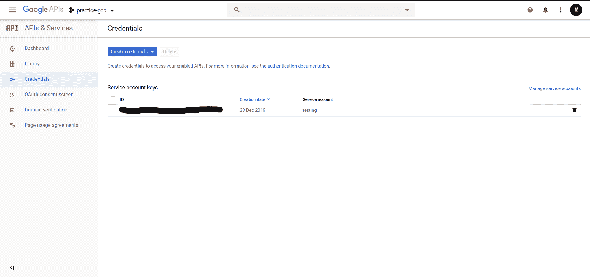
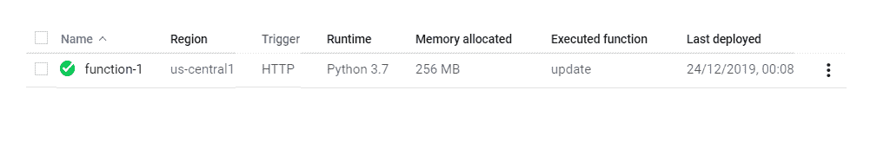
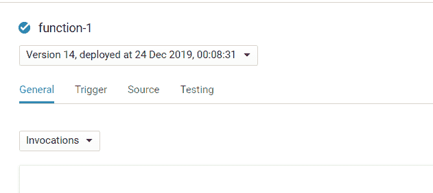
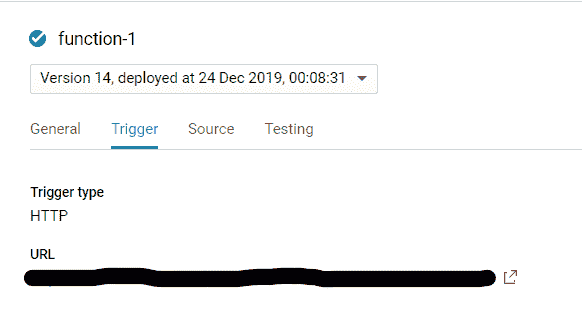

# 使用谷歌云功能为机器学习模型生成数据

> 原文:[https://www . geesforgeks . org/using-Google-cloud-function-to-generate-data-for-machine-learning-model/](https://www.geeksforgeeks.org/using-google-cloud-function-to-generate-data-for-machine-learning-model/)

前提:[在谷歌云平台上部署云功能](https://www.geeksforgeeks.org/deploy-cloud-function-on-google-cloud-platform/)

你是否搜索数据来在线训练你的模型？如果我们告诉您，您可以在几行代码中生成自己的数据，会怎么样？

你只需要一个**谷歌云平台**账号，知道如何将简单代码部署到云功能。我们将使用谷歌表单来存储数据。您可以使用云 SQL 或谷歌云存储桶或 Firebase 来存储数据。您所需要做的就是启用必要的 API。

**启用应用编程接口并创建凭证:**

1.  前往云控制台中的[市场](https://console.developers.google.com/apis/dashboard)。
2.  点击启用应用编程接口和服务
3.  然后搜索谷歌驱动应用编程接口并启用它
4.  然后转到屏幕左侧导航栏上的凭据选项卡。
5.  然后单击创建凭据，然后选择服务帐户密钥
6.  Then create a new service account by giving it a name and set the Role to Editor under the Projects sub-field and keep the key type as JSON and click on Create button. Keep the Downloaded JSON safely.

    完成所有这些步骤后，您的页面应该如下所示

    

7.  再次转到仪表板并遵循相同的步骤。这次搜索谷歌表单并启用应用编程接口。

**创建电子表格**

1.  在谷歌工作表中创建电子表格
2.  在下载的 JSON 文件中查找字段 *client_email* 并复制该邮件。
3.  打开新创建的电子表格，点击共享选项，在那里输入粘贴*客户端 _ 电子邮件*。

于是，无聊的部分就完成了。现在，让我们进入代码。

**设置云端功能**

1.  创建一个新的云函数，并将*运行时*更改为 *Python 3.7*
2.  Go to *requirements.txt* and delete the boilerplate text and add the following lines to it.

    *gspread>= 3 . 1 . 0
    oauth 2 client>= 4 . 1 . 3*

3.  Now the most important and the best part, *writing the code*. Delete the entire boilerplate code and paste the following code

    ```
    import gspread
    from oauth2client.service_account import ServiceAccountCredentials
    from datetime import datetime

    def update(request):
        # getting the variables ready
        data = {
            # your client_json contents as dictionary
        }

        request_json = request.get_json()
        request_args = request.args
        temp = ""

        if request_json and 'temp' in request_json:
            temp = request_json['temp']
        elif request_args and 'temp' in request_args:
            temp = request_args['temp']

        # use creds to create a client to interact with the Google Drive API
        scope = ['https://spreadsheets.google.com/feeds', 'https://www.googleapis.com/auth/drive']

        creds = ServiceAccountCredentials.from_json_keyfile_dict(data, scope)

        client = gspread.authorize(creds)

        # Find a workbook by name and open the first sheet
        # Make sure you use the right name here.
        sheet = client.open("Temperature").sheet1

        row = [datetime.now().strftime("% d/% m/% Y % H:% M:% S"), temp]
        index = 2
        sheet.insert_row(row, index)
    ```

    **代码解释–**

    > ->首先，我们获得必要的进口。 *gspread* 是执行 Google Sheets 处理的库。然后，我们进口 *oauth2client* 。这将处理我们对生成的凭据的身份验证。然后，我们导入*日期时间*以正确记录当前时间和日期的数据。
    > 
    > ->进入*更新(请求)*，首先我们在*数据*字典中添加我们的凭证。然后，我们将用户请求参数存储在一个名为 *request_json* 的变量中，然后初始化 *temp* ，然后将*“temp”*键值分配到该变量中。
    > 
    > ->我们正在定义身份验证的范围。我们正在使用 *oauth2client* 在指定的范围内进行必要的身份验证。
    > 然后，打开你的谷歌电子表格，在那里指定你的工作表名称。然后，我们在*索引*变量的指定行插入记录的日期和时间以及工作表中的参数。

4.  现在在*功能中输入*更新*执行*，然后点击*策略*

之后你的云功能页面应该是这样的

之后，你需要点击功能名称，这里*功能-1*


然后，转到*触发*选项卡


之后，注意那里显示的网址。这是您将发送 GET 请求和数据参数的 URL，以便将参数值添加到电子表格中。

**设置物联网设备**
你可以使用 *Nodemcu* 或 *Arduino* 将数据发送到谷歌表单，但你将需要一个 WiFi 模块，当然，树莓皮也可以使用。现在，您所要做的就是将 http 请求连同参数一起发送到 Cloud Function URL，这里是 *temp* 或 temp。这将编辑电子表格并将参数值添加到电子表格中。

话虽如此，这就是如何使用云功能将数据记录到谷歌表单。您可以对云 SQL 或任何其他存储方式进行同样的操作。存储的数据可以用作其相关机器学习模型的训练数据。