# 在 Python 中使用 Google Sheets 作为数据库

> 原文:[https://www . geesforgeks . org/using-Google-sheets-as-database-in-python/](https://www.geeksforgeeks.org/using-google-sheets-as-database-in-python/)

在本文中，我们将讨论如何使用谷歌表单像数据库一样运行任何 Python 文件。

### 谷歌电子表格:

谷歌电子表格是一个免费的在线网络应用程序，类似于微软的电子表格。您可以使用它为各种项目创建和编辑表格，如联系人列表、预算和几乎所有您能想象到的内容。

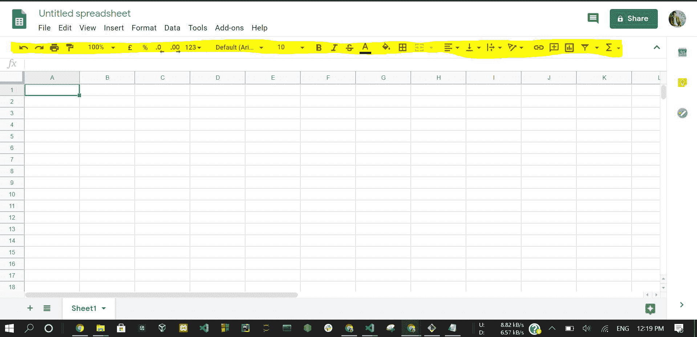

谷歌电子表格(突出显示的是工具栏)

### 应用程序接口:

连接是一件非常重要的事情，我们都已经习惯了即时连接，无论是桌面还是移动，世界都触手可及。那么数据是如何从 A 点到 B 点传输的，不同的设备和应用程序是如何相互连接的。应用编程接口是一个信使，它接受请求，告诉系统你想做什么，并向你返回响应。

### 谷歌电子表格应用编程接口:

我们可以使用这个谷歌电子表格作为数据存储，您可以通过一个应用编程接口访问这个数据存储，所以我们可以做的是我们可以输入我们的数据，从您的应用程序中，您可以通过一个常规的 JSON 应用编程接口访问数据。

### 逐步方法:

*   因此，我们的第一步是在您的任何谷歌帐户上创建一个电子表格，并给它一个合适的名称，就像我们可以用一些随机条目命名*谷歌表单应用编程接口教程*如下所示:

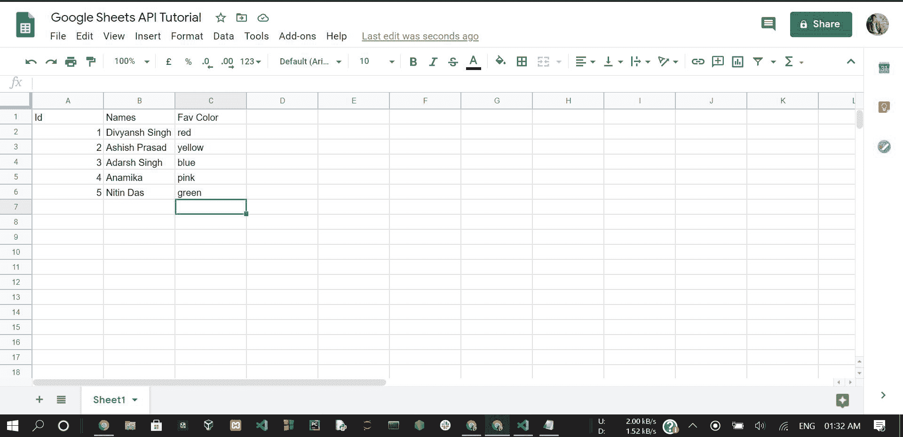

谷歌表单

*   下一步访问[谷歌云平台](https://console.cloud.google.com/)现在打开如下所示的页面:

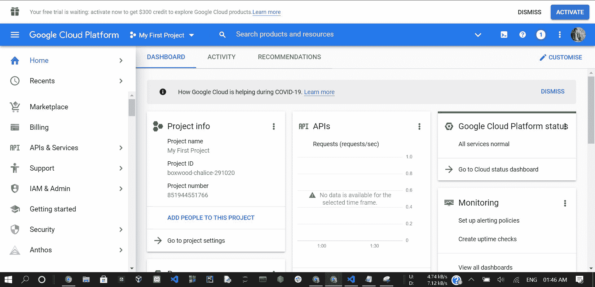

谷歌云平台

*   现在点击**我的第一个项目**出现如下对话框，现在点击**新项目**

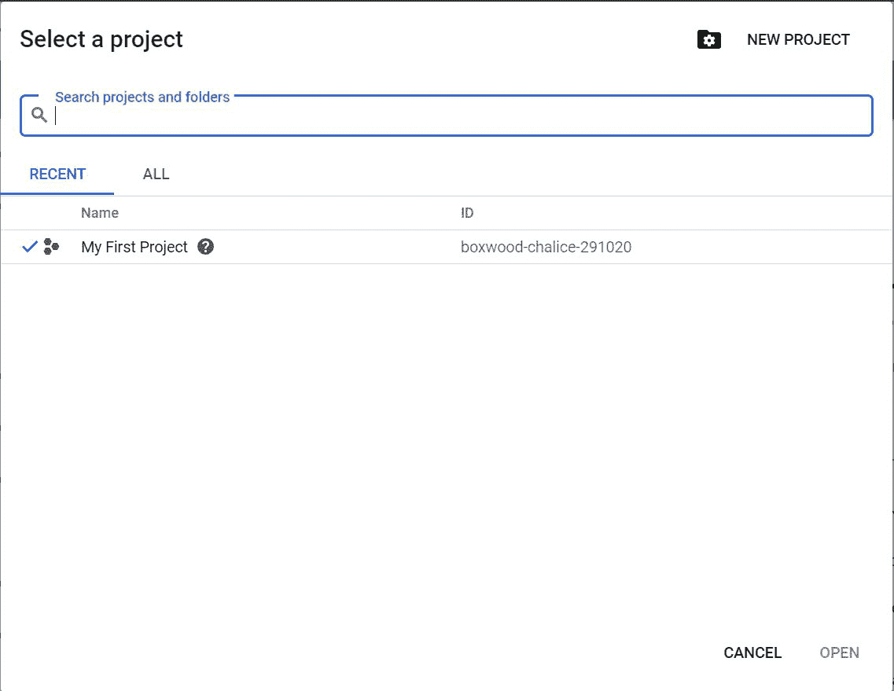

*   现在创建您的项目。现在点击侧菜单栏中的 **API &服务**，然后进入如下所示的库，搜索**谷歌驱动**，点击**谷歌驱动 API** :

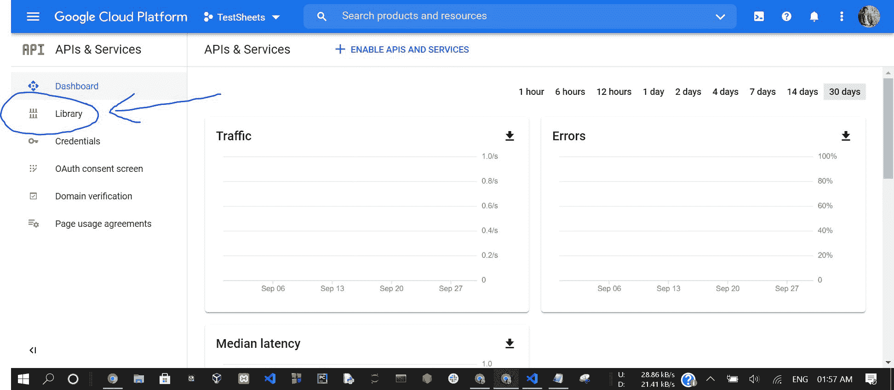

点击**启用**

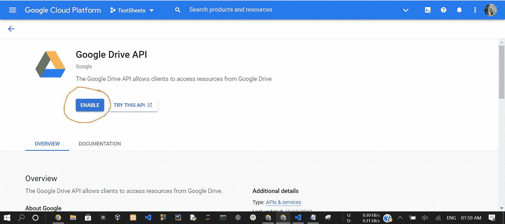

*   现在我们要下载一个 *JSON* 文件，它将存储我们的凭证，所以一旦下载，我们将返回到库，搜索谷歌表单应用编程接口，启用它，一旦启用，我们都准备好用我们的代码连接一些东西，所以这就是我们的谷歌云平台，只要确保跟踪 *JSON* 文件在哪里，因为我们现在实际上要打开它。

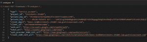

creds.json

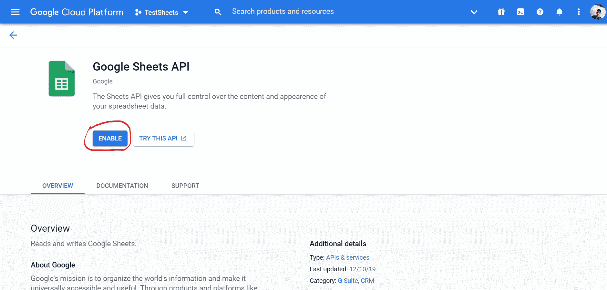

*   现在我们将复制**客户端电子邮件**，然后转到我们之前制作的谷歌表单，转到共享选项，将该电子邮件粘贴到其中，然后单击发送。这允许从我们的应用编程接口访问谷歌表单。不，我们现在回到 *Pycharm* ，创建一个 python 文件 **sheets.py** 。

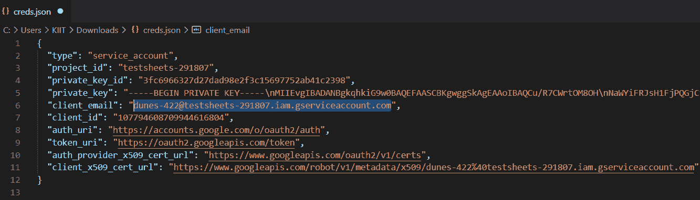 

*   现在我们将回到 *Pycharm* 现在，创建一个 python 文件 **sheets.py.** 现在我们没有编写任何代码，但是我们将使用 *pip* 安装两个包或模块，这样我们就可以实际使用该 API，为此，在 *Pycharm* 中，我们只需打开内置终端，或者我们可以打开命令提示符并键入以下命令:

```py
pip install gspread oauth2client 
```

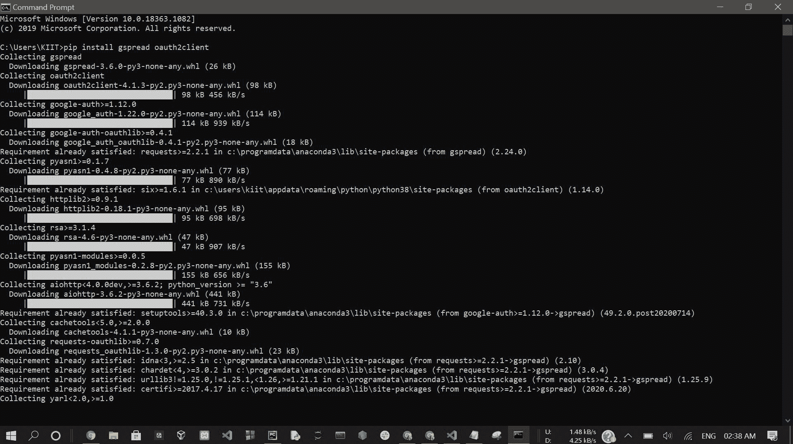

*   完成后，您需要使用一些模块创建一个 python 脚本。以下是完整的程序:

## 蟒蛇 3

```py
# Import required modules
import gspread
from oauth2client.service_account import ServiceAccountCredentials
from pprint import pprint

scope = ["https://spreadsheets.google.com/feeds", 'https://www.googleapis.com/auth/spreadsheets',
         "https://www.googleapis.com/auth/drive.file", "https://www.googleapis.com/auth/drive"]

# Assign credentials ann path of style sheet
creds = ServiceAccountCredentials.from_json_keyfile_name("creds.json", scope)
client = gspread.authorize(creds)
sheet = client.open("Google Sheets API Tutorial").sheet1

# display data
data = sheet.get_all_records()
row4 = sheet.row_values(4)
col2 = sheet.col_values(2)
cell = sheet.cell(5, 2).value

print("Column 2 Data : ")
pprint(col2)
print("\nRow 4 Data : ")
pprint(row4)
print("\nCell (5,2) Data : ")
pprint(cell)
print("\nAll Records : ")
pprint(data)

# Inserting data
insertRow = [6, "Soumodeep Naskar", "Purple"]
sheet.insert_row(insertRow, 4)
print("\nAll Records after inserting new row : ")
pprint(data)

# Deleting data
sheet.delete_row(7)
print("\nAll Records after deleting row 7 : ")
pprint(data)

# Update a cell
sheet.update_cell(5, 2, "Nitin Das")
print("\nAll Records after updating cell (5,2) : ")
pprint(data)

# Display no. of rows, columns
# and no. of rows having content
numRows = sheet.row_count
numCol = sheet.col_count
print("Number of Rows : ", numRows)
print("Number of Columns : ", numCol)
print("Number of Rows having content : ", len(data))
```

**输出:**

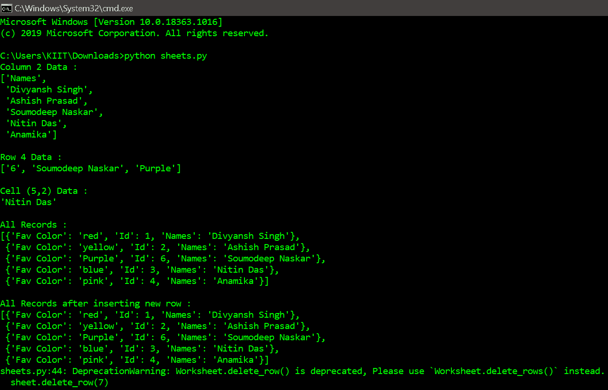 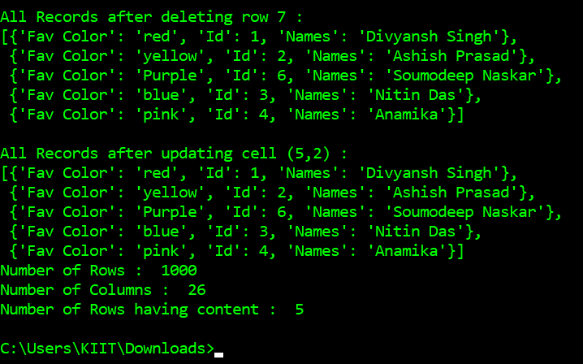