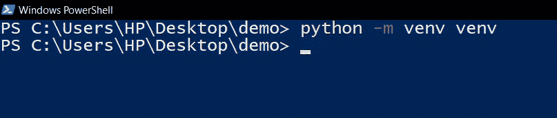
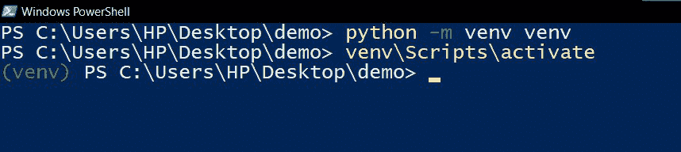
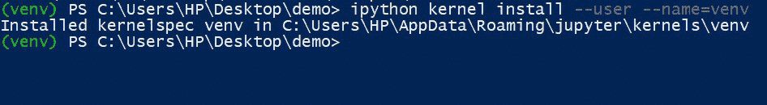
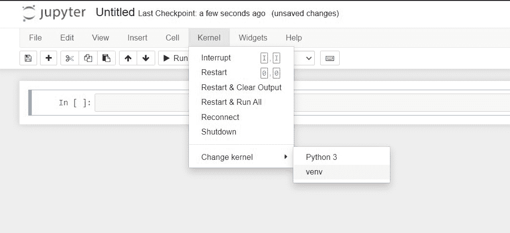
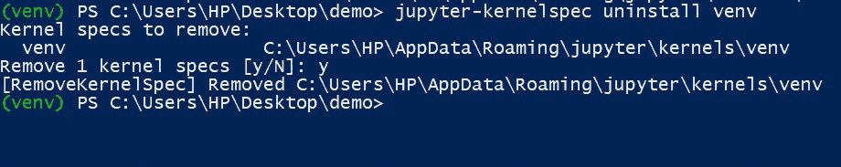

# 在虚拟环境中使用 Jupyter 笔记本

> 原文:[https://www . geeksforgeeks . org/using-jupyter-notebook-in-virtual-environment/](https://www.geeksforgeeks.org/using-jupyter-notebook-in-virtual-environment/)

在本文中，我们将看到如何在 Jupyter 中设置虚拟环境。有时我们希望在虚拟环境中使用 Jupyter 笔记本，以便在笔记本的范围内只有选定的软件包可用。为此，我们必须在 Jupyter 笔记本可用的内核列表中为虚拟环境添加一个新内核。让我们看看如何做到这一点:

**第一步:创建虚拟环境**

打开要创建项目的目录。打开 cmd/powershell 并导航到同一目录，然后运行以下命令来创建虚拟环境。

```
python -m venv venv
```



**第二步:激活虚拟环境**

现在我们有了虚拟环境，让我们激活它。

```
venv\Scripts\activate
```



**步骤 3:使用以下命令为虚拟环境安装 jupyter 内核:**

运行以下命令将创建一个内核，该内核可用于在虚拟环境中运行 jupyter notebook 命令。

```
ipython kernel install --user --name=venv
```



**第四步:在这个虚拟环境中想要使用 jupyter 笔记本的时候选择安装的内核**

现在让我们检查一下我们的内核是否已经创建。只需在命令提示符或 Powershell 中运行“jupyter notebook”命令，jupyter 环境就会打开。单击内核，然后单击更改内核，您将能够看到刚刚创建的内核。



您可以看到，现在内核列表中有了内核，并且 jupyter 笔记本也有了独立的依赖项，更加有条理。完成项目并且不再需要内核后，可以通过运行以下代码来卸载它:

```
jupyter-kernelspec uninstall venv
```

