# 在 Python 中使用 Plotly 进行交互式数据可视化

> 原文:[https://www . geeksforgeeks . org/使用-plotly-for-interactive-data-visualization-in-python/](https://www.geeksforgeeks.org/using-plotly-for-interactive-data-visualization-in-python/)

**Plotly** 是 Python 的开源模块，用于数据可视化，支持折线图、散点图、条形图、直方图、面积图等各种图形。在这篇文章中，我们将看到如何用 plot 绘制一个基本的图表，以及如何使一个图表具有交互性。但是在开始之前，你可能想知道为什么需要学习情节，所以让我们来看看它。

## 为什么是阴谋

Plotly 在幕后使用 javascript，用于制作交互式绘图，我们可以放大图形或添加附加信息，如悬停数据等。让我们来看看 plotly 的更多优势–

*   Plotly 具有悬停工具功能，允许我们检测大量数据点中的任何异常值或异常情况。
*   它在视觉上很有吸引力，能被广大观众所接受。
*   它允许我们对我们的图表进行无休止的定制，这使得我们的情节对其他人来说更有意义和更容易理解。

## 装置

Plotly 没有内置 Python。要安装它，请在终端中键入以下命令。

```
pip install plotly
```

plotly 安装图像小部件

## 图形包装结构概述

在 Plotly 中，有三个主要模块–

*   **plotly.plotly** 充当本地机器和 plotly 之间的接口。它包含需要 Plotly 服务器响应的功能。
*   **plotly.graph_objects** 模块包含负责创建图的对象(图形、布局、数据和图的定义，如散点图、折线图)。图形可以表示为字典或 plotly.graph_objects 的实例。图和这些在被传递到 plotly.js 之前被序列化为 JSON。图被表示为树，其中根节点具有三个顶层属性–**数据、布局、**和**框架**以及名为“**属性**的命名节点。

**注意:** plotly.express 模块可以一次创建整个图形。它在内部使用 graph_objects 并返回 graph_objects。图实例。

**示例:**

## 蟒蛇 3

```
import plotly.express as px

# Creating the Figure instance
fig = px.line(x=[1, 2], y=[3, 4])

# printing the figure instance
print(fig)
```

**输出:**

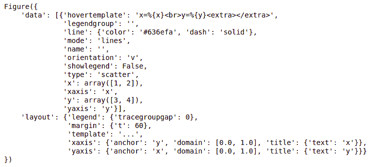

*   **plotly.tools** 模块包含各种工具形式的功能，可以增强 plotly 的体验。

看完 plotly 的基础知识后，让我们看看如何使用 plotly 创建一些基本图表。

## 折线图

一张[折线图](https://www.geeksforgeeks.org/line-chart-using-plotly-in-python/)是一个简单的曲线图，其中一条线被绘制成 X 轴和 Y 轴之间的鞋子关系。它可以使用 [px.line()](https://www.geeksforgeeks.org/plotly-express-line-function-in-python/) 方法创建，其中每个数据位置被表示为 2D 空间中折线标记的顶点(该位置由 x 和 y 列给出)。

**语法:**

> 语法:plotly . express . line(data _ frame =无，x =无，y =无，line _ group =无，color =无，line _ dash =无，hover _ name =无，hover _ data =无，title =无，模板=无，宽度=无，高度=无)

**示例:**

## 蟒蛇 3

```
import plotly.express as px

# using the iris dataset
df = px.data.iris()

# plotting the line chart
fig = px.line(df, y="sepal_width",)

# showing the plot
fig.show()
```

**输出:**

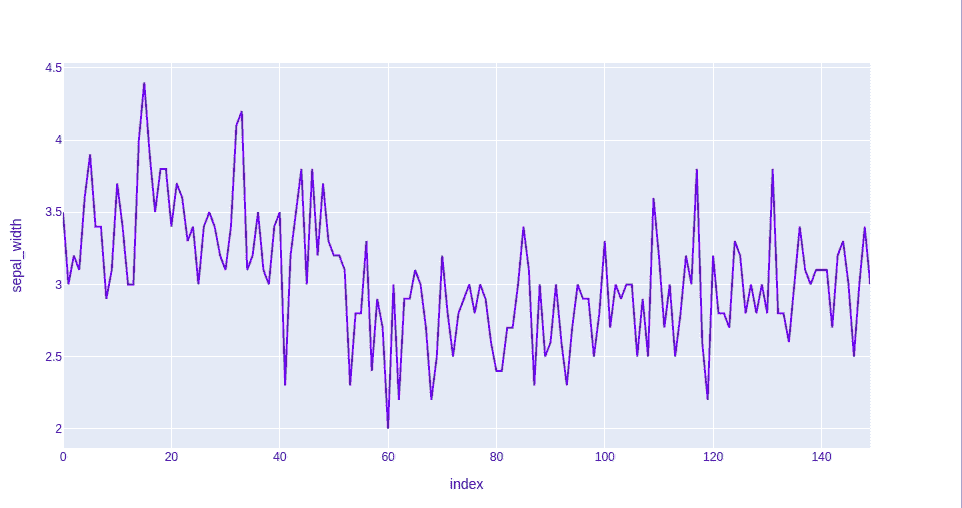

在上面的例子中，我们可以看到–

*   x 轴和 y 轴的标签已由 plotly 自动给出。
*   悬停时显示 x 轴和 y 轴的数据。
*   我们也可以根据需要选择一部分数据，也可以缩小。
*   Plotly 还提供了一套工具(见右上角)来与每个图表进行交互。
*   Poltly 还允许我们以静态格式在本地保存图形。

现在让我们试着稍微定制一下我们的图表。

**示例 1:** 在本例中，我们将使用线划参数，该参数用于根据传递的数据框列对线进行分组。

## 蟒蛇 3

```
import plotly.express as px

# using the iris dataset
df = px.data.iris()

# plotting the line chart
fig = px.line(df, y="sepal_width", line_group='species')

# showing the plot
fig.show()
```

**输出:**

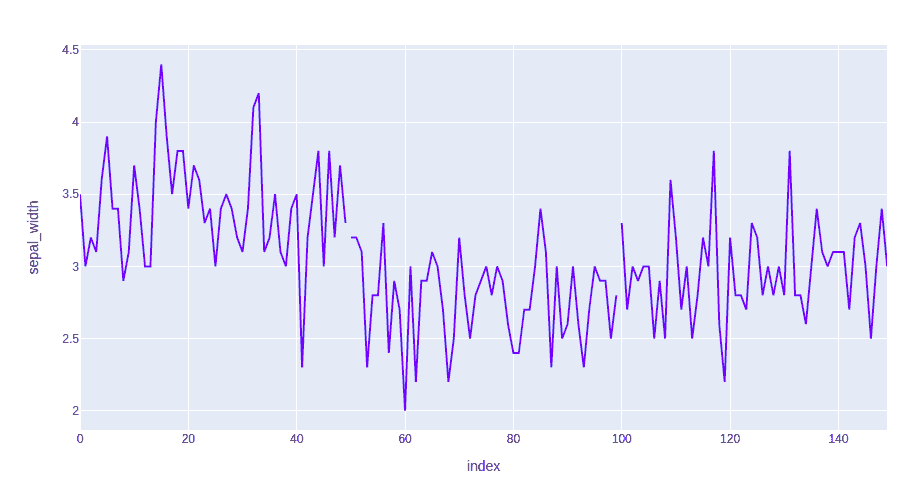

**示例 2:** 在本例中，我们将根据物种对数据进行分组和着色。我们还将更改行格式。为此，我们将使用两个属性，如–line _ dash 和 color。

## 蟒蛇 3

```
import plotly.express as px

# using the iris dataset
df = px.data.iris()

# plotting the line chart
fig = px.line(df, y="sepal_width", line_dash='species',
              color='species')

# showing the plot
fig.show()
```

**输出:**

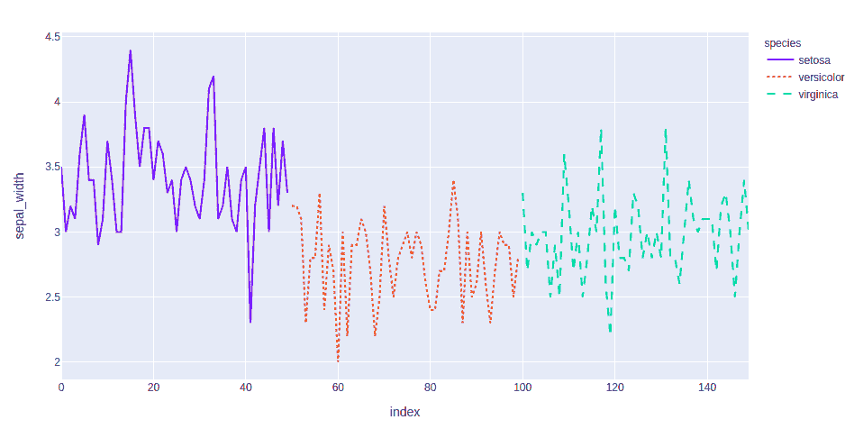

## 条形图

[条形图](https://www.geeksforgeeks.org/bar-chart-using-plotly-in-python/)是数据的图形表示，用高度或长度与其代表的值成比例的矩形条表示分类数据。换句话说，它是数据集的图形表示。这些数据集包含代表长度或高度的变量的数值。它可以使用 px.bar()方法创建。

**语法:**

> plotly . express . bar(data _ frame =无，x =无，y =无，color =无，facet _ row =无，facet _ col =无，facet_col_wrap=0，hover _ name =无，hover _ data =无，custom _ data =无，text =无，error _ x =无，error _ x _ 减=无，error _ y =无，error _ y _ 减=无，title =无，模板=无，宽度=无，高度=无，**kwargs)

**示例:**

## 蟒蛇 3

```
import plotly.express as px

# Loading the data
df = px.data.tips()

# Creating the bar chart
fig = px.bar(df, x='day', y="total_bill")

fig.show()
```

**输出:**

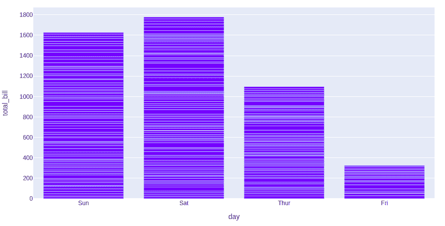

让我们试着定制这个情节。我们将使用的定制–

*   **颜色:**用于给条形上色。
*   **facet_row:** 根据传递的数据将图形分成行
*   **facet_col:** 根据传递的数据将图形划分为列

**示例:**

## 蟒蛇 3

```
import plotly.express as px

# Loading the data
df = px.data.tips()

# Creating the bar chart
fig = px.bar(df, x='day', y="total_bill", color='sex',
             facet_row='time', facet_col='sex')

fig.show()
```

**输出:**

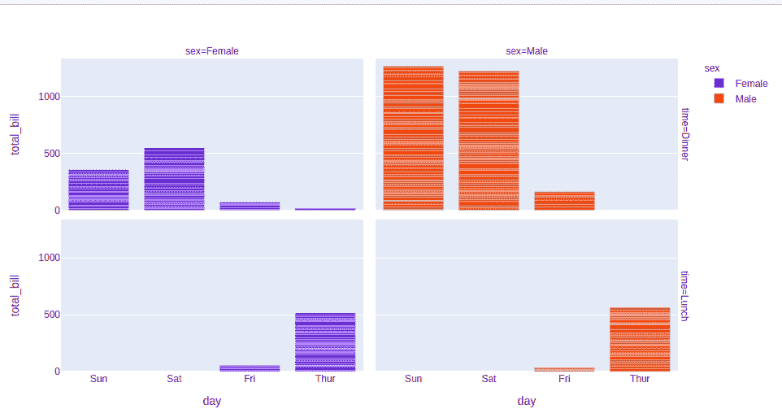

## 散点图

一个[散点图](https://www.geeksforgeeks.org/scatter-plot-using-plotly-in-python/)是一组在水平和垂直轴上代表单个数据的点。一种图表，其中两个变量的值沿 X 轴和 Y 轴绘制，结果点的模式揭示了它们之间的相关性。它可以使用 [px.scatter()](https://www.geeksforgeeks.org/plotly-express-scatter-function-in-python/) 方法创建。

**语法:**

> plotly.express .散点(data _ frame =无，x =无，y =无，color =无，symbol =无，size =无，hover _ name =无，hover _ data =无，facet _ row =无，facet _ col =无，facet_col_wrap=0，不透明度=无，title =无，模板=无，宽度=无，高度=无，**kwargs)

**示例:**

## 蟒蛇 3

```
import plotly.express as px

# using the dataset
df = px.data.tips()

# plotting the scatter chart
fig = px.scatter(df, x='total_bill', y="tip")

# showing the plot
fig.show()
```

**输出:**

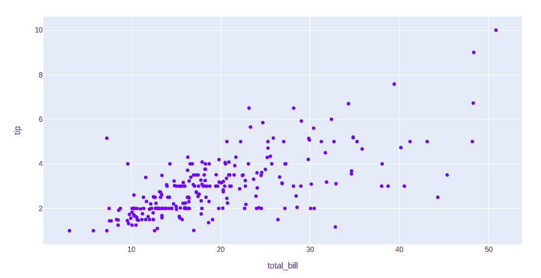

让我们看看这个图表的各种定制，我们将使用–

*   **颜色:**给点上色。
*   **符号:**根据传递的数据给每个点赋予一个符号。
*   **大小:**每个点的大小。

**示例:**

## 蟒蛇 3

```
import plotly.express as px

# using the dataset
df = px.data.tips()

# plotting the scatter chart
fig = px.scatter(df, x='total_bill', y="tip", color='time',
                 symbol='sex', size='size', facet_row='day',
                 facet_col='time')

# showing the plot
fig.show()
```

**输出:**

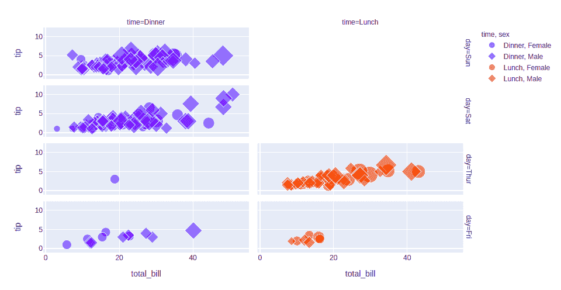

## 柱状图

A [直方图](https://www.geeksforgeeks.org/histogram-using-plotly-in-python/)基本上是用来表示一些组的形式的数据。这是一种条形图，其中 X 轴表示面元范围，而 Y 轴给出频率信息。它可以使用 px .直方图()方法创建。

**语法:**

> plotly.express .直方图(data _ frame =无，x =无，y =无，color =无，facet _ row =无，facet _ col =无，barnorm =无，histnorm =无，nbins =无，title =无，模板=无，宽度=无，高度=无)

**示例:**

## 蟒蛇 3

```
import plotly.express as px

# using the dataset
df = px.data.tips()

# plotting the histogram
fig = px.histogram(df, x="total_bill")

# showing the plot
fig.show()
```

**输出:**

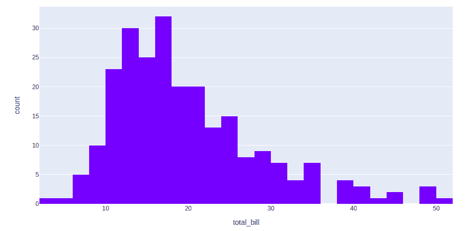

让我们定制上面的图表。我们将使用的定制是–

*   **颜色:**给条形上色
*   **nbins:** 设置箱数
*   **histnorm:** 表示仓位的模式。使用此参数可以传递的不同值有-
    *   **百分比或概率:**给定箱的 histfunc 输出除以所有箱的 histfunc 输出之和。
    *   **密度:**给定仓位的 histfunc 输出除以仓位大小。
    *   **概率密度:**给定仓的 histfunc 的输出被归一化，使得它对应于随机
*   **酒曲:**可以是“组”、“叠加”或“相对”。
    *   **组:**正数值的条堆叠在零之上，负数值的条堆叠在零之下
    *   **叠加:**条相互重叠绘制
    *   **组:**条条并排放置。

**示例:**

## 蟒蛇 3

```
import plotly.express as px

# using the dataset
df = px.data.tips()

# plotting the histogram
fig = px.histogram(df, x="total_bill", color='sex',
                   nbins=50, histnorm='percent',
                   barmode='overlay')

# showing the plot
fig.show()
```

**输出:**

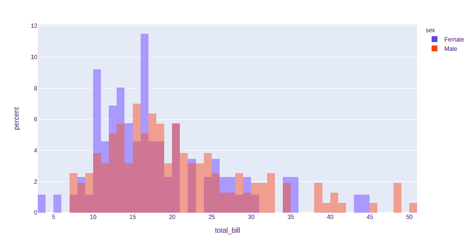

## 圆形分格统计图表

A [饼状图](https://www.geeksforgeeks.org/pie-plot-using-plotly-in-python/)是一个圆形的统计图形，它被分成若干个切片来说明数字比例。它描绘了一个使用“饼图切片”的特殊图表，其中每个扇区显示数据的相对大小。圆形图以半径的形式切割成描述相对频率或幅度的线段，也称为圆形图。它可以使用 px.pie()方法创建。

**语法:**

> plotly . express . pie(data _ frame =无，name =无，values =无，color =无，color _ discrete _ sequence =无，color_discrete_map={}，hover _ name =无，hover _ data =无，custom _ data =无，标签={}，title =无，模板=无，宽度=无，高度=无，不透明度=无，孔=无)

**示例:**

## 蟒蛇 3

```
import plotly.express as px

# Loading the iris dataset
df = px.data.tips()

fig = px.pie(df, values="total_bill", names="day")
fig.show()
```

**输出:**

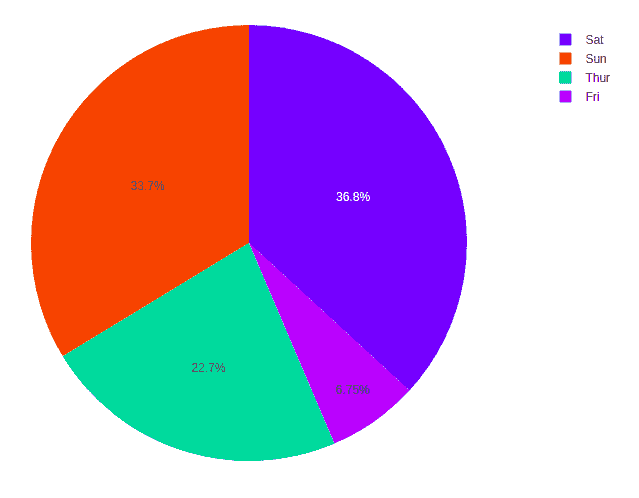

让我们定制上面的图表。我们将使用的定制是–

*   **颜色 _ 离散 _ 序列:**定义有效 CSS 颜色的字符串
*   **不透明度:**标记的不透明度。该值应该介于 0 和 1 之间
*   **孔:**在中间创建一个孔，使其成为一个圆环图。该值应该介于 0 和 1 之间

**示例:**

## 蟒蛇 3

```
import plotly.express as px

# Loading the iris dataset
df = px.data.tips()

fig = px.pie(df, values="total_bill", names="day",
             color_discrete_sequence=px.colors.sequential.RdBu,
             opacity=0.7, hole=0.5)
fig.show()
```

**输出:**

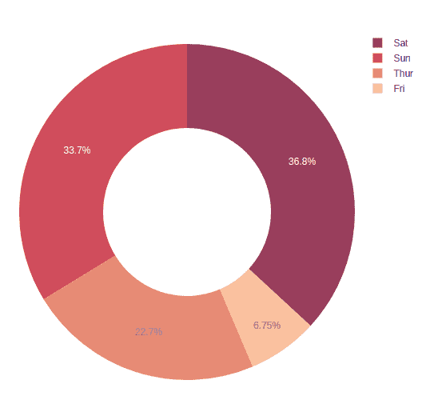

## 箱线图

创建[箱线图](https://www.geeksforgeeks.org/box-plot-using-plotly-in-python/)也称为触须图，以显示具有最小值、第一个四分位数、中值、第三个四分位数和最大值等属性的数据值集合的摘要。在方框图中，从第一个四分位数到第三个四分位数创建了一个方框，在中间位置也有一条穿过方框的垂直线。这里，x 轴表示要绘制的数据，而 y 轴表示频率分布。它可以使用 px.box()方法创建

**语法:**

> plotly . express . box(data _ frame = None，x=None，y=None，color=None，facet_row=None，facet_col=None，title=None，template=None，width=None，height=None，**kwargs)

**示例:**

## 蟒蛇 3

```
import plotly.express as px

# using the dataset
df = px.data.tips()

# plotting the boxplot
fig = px.box(df, x="day", y="tip")

# showing the plot
fig.show()
```