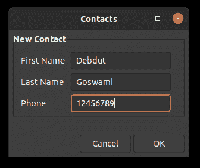
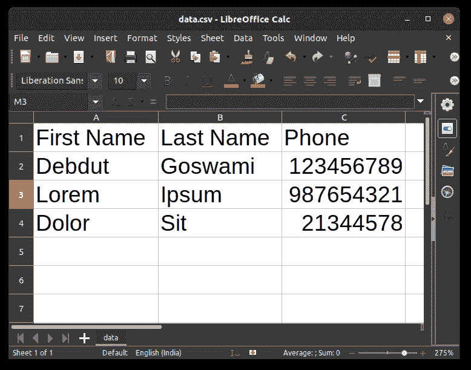

# 用 Python 使用 Zenity

> 原文:[https://www.geeksforgeeks.org/using-zenity-with-python/](https://www.geeksforgeeks.org/using-zenity-with-python/)

不，这不是另一个 Tkinter 教程。相反，我们将使用 Zenity 来创建图形用户界面。迷茫？嗯，我是来救援的。Zenity 是一个自由软件和跨平台程序，允许在命令行和 shell 脚本中执行 GTK 对话框。Zenity 仅在 Linux 中可用。对不起 Windows 用户，这个不是给你的。相反，您可以使用 [python-zenity](https://pypi.org/project/python-zenity/) ，但是我们在这里不讨论这个。

那么，让我们开始吧。首先，您需要在系统上安装 **Zenity** 。为此，只需打开您的终端并在其中键入以下内容

```py
sudo apt-get update -y
sudo apt-get install -y zenity
```

现在您已经安装了 Zenity，让我们开始编写脚本。首先，创建一个新的项目目录，然后在项目目录中，创建一个名为 **run.sh** 的新文件，并在其中添加以下脚本。别担心，我将提供整个代码的详细演练。

```py
#!/bin/sh

zenity --forms --title="Contacts" \
   --text="New Contact" \
   --add-entry="First Name" \
   --add-entry="Last Name" \
   --add-entry="Phone" > data.txt
#optional: continue adding data to the existing data.txt file
#   --add-entry="Phone" >> data.txt

python3 contacts.py
```

### 演练:

1.  第一条线是舍邦线。shebang 是脚本文件中的一个特殊字符序列，它指定应该调用哪个程序来运行脚本。shebang 总是在文件的第一行，由字符#组成！后跟解释程序的路径。
2.  下一行是 Zenity 的名字。–forms 属性定义了图形用户界面的形式。–title 指定窗口的标题。\是行分隔符。之所以使用行分隔符，是因为 Zenity 希望将整个内容写在一行中，但是我们将它变成多行，这样我们的脚本看起来就干净了。它是可选的。
3.  第三行有–text 参数。这只是在表单中添加一个标题。
4.  第四行和第五行指定输入字段，该字段将分别用于名字和姓氏。
5.  第六行也是一个输入字段，但是在它的末尾要注意 *> data.txt* 所以，这是一个 bash 命令，用于将输出指向 data.txt 文件
6.  第七行调用 python 脚本，稍后我们将看到它。

现在，让我们进入 python 脚本。不需要安装任何额外的软件包。我们将只使用内置模块。那么，让我们开始编码。

## 蟒蛇 3

```py
# import the modules
import os, csv

def write(first, last, phone):

    # checks if the csv file already exists or not
    if os.path.isfile('data.csv'):
        with open('data.csv', 'a') as file:

            # if it exists then appending the rows to it
            writer = csv.writer(file)

            # writing the rows
            writer.writerow([first, last, phone])
    else:

        # column names
        header = ['First Name', 'Last Name', 'Phone']

        # creating new file in write (w) mode
        with open('data.csv', 'w') as file:

            # initializing writer
            writer = csv.DictWriter(file, fieldnames = header)

            # writing the column header
            writer.writeheader()

            # writing the new entry
            writer.writerow({
                'First Name' : first,
                'Last Name' : last,
                'Phone' : phone})

# driver function
if __name__ == "__main__":

    # reads the data from txt file
    # removes new line and split it with '|' delimiter
    data = open('data.txt').readline().strip().split('|')

    # unziping the list to individual variables
    first_name, last_name, phone = data

    # calling write function
    write(first_name, last_name, phone)

    # removes the data.txt (optional)
    os.remove('data.txt')
```

因此，这基本上是从文件中读取数据，然后将其写入 csv 文件。然后，您可以使用任何电子表格查看器查看 csv 文件。

现在，你们都准备好了。现在，要运行整个程序，只需在项目文件夹中打开您的终端并键入**。/run.sh** 你的 GUI 应该会打开。填写详细信息，点击**确定**，您的数据应写入 *data.csv* 文件。你的 Gui 窗口应该看起来像这样。



输入一些数据后，您的 csv 文件应该如下所示。



Zenity 对于创建一个简单的图形用户界面非常有用。