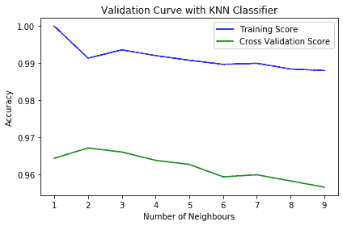

# 验证曲线

> 原文:[https://www.geeksforgeeks.org/validation-curve/](https://www.geeksforgeeks.org/validation-curve/)

一条**验证曲线**是一个重要的诊断工具，它显示了机器学习模型的精度变化与模型的某些参数变化之间的敏感性。
验证曲线通常绘制在模型的某些参数和模型得分之间。验证曲线中有两条曲线，一条用于训练集分数，一条用于交叉验证分数。默认情况下，scikit-learn 库中的验证曲线函数执行三重交叉验证。
验证曲线用于评估基于超参数的现有模型，而不是用于调整模型。这是因为，如果我们根据验证分数来调整模型，模型可能会偏向于调整模型所针对的特定数据；因此，不能很好地估计模型的泛化能力。
**解释验证曲线**
解释验证曲线的结果有时会很棘手。查看验证曲线时，请记住以下几点:

*   理想情况下，我们希望验证曲线和训练曲线看起来尽可能相似。
*   如果两个分数都很低，模型很可能是 ***低于*** 。这意味着要么是模型太简单，要么是特征太少。也有可能是模型过于正规化的情况。
*   如果训练曲线较快达到高分，验证曲线滞后，则模型为 ***过拟合。*** 这意味着模型非常复杂，数据太少；或者这可能仅仅意味着数据太少。
*   我们需要训练曲线和验证曲线最接近的参数值。

**Python 中验证曲线的实现:**
为了简单起见，在这个例子中，我们将使用非常流行的，*数字*数据集。关于此数据集的更多信息可在以下链接中获得:
[https://sci kit-learn . org/stable/auto _ examples/datasets/plot _ digits _ last _ image](https://scikit-learn.org/stable/auto_examples/datasets/plot_digits_last_image)
对于此示例，我们将使用 k-近邻分类器，并将根据训练集分数和交叉验证分数与“k”的值(即要考虑的近邻数量)绘制模型的准确性。
**代码:Python 代码，实现 5 重交叉验证，测试‘k’值从 1 到 10。**

## 蟒蛇 3

```
# Import Required libraries
import matplotlib.pyplot as plt
import numpy as np
from sklearn.datasets import load_digits
from sklearn.neighbors import KNeighborsClassifier
from sklearn.model_selection import validation_curve

# Loading dataset
dataset = load_digits()

# X contains the data and y contains the labels
X, y = dataset.data, dataset.target

# Setting the range for the parameter (from 1 to 10)
parameter_range = np.arange(1, 10, 1)

# Calculate accuracy on training and test set using the
# gamma parameter with 5-fold cross validation
train_score, test_score = validation_curve(KNeighborsClassifier(), X, y,
                                       param_name = "n_neighbors",
                                       param_range = parameter_range,
                                        cv = 5, scoring = "accuracy")

# Calculating mean and standard deviation of training score
mean_train_score = np.mean(train_score, axis = 1)
std_train_score = np.std(train_score, axis = 1)

# Calculating mean and standard deviation of testing score
mean_test_score = np.mean(test_score, axis = 1)
std_test_score = np.std(test_score, axis = 1)

# Plot mean accuracy scores for training and testing scores
plt.plot(parameter_range, mean_train_score,
     label = "Training Score", color = 'b')
plt.plot(parameter_range, mean_test_score,
   label = "Cross Validation Score", color = 'g')

# Creating the plot
plt.title("Validation Curve with KNN Classifier")
plt.xlabel("Number of Neighbours")
plt.ylabel("Accuracy")
plt.tight_layout()
plt.legend(loc = 'best')
plt.show()
```

**输出:**



从该图中，我们可以观察到 *'k' = 2* 将是 k 的理想值。随着邻居数量(k)的增加，训练分数的准确性以及交叉验证分数都降低。