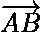
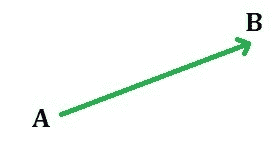
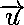
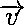
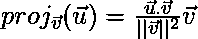
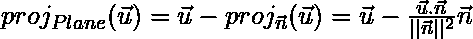
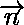

# 使用 Python 进行矢量投影

> 原文:[https://www . geesforgeks . org/vector-projection-use-python/](https://www.geeksforgeeks.org/vector-projection-using-python/)

矢量是一种既有大小(即长度)又有方向的几何对象。一个矢量一般由如下图所示的连接起点 A 和终点 B 的具有一定方向的线段表示，用
表示

## 一个向量在另一个向量上的投影

一个向量到另一个向量的投影被给出为


**计算矢量投影到 Python 中的另一个矢量:**

```
# import numpy to perform operations on vector
import numpy as np

u = np.array([1, 2, 3])   # vector u
v = np.array([5, 6, 2])   # vector v:

# Task: Project vector u on vector v

# finding norm of the vector v
v_norm = np.sqrt(sum(v**2))    

# Apply the formula as mentioned above
# for projecting a vector onto another vector
# find dot product using np.dot()
proj_of_u_on_v = (np.dot(u, v)/v_norm**2)*v

print("Projection of Vector u on Vector v is: ", proj_of_u_on_v)
```

**输出:**

```
Projection of Vector u on Vector v is:  [1.76923077 2.12307692 0.70769231]
```

**用于将一个向量投影到另一个向量上的一个线性代码:**

```
(np.dot(u, v)/np.dot(v, v))*v
```

## 向量在平面上的投影

矢量在平面上的投影是通过从中减去与平面正交的分量来计算的。

在哪里，就是平面法向量。

**用 Python 计算平面上的矢量投影:**

```
# import numpy to perform operations on vector
import numpy as np

# vector u 
u = np.array([2, 5, 8])       

# vector n: n is orthogonal vector to Plane P
n = np.array([1, 1, 7])       

# Task: Project vector u on Plane P

# finding norm of the vector n 
n_norm = np.sqrt(sum(n**2))    

# Apply the formula as mentioned above
# for projecting a vector onto the orthogonal vector n
# find dot product using np.dot()
proj_of_u_on_n = (np.dot(u, n)/n_norm**2)*n

# subtract proj_of_u_on_n from u: 
# this is the projection of u on Plane P
print("Projection of Vector u on Plane P is: ", u - proj_of_u_on_n)
```

**输出:**

```
Projection of Vector u on Plane P is:  [ 0.76470588  3.76470588 -0.64705882]
```