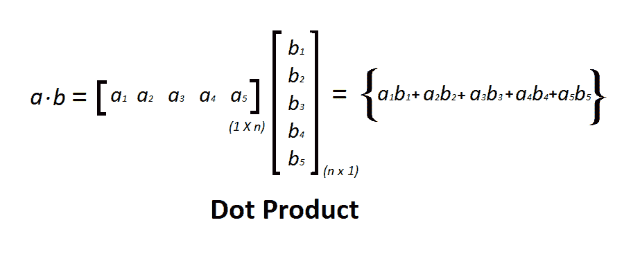
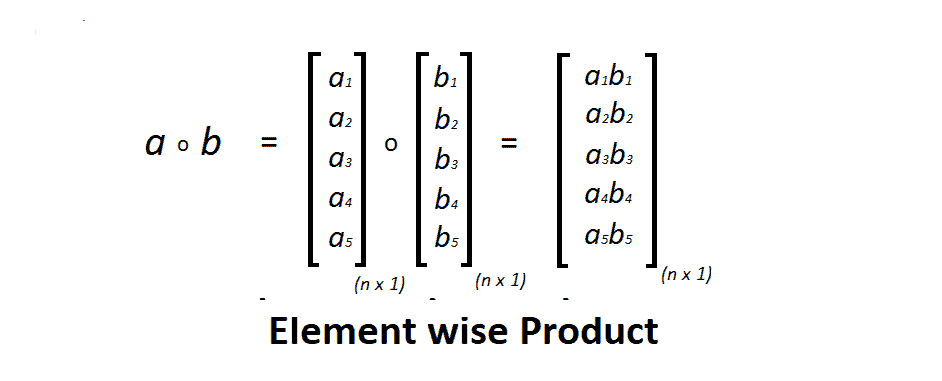

# Python 中的矢量化

> 原文:[https://www.geeksforgeeks.org/vectorization-in-python/](https://www.geeksforgeeks.org/vectorization-in-python/)

我们知道，大多数应用程序都必须处理大量数据集。因此，一个非计算最优的函数可能会成为你的算法中的一个巨大瓶颈，并可能导致一个需要很长时间才能运行的模型。为了确保代码的计算效率，我们将使用矢量化。

执行任何算法的时间复杂度对于决定一个应用程序是否可靠至关重要。当涉及到输出的实时应用时，在尽可能多的最佳时间内运行大型算法是非常重要的。为此，Python 有一些标准的数学函数，可以对整个数据数组进行快速运算，而无需编写循环。包含此类功能的库之一是*。让我们看看在矢量化的情况下如何使用这个标准函数。*

***什么是矢量化？**
矢量化是用来加速 Python 代码而不使用循环的。使用这样的函数有助于有效地最小化代码的运行时间。对向量执行各种操作，例如向量的*点积*，也称为*标量积*，因为它产生单个输出，外积产生尺寸等于向量的长度 X 长度的方阵，*逐元素乘法*，乘积相同的索引元素和矩阵的尺寸保持不变。*

*我们将通过计算经典方法的处理时间来了解这些方法如何比使用一些标准函数更耗时。*

> ***外(a，b):** 计算两个向量的外积。
> **乘(a，b):** 两阵的矩阵乘积。
> **点(a，b):** 两个数组的点积。
> **零((n，m)):** 返回给定形状和类型的矩阵，用零填充。
> **process_time():** 返回当前进程的系统和用户 CPU 时间之和的值(以分数秒为单位)。它不包括睡眠期间经过的时间。*

***点积:**
点积是一种代数运算，其中两个相等长度的向量相乘，从而产生一个数字。点积常称为 ***内积*** 。这个乘积产生一个标量数。我们来考虑两个相同长度的矩阵 *a* 和 *b* ，点积是先取第一个矩阵的转置，然后再进行*a’*(a 的转置)和 *b* 的数学矩阵乘法，如下图所示。*

***点积的图形表示–**
*

*下面是 Python 代码:*

```
*# Dot product
import time
import numpy
import array

# 8 bytes size int
a = array.array('q')
for i in range(100000):
    a.append(i);

b = array.array('q')
for i in range(100000, 200000):
    b.append(i)

# classic dot product of vectors implementation 
tic = time.process_time()
dot = 0.0;

for i in range(len(a)):
      dot += a[i] * b[i]

toc = time.process_time()

print("dot_product = "+ str(dot));
print("Computation time = " + str(1000*(toc - tic )) + "ms")

n_tic = time.process_time()
n_dot_product = numpy.dot(a, b)
n_toc = time.process_time()

print("\nn_dot_product = "+str(n_dot_product))
print("Computation time = "+str(1000*(n_toc - n_tic ))+"ms")*
```

***输出:***

```
*dot_product = 833323333350000.0
Computation time = 35.59449199999999ms

n_dot_product = 833323333350000
Computation time = 0.1559900000000225ms* 
```

 ***外积:**
两个坐标向量的*张量积*被称为 ***外积*** 。让我们考虑两个向量 *a* 和 *b* ，它们的维数分别为`n x 1`和`m x 1`，然后向量的外积得到一个矩形矩阵 **`n x m`** 。如果两个向量具有相同的维数，那么结果矩阵将是一个正方形矩阵，如图所示。*

***外部产品的图示–**
*

*下面是 Python 代码:*

```
*# Outer product
import time
import numpy
import array

a = array.array('i')
for i in range(200):
    a.append(i);

b = array.array('i')
for i in range(200, 400):
    b.append(i)

# classic outer product of vectors implementation 
tic = time.process_time()
outer_product = numpy.zeros((200, 200))

for i in range(len(a)):
   for j in range(len(b)):
      outer_product[i][j]= a[i]*b[j]

toc = time.process_time()

print("outer_product = "+ str(outer_product));
print("Computation time = "+str(1000*(toc - tic ))+"ms")

n_tic = time.process_time()
outer_product = numpy.outer(a, b)
n_toc = time.process_time()

print("outer_product = "+str(outer_product));
print("\nComputation time = "+str(1000*(n_toc - n_tic ))+"ms")
  *
```

***输出:***

```
*outer_product = [[     0\.      0\.      0\. ...,      0\.      0\.      0.]
 [   200\.    201\.    202\. ...,    397\.    398\.    399.]
 [   400\.    402\.    404\. ...,    794\.    796\.    798.]
 ..., 
 [ 39400\.  39597\.  39794\. ...,  78209\.  78406\.  78603.]
 [ 39600\.  39798\.  39996\. ...,  78606\.  78804\.  79002.]
 [ 39800\.  39999\.  40198\. ...,  79003\.  79202\.  79401.]]

Computation time = 39.821617ms

outer_product = [[    0     0     0 ...,     0     0     0]
 [  200   201   202 ...,   397   398   399]
 [  400   402   404 ...,   794   796   798]
 ..., 
 [39400 39597 39794 ..., 78209 78406 78603]
 [39600 39798 39996 ..., 78606 78804 79002]
 [39800 39999 40198 ..., 79003 79202 79401]]

Computation time = 0.2809480000000031ms* 
```

 ***元素积:**
两个矩阵的元素积是第一个矩阵的每个元素与后一个矩阵的对应元素相乘的代数运算。矩阵的维数应该相同。
考虑两个矩阵 *a* 和 *b* ， *a* 中一个元素的索引为 *i* 和 *j* ，然后 *a(i，j)* 分别乘以 *b(i，j)* ，如下图所示。*

***元素智慧产品的图示–**
*

*下面是 Python 代码:*

```
*# Element-wise multiplication
import time
import numpy
import array

a = array.array('i')
for i in range(50000):
    a.append(i);

b = array.array('i')
for i in range(50000, 100000):
    b.append(i)

# classic element wise product of vectors implementation 
vector = numpy.zeros((50000))

tic = time.process_time()

for i in range(len(a)):
      vector[i]= a[i]*b[i]

toc = time.process_time()

print("Element wise Product = "+ str(vector));
print("\nComputation time = "+str(1000*(toc - tic ))+"ms")

n_tic = time.process_time()
vector = numpy.multiply(a, b)
n_toc = time.process_time()

print("Element wise Product = "+str(vector));
print("\nComputation time = "+str(1000*(n_toc - n_tic ))+"ms")*
```

***输出:***

```
*Element wise Product = [  0.00000000e+00   5.00010000e+04   1.00004000e+05 ...,   4.99955001e+09
   4.99970000e+09   4.99985000e+09]

Computation time = 23.516678000000013ms

Element wise Product = [        0     50001    100004 ..., 704582713 704732708 704882705]
Computation time = 0.2250640000000248ms* 
```