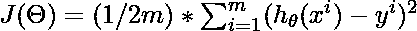
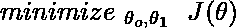
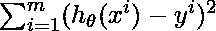
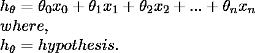
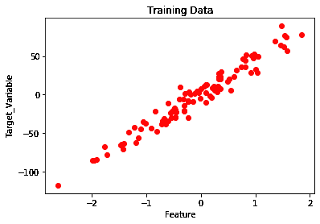
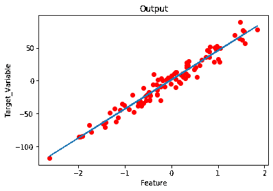
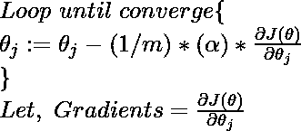
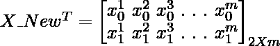
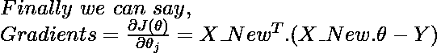

# 梯度下降矢量化

> 原文:[https://www . geesforgeks . org/梯度下降矢量化/](https://www.geeksforgeeks.org/vectorization-of-gradient-descent/)

在机器学习中，**回归**问题可以通过以下方式解决:

1.使用**优化算法**–梯度下降

*   批量梯度下降。
*   随机梯度下降。
*   小批量梯度下降
*   其他高级优化算法，如(共轭下降…)

2.使用**法向方程**:

*   使用线性代数的概念。

让我们考虑一元线性回归问题的**批梯度下降的情况。**

这个回归问题的**成本函数**是:

<center></center>

**目标:**

<center></center>

为了解决这个问题，我们可以选择**矢量化方法**(使用线性代数的概念)或者**非矢量化方法**(使用 for 循环)。

### 1.非工厂化方法:

这里为了求解下面提到的数学表达式，我们使用**进行循环**。

```
The above mathematical expression is a part of Cost Function.

```

<center></center>

```
The above Mathematical Expression is the hypothesis.

```

<center></center>

**代码:非工厂化 Grad** 的 Python 实现

```
# Import required modules.
from sklearn.datasets import make_regression
import matplotlib.pyplot as plt
import numpy as np
import time

# Create and plot the data set.
x, y = make_regression(n_samples = 100, n_features = 1,
                       n_informative = 1, noise = 10, random_state = 42)

plt.scatter(x, y, c = 'red')
plt.xlabel('Feature')
plt.ylabel('Target_Variable')
plt.title('Training Data')
plt.show()

# Convert y from 1d to 2d array.
y = y.reshape(100, 1)

# Number of Iterations for Gradient Descent
num_iter = 1000

# Learning Rate
alpha = 0.01

# Number of Training samples.
m = len(x)

# Initializing Theta.
theta = np.zeros((2, 1),dtype = float)

# Variables
t0 = t1 = 0
Grad0 = Grad1 = 0

# Batch Gradient Descent.
start_time = time.time()

for i in range(num_iter):
    # To find Gradient 0.
    for j in range(m):
        Grad0 = Grad0 + (theta[0] + theta[1] * x[j]) - (y[j])

    # To find Gradient 1.
    for k in range(m):
        Grad1 = Grad1 + ((theta[0] + theta[1] * x[k]) - (y[k])) * x[k]
    t0 = theta[0] - (alpha * (1/m) * Grad0)
    t1 = theta[1] - (alpha * (1/m) * Grad1)
    theta[0] = t0
    theta[1] = t1
    Grad0 = Grad1 = 0

# Print the model parameters.    
print('model parameters:',theta,sep = '\n')

# Print Time Take for Gradient Descent to Run.
print('Time Taken For Gradient Descent in Sec:',time.time()- start_time)

# Prediction on the same training set.
h = []
for i in range(m):
    h.append(theta[0] + theta[1] * x[i])

# Plot the output.
plt.plot(x,h)
plt.scatter(x,y,c = 'red')
plt.xlabel('Feature')
plt.ylabel('Target_Variable')
plt.title('Output')
```

**输出:**

<center>

</center>

```
model parameters:
[[ 1.15857049]
 [44.42210912]]

Time Taken For Gradient Descent in Sec: 2.482538938522339

```

<center>

</center>

### 2.矢量化方法:

这里为了求解下面提到的数学表达式，我们使用**矩阵和**向量(线性代数)。

```
The above mathematical expression is a part of Cost Function.

```

<center>
</center>

```
The above Mathematical Expression is the hypothesis.

```

<center></center>

#### 批量梯度下降:

<center></center>

#### 使用矩阵运算寻找梯度的概念:







**代码:矢量化梯度下降法的 Python 实现**

```
# Import required modules.
from sklearn.datasets import make_regression
import matplotlib.pyplot as plt
import numpy as np
import time

# Create and plot the data set.
x, y = make_regression(n_samples = 100, n_features = 1,
                       n_informative = 1, noise = 10, random_state = 42)

plt.scatter(x, y, c = 'red')
plt.xlabel('Feature')
plt.ylabel('Target_Variable')
plt.title('Training Data')
plt.show()

# Adding x0=1 column to x array.
X_New = np.array([np.ones(len(x)), x.flatten()]).T

# Convert y from 1d to 2d array.
y = y.reshape(100, 1)

# Number of Iterations for Gradient Descent
num_iter = 1000

# Learning Rate
alpha = 0.01

# Number of Training samples.
m = len(x)

# Initializing Theta.
theta = np.zeros((2, 1),dtype = float)

# Batch-Gradient Descent.
start_time = time.time()

for i in range(num_iter):
    gradients = X_New.T.dot(X_New.dot(theta)- y)
    theta = theta - (1/m) * alpha * gradients

# Print the model parameters.    
print('model parameters:',theta,sep = '\n')

# Print Time Take for Gradient Descent to Run.
print('Time Taken For Gradient Descent in Sec:',time.time() - start_time)

# Hypothesis.
h = X_New.dot(theta) # Prediction on training data itself.

# Plot the Output.
plt.scatter(x, y, c = 'red')
plt.plot(x ,h)
plt.xlabel('Feature')
plt.ylabel('Target_Variable')
plt.title('Output')
```

#### 输出:

<center></center>

```
model parameters:
[[ 1.15857049]
 [44.42210912]]

Time Taken For Gradient Descent in Sec: 0.019551515579223633
```

<center>

</center>

#### **观测值:**

1.  实现矢量化方法减少了梯度下降(高效代码)的执行时间。
2.  易于调试。