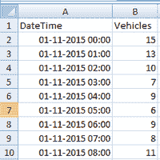
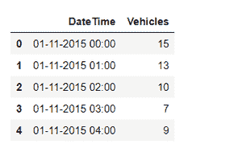

# 根据传感器数据预测车辆数量

> 原文:[https://www . geesforgeks . org/vehicle-count-prediction-from-sensor-data/](https://www.geeksforgeeks.org/vehicle-count-prediction-from-sensor-data/)

**先决条件:** [回归和分类|监督机器学习](https://www.geeksforgeeks.org/regression-classification-supervised-machine-learning/)

放置在路口的传感器收集不同路口的车辆数量数据，并将数据提供给运输经理。现在我们的任务是根据传感器数据预测车辆总数。

本文解释了如何处理带有时间戳的传感器数据，并预测特定时间的车辆计数，

**数据集描述:**

该数据集包含 2 个属性。它们是日期时间和车辆。其中车辆是类别标签。

下载该数据的链接–[点击此处](https://drive.google.com/drive/u/0/folders/1Z74vQWZtbXYBz_uqttMUtH9EWmKbBOlb)



类别标签是数字类型的。所以**回归技术**很适合这个问题。回归用于将数据映射到预定义的函数中。这是一种监督学习算法，用于根据历史数据预测值。如果数据是数字，我们可以对数据进行回归。这里的类别标签 Ie Vehicles 属性是数值的类别标签，所以应该进行回归。

[**【随机森林回归器】**](https://www.geeksforgeeks.org/random-forest-regression-in-python/) 是一种集成技术，它获取输入并构建树，然后获取每行/每个元组中所有树的平均值。

> **语法:**randomforestreversor(n _ estimates = 100，* criteria = ' MSE '，max_depth=None，min_samples_split=2，min_samples_leaf=1，min_weight_fraction_leaf=0.0，max_features='auto '，max_leaf_nodes=None，min _ 杂质 _ reduce = 0.0，min _ 杂质 _split=None，bootstrap=True，oob_score=False，n_jobs=None，random_state=None，verbose=0，warm_start

**进场:**

*   导入必要的模块
*   加载数据集
*   分析数据
*   将 DateTime 属性转换为周、日、小时、月等(采用时间戳格式。)
*   构建模型
*   训练模型
*   测试数据
*   预测结果

**步骤 1:** 导入熊猫模块，加载数据帧。

## 蟒蛇 3

```
# importing the pandas module for
# data frame
import pandas as pd

# load the data set into train variable.
train = pd.read_csv('vehicles.csv')

# display top 5 values of data set
train.head()
```

**输出:**



**步骤 2:** 定义从时间戳(DateTime)中获取月、日、小时的函数，并将其加载到不同的列中。

## 蟒蛇 3

```
# function to get all data from time stamp

# get date
def get_dom(dt):
    return dt.day

# get week day
def get_weekday(dt):
    return dt.weekday()

# get hour
def get_hour(dt):
    return dt.hour

# get year
def get_year(dt):
    return dt.year

# get month
def get_month(dt):
    return dt.month

# get year day
def get_dayofyear(dt):
    return dt.dayofyear

# get year week
def get_weekofyear(dt):
    return dt.weekofyear

train['DateTime'] = train['DateTime'].map(pd.to_datetime)
train['date'] = train['DateTime'].map(get_dom)
train['weekday'] = train['DateTime'].map(get_weekday)
train['hour'] = train['DateTime'].map(get_hour)
train['month'] = train['DateTime'].map(get_month)
train['year'] = train['DateTime'].map(get_year)
train['dayofyear'] = train['DateTime'].map(get_dayofyear)
train['weekofyear'] = train['DateTime'].map(get_weekofyear)

# display
train.head()
```